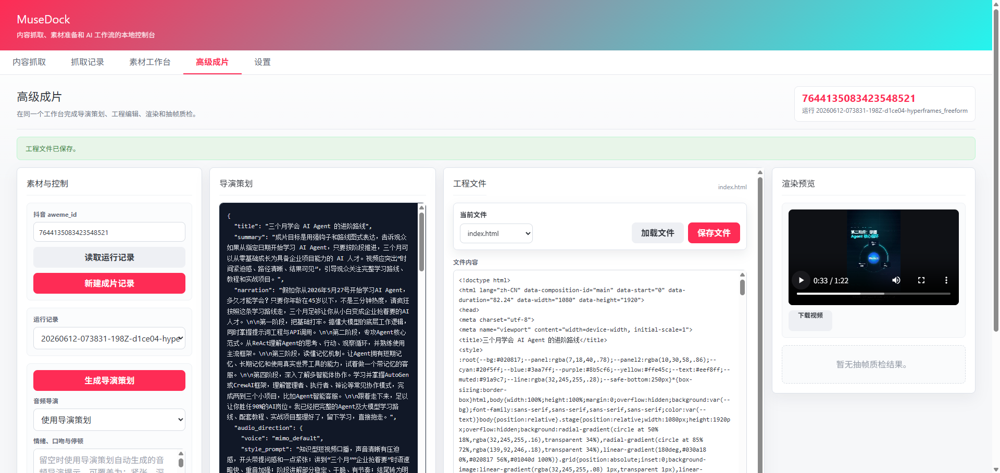

# MuseDock



MuseDock 是一个本地优先的短视频素材采集与高级成片工作台。它把抖音内容采集、评论缓存、素材准备、音频转写、导演策划、TTS 口播、HyperFrames 工程生成、人工编辑、工程校验、MP4 渲染和抽帧质检放在同一个 Web GUI 里，目标是把零散短视频素材沉淀为可复用、可检查、可继续打磨的本地创作资产。

当前项目的主体验是 **高级成片页面**：用户可以从一个抖音 `aweme_id` 创建 HyperFrames 自由成片记录，生成导演策划、口播音频和可运行的视频工程，直接在页面里编辑 `index.html`、`design.md`、`hyperframes.json` 等工程文件，再执行校验、渲染和抽帧质检。

## 核心亮点

- **高级成片工作台**：围绕 HyperFrames 自由工程组织完整流程，支持读取素材运行记录、新建成片记录、生成导演策划、生成音频轨、生成工程、编辑工程文件、校验工程、渲染视频和抽帧质检。
- **导演策划 Agent**：基于已有素材上下文、口播、分镜和风格要求生成结构化导演简报，沉淀成片目标、叙事结构、视觉方向、音频导演提示和制作检查点。
- **高级成片音频轨**：支持使用导演策划自动生成的音频导演提示，也可以人工补充情绪、口吻、语速和停顿描述；生成后的 TTS 会作为本地 `assets/narration.wav` 注入 HyperFrames 工程，避免渲染时依赖运行期 API URL。
- **自由工程生成**：工程 Agent 输出完整 HyperFrames 文件集，默认包含 `index.html`、`design.md`、`hyperframes.json`、`package.json` 和 `meta.json`，后端会过滤不允许的文件和二进制产物，并规范化音频、字体、时间线和合成属性。
- **页面内工程编辑**：高级成片页面可加载和保存白名单内文本文件，便于微调 HTML/CSS/GSAP、设计说明和工程配置；保存路径经过运行 ID 与文件名校验，避免越权写入。
- **工程校验与质量门禁**：后端可运行 `hyperframes lint`、`hyperframes validate`、`hyperframes inspect --samples 12`，并把结果写入工程 `checks/` 目录和运行记录。
- **渲染与抽帧质检**：渲染完成后页面展示 MP4 预览和下载入口；抽帧质检会生成联系表，方便快速检查画面稳定性、字幕覆盖和整体观感。
- **本地优先数据链路**：采集记录、评论、素材、Agent 运行记录、TTS、工程文件、质检报告和渲染产物都保存在本地目录，方便复盘和二次加工。

## 页面与工作流

### 高级成片页面

高级成片页面是目前最重要的工作台，路径形态为：

```text
/hyperframes-freeform/:aweme_id
/hyperframes-freeform/:aweme_id/:run_id
```

页面由四个区域组成：

- **素材与控制**：输入 `aweme_id`，读取运行记录，新建成片记录，并依次触发导演策划、音频生成、工程生成、工程校验、视频渲染和抽帧质检。
- **导演策划**：展示 AI 生成的导演简报 JSON，帮助确认标题、摘要、旁白结构、音频导演、场景规划和视觉方向。
- **工程文件**：列出当前自由工程文件，可加载、编辑并保存白名单内文本文件。
- **渲染预览**：展示生成的 MP4、下载入口，以及抽帧质检联系表。

推荐流程：

1. 在“采集”或“记录”页准备抖音素材，并确保素材已进入本地媒体目录。
2. 从素材工作台进入“高级成片”，或手动打开 `/hyperframes-freeform/<aweme_id>`。
3. 点击“读取运行记录”，必要时点击“新建成片记录”。
4. 点击“生成导演策划”，确认短片目标、节奏和视觉方向。
5. 在“音频导演”区域选择使用导演策划，或手动补充情绪、口吻、语速和停顿描述。
6. 点击“生成音频轨”，生成高级成片专用 TTS 音频。
7. 点击“生成 HyperFrames 工程”，得到包含本地口播音频的自由工程文件。
8. 在“工程文件”区域加载并编辑 `index.html`、`design.md` 或配置文件。
9. 点击“校验工程”，通过 lint、validate 和 inspect 后再渲染。
10. 点击“渲染视频”，在页面内预览 MP4。
11. 点击“抽帧质检”，查看联系表，必要时回到工程文件继续调整。

生成文件通常位于：

```text
data/media/douyin/<aweme_id>/agent_runs/<run_id>-hyperframes-freeform/
```

常见产物：

```text
index.html
design.md
hyperframes.json
package.json
meta.json
assets/narration.wav
output.mp4
checks/
inspect/contact_sheet.jpg
```

### 采集与素材页面

MuseDock 仍保留完整的素材前置链路：

- 抖音扫码登录、关键词搜索、视频 ID/链接抓取、作者主页视频抓取。
- 小红书关键词搜索、笔记详情和历史记录入口。
- 抖音一级评论与二级评论缓存，结果写入本地 SQLite。
- 视频下载、音频抽取、关键帧抽取、素材状态查看。
- 小米 MiMo ASR 音频转写，支持大音频压缩、切片转写和结果合并。

## 高级成片设计

高级成片链路强调“AI 生成 + 工程可控 + 质量可查”：

- **运行记录层**：每个高级成片任务以 `hyperframes_freeform` 运行记录保存状态，记录导演策划、工程文件、校验结果、渲染结果和抽帧质检结果。
- **导演策划层**：AI 先输出导演简报，而不是直接生成最终视频，让叙事目标、视觉方向和检查要点先被固定下来。
- **音频生成层**：高级成片拥有独立音频状态，使用导演策划或人工输入的情绪、口吻、语速和停顿提示生成 TTS；工程生成时会复制为本地 `assets/narration.wav` 并注入 `<audio id="narration-audio">`。
- **工程生成层**：AI 生成可运行的 HyperFrames 自由工程；后端只接受白名单文件，并规范化 `index.html` 中的合成属性、音频引用、字体和时间线结构。
- **工程编辑层**：页面把工程文件暴露给用户审阅和修改，避免成片流程停留在黑盒 prompt 调参。
- **校验层**：工程生成后需要经过 HyperFrames CLI 的 lint、validate 和 inspect 检查。
- **渲染层**：渲染阶段使用已保存工程，不重新请求大模型，便于复现和定位问题。
- **质检层**：抽帧生成联系表和报告，帮助在提交或发布前检查视频的关键画面。

## 关键约束

- 高级成片工程只允许访问白名单文件：`index.html`、`design.md`、`hyperframes.json`、`package.json`、`meta.json`、`output.mp4`、`contact_sheet.jpg`。
- 页面只能以文本方式编辑 `index.html`、`design.md`、`hyperframes.json`、`package.json` 和 `meta.json`。
- AI 工程响应不允许包含 `output.mp4`、`contact_sheet.jpg` 或任何二进制产物。
- `run_id` 和工程文件名都会做路径安全校验，禁止 `..`、路径分隔符和非白名单文件。
- `index.html` 会被规范化，补齐 `data-composition-id`、`data-duration`、尺寸属性和可被 HyperFrames 识别的时间线结构。
- 高级成片口播音频会统一落到工程内 `assets/narration.wav`，并使用独立音频轨，避免渲染阶段引用 `/api/.../tts/...` 这类运行期接口路径。
- 系统字体会尽量映射为 HyperFrames 可用字体，例如 `inter`、`jetbrains-mono`、`montserrat`、`noto-sans`、`open-sans`。

## 技术栈

- 前端：React、React Router、Vite
- UI：Tailwind CSS、本地 shadcn 风格组件、lucide-react
- 后端：Node.js 22、Express
- 数据库：SQLite、better-sqlite3
- 浏览器自动化：Playwright、Chrome CDP
- 媒体处理：ffmpeg、ffprobe、`@ffmpeg-installer/ffmpeg`
- AI 能力：OpenAI-compatible 文字模型、小米 MiMo ASR/TTS
- 视频工程：HyperFrames CLI、HTML/CSS/GSAP

## 环境要求

- Node.js 22
- npm
- Google Chrome
- ffmpeg
- ffprobe

项目在 `package.json#engines` 中约束 Node.js 22。切换 Node 版本后建议重新安装依赖：

```powershell
npm install
```

如果 `better-sqlite3` 出现 ABI 不匹配，可执行：

```powershell
npm rebuild better-sqlite3
```

`ffmpeg` 会优先读取 `FFMPEG_PATH`，其次使用项目依赖内置路径，最后尝试系统 `PATH`。`ffprobe` 用于读取 TTS 分段音频时长，建议安装到系统 `PATH`，或通过 `FFPROBE_PATH` 指定。

## 安装与启动

```powershell
npm install
npm run build:frontend
npm run start
```

启动后打开：

```text
http://localhost:3000
```

开发前端时可单独启动 Vite：

```powershell
npm run dev:frontend
```

## 常用命令

```powershell
# 启动 Express 服务和已构建前端
npm run start

# 启动 Vite 前端开发服务
npm run dev:frontend

# 构建前端
npm run build:frontend

# 运行完整回归测试
npm test

# 高级成片相关专项测试
node tests/test-hyperframes-freeform-agent.js
node tests/test-hyperframes-freeform-project.js
node tests/test-hyperframes-freeform-quality.js
node tests/test-hyperframes-studio-api-client.mjs
node tests/test-hyperframes-studio-hook.mjs
node tests/test-hyperframes-studio-page.mjs
node tests/test-media-workspace-navigation.mjs

# 旧版 Agent 与成片链路常用专项测试
node tests/test-agent-runs.js
node tests/test-ai-tts-model.js
node tests/test-phrase-timeline.js
node tests/test-video-quality-report.js
node tests/test-storyboard-schema.js
node tests/test-storyboard-agent.js
node tests/test-hyperframes-visual-dsl.js
node tests/test-hyperframes-scene-renderers.js
node tests/test-hyperframes-project.js
node tests/test-hyperframes-renderer.js

# 分析已生成的旧版 HyperFrames 工程质量报告
node scripts/analyze-video-quality.js data/media/douyin/<aweme_id>/agent_runs/<run_id>-hyperframes
```

## 环境变量

| 变量 | 说明 | 默认值 |
| --- | --- | --- |
| `MEDIACRAWLER_DB_PATH` | SQLite 数据库路径 | `data/mediacrawler.db` |
| `OPENAI_API_KEY` | OpenAI-compatible 服务 API Key | 空 |
| `ASR_API_KEY` | ASR 服务 API Key | 空 |
| `ASR_PROVIDER` | ASR 服务提供商，MiMo 填 `mimo` | 空 |
| `MIMO_API_KEY` | 小米 MiMo API Key，未配置时可回退读取 `ASR_API_KEY` | 空 |
| `MIMO_BASE_URL` | 小米 MiMo API Base URL | `https://api.xiaomimimo.com/v1` |
| `MIMO_ASR_MODEL` | 小米 MiMo ASR 模型 ID | `mimo-v2.5-asr` |
| `MIMO_TTS_MODEL` | 小米 MiMo TTS 模型 ID | `mimo-v2.5-tts` |
| `ASR_LANGUAGE` | MiMo ASR 识别语言，支持 `auto`、`zh`、`en` | `auto` |
| `FFMPEG_PATH` | 手动指定 ffmpeg 可执行文件路径 | 空 |
| `FFPROBE_PATH` | 手动指定 ffprobe 可执行文件路径 | 空 |

文字模型按 OpenAI-compatible `POST /chat/completions` 调用。DeepSeek、OpenAI 或自定义兼容服务都可以通过设置页配置供应商、Base URL、模型 ID 和 API Key。

## 本地数据

MuseDock 会在本地生成运行数据：

- `data/mediacrawler.db`：SQLite 数据库
- `data/media/douyin/<aweme_id>/`：抖音视频素材目录
- `data/media/douyin/<aweme_id>/transcript.json`：音频转写结果
- `data/media/douyin/<aweme_id>/agent_runs/`：高级成片运行结果、TTS 音频、字幕时间轴、HyperFrames 工程、质检报告和 MP4
- `data/media/douyin/<aweme_id>/agent_runs/<run_id>-hyperframes-freeform/`：高级成片自由工程目录
- `data/config/agent_templates.json`：本地保存的 Agent 模板覆盖配置
- `chrome-user-data/`：Chrome CDP 使用的本地浏览器数据
- `douyin-cookies.json`：抖音 Cookie 持久化文件

这些文件通常不适合提交到公开仓库。协作或开源前请确认 `.gitignore` 已排除本地数据库、浏览器缓存、Cookie 和媒体产物。

## 目录结构

```text
.
+-- frontend-react/      # React + Vite 前端源码
|   +-- src/pages/       # 页面入口，高级成片页在 HyperframesStudioPage.jsx
|   +-- src/components/  # 通用组件和 hyperframes-studio 工作台组件
+-- frontend-dist/       # 前端构建产物
+-- server/              # Express 服务、路由、抓取器和业务服务
|   +-- routes/          # API 路由
|   +-- scraper/         # 抖音、小红书抓取逻辑
|   +-- services/        # 数据存储、媒体处理、AI 配置、Agent、分镜和视频工程服务
|   +-- resources/       # HyperFrames 技能与提示上下文资源
|   +-- state/           # 运行时 Cookie 状态
+-- data/                # SQLite 数据库、本地媒体素材和本地配置
+-- docs/                # 项目文档、计划和交接记录
+-- tests/               # 回归测试脚本
```

## API 概览

### 高级成片

- `POST /api/agents/douyin/:aweme_id/hyperframes-freeform-runs`：新建高级成片运行记录
- `POST /api/agents/douyin/:aweme_id/runs/:run_id/hyperframes-freeform/brief`：生成导演策划
- `POST /api/agents/douyin/:aweme_id/runs/:run_id/hyperframes-freeform/audio`：生成高级成片音频轨
- `POST /api/agents/douyin/:aweme_id/runs/:run_id/hyperframes-freeform/project`：生成 HyperFrames 自由工程
- `POST /api/agents/douyin/:aweme_id/runs/:run_id/hyperframes-freeform/check`：校验工程
- `POST /api/agents/douyin/:aweme_id/runs/:run_id/hyperframes-freeform/render`：渲染自由工程 MP4
- `POST /api/agents/douyin/:aweme_id/runs/:run_id/hyperframes-freeform/inspect`：执行抽帧质检
- `GET /api/agents/douyin/:aweme_id/runs/:run_id/hyperframes-freeform/files/:file_name`：读取工程文件
- `PUT /api/agents/douyin/:aweme_id/runs/:run_id/hyperframes-freeform/files/:file_name`：保存工程文本文件

### 抖音

- `POST /api/douyin/qrcode-login`：启动扫码登录
- `GET /api/douyin/login-status`：检查扫码登录结果
- `GET /api/douyin/check-login`：检查当前登录态
- `GET /api/douyin/search?keyword=...&max=20`：关键词搜索
- `GET /api/douyin/aweme?ids=...`：按视频 ID 或链接抓取详情
- `GET /api/douyin/creator?sec_uid=...&max=20`：抓取作者主页视频
- `GET /api/douyin/comments?aweme_id=...`：抓取评论和二级评论
- `GET /api/douyin/comments/local?aweme_id=...`：读取本地评论缓存

### 素材

- `POST /api/media/douyin/:aweme_id/prepare`：准备视频、音频和关键帧
- `GET /api/media/douyin/:aweme_id/status`：查看素材状态
- `POST /api/media/douyin/:aweme_id/transcribe`：触发音频转写
- `POST /api/media/douyin/:aweme_id/open`：打开素材目录或目标文件
- `GET /api/media/douyin/:aweme_id/tasks`：读取素材任务列表
- `GET /api/media/douyin/:aweme_id/tasks/:task_id`：读取素材任务状态

### AI Agent

- `GET /api/agents/templates`：读取可编辑任务 Agent 模板列表
- `GET /api/agents/templates/:id`：读取单个任务 Agent 模板
- `PUT /api/agents/templates/:id`：保存任务 Agent 模板覆盖配置
- `DELETE /api/agents/templates/:id/override`：恢复任务 Agent 默认配置
- `GET /api/agents/storyboard-template`：读取分镜 Agent 配置
- `PUT /api/agents/storyboard-template`：保存分镜 Agent 覆盖配置
- `DELETE /api/agents/storyboard-template/override`：恢复分镜 Agent 默认配置
- `POST /api/agents/messages/preview`：预览任务 Agent messages
- `POST /api/agents/storyboard-messages/preview`：预览分镜 Agent messages
- `POST /api/agents/douyin/:aweme_id/runs`：执行抖音素材的 Agent 任务
- `GET /api/agents/douyin/:aweme_id/runs`：读取素材的 Agent 运行记录
- `GET /api/agents/douyin/:aweme_id/runs/:run_id`：读取单次 Agent 运行详情
- `GET /api/agents/douyin/:aweme_id/runs/:run_id/next-action`：读取推荐下一步动作
- `POST /api/agents/douyin/:aweme_id/runs/:run_id/tts`：生成 TTS 音频和字幕时间轴
- `POST /api/agents/douyin/:aweme_id/runs/:run_id/scene-tts`：生成场景级 TTS
- `POST /api/agents/douyin/:aweme_id/runs/:run_id/compress-narration`：压缩旁白文本
- `POST /api/agents/douyin/:aweme_id/runs/:run_id/storyboard`：生成 AI 分镜
- `POST /api/agents/douyin/:aweme_id/runs/:run_id/visual-storyboard`：生成视觉分镜
- `PUT /api/agents/douyin/:aweme_id/runs/:run_id/storyboard`：保存人工编辑后的分镜
- `POST /api/agents/douyin/:aweme_id/runs/:run_id/hyperframes/project`：生成旧版 HyperFrames 视频工程
- `POST /api/agents/douyin/:aweme_id/runs/:run_id/hyperframes/render`：渲染旧版 MP4
- `GET /api/agents/douyin/:aweme_id/runs/:run_id/hyperframes/files/:file_name`：读取旧版 MP4

### 配置与历史

- `GET /api/history/douyin`：读取抖音抓取记录，并附带素材、转写和评论缓存状态
- `GET /api/history/douyin/keywords`：读取抖音历史关键词
- `DELETE /api/history/douyin`：删除抖音历史记录
- `GET /api/history/xhs`：读取小红书抓取记录
- `GET /api/config/ai-models`：读取 AI 模型配置
- `POST /api/config/ai-models`：保存 AI 模型配置
- `GET /api/config/cookies`：读取 Cookie 配置
- `POST /api/config/cookies`：保存 Cookie 配置

## 测试与验证

完整回归测试：

```powershell
npm test
```

前端发布前请运行：

```powershell
npm run build:frontend
```

高级成片改动建议至少运行：

```powershell
node tests/test-hyperframes-freeform-agent.js
node tests/test-hyperframes-freeform-project.js
node tests/test-hyperframes-freeform-quality.js
node tests/test-hyperframes-studio-api-client.mjs
node tests/test-hyperframes-studio-hook.mjs
node tests/test-hyperframes-studio-page.mjs
node tests/test-agent-runs.js
```

## 路线图

- 增强高级成片页的工程预览与差异检查能力。
- 增加真实任务队列和后端进度推送，替代部分前端轮询与估算状态。
- 扩展更多高级成片风格预设和可复用 HyperFrames 技能。
- 补齐小红书评论、素材准备和 AI 成片工作流。
- 增加端到端测试、CI 和更清晰的部署文档。

## 免责声明

MuseDock 仅用于学习、研究和本地内容工作流整理。使用者应遵守目标平台的服务条款、robots 协议、版权规则和所在地法律法规。请勿将本项目用于未授权的数据采集、隐私侵犯、批量骚扰或其他不当用途。

## License

MuseDock 基于 [Apache License 2.0](./LICENSE) 开源。
