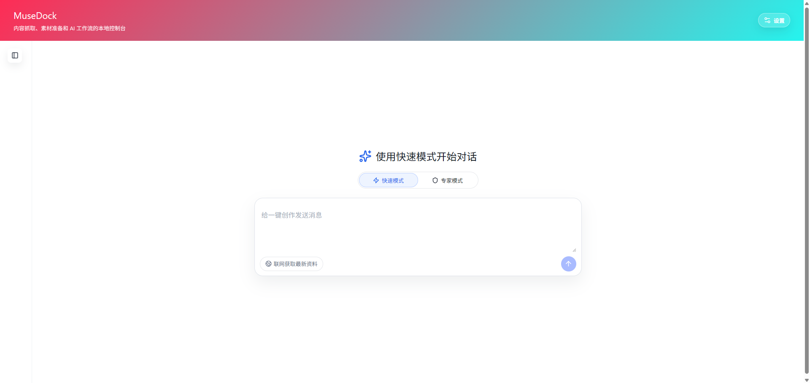
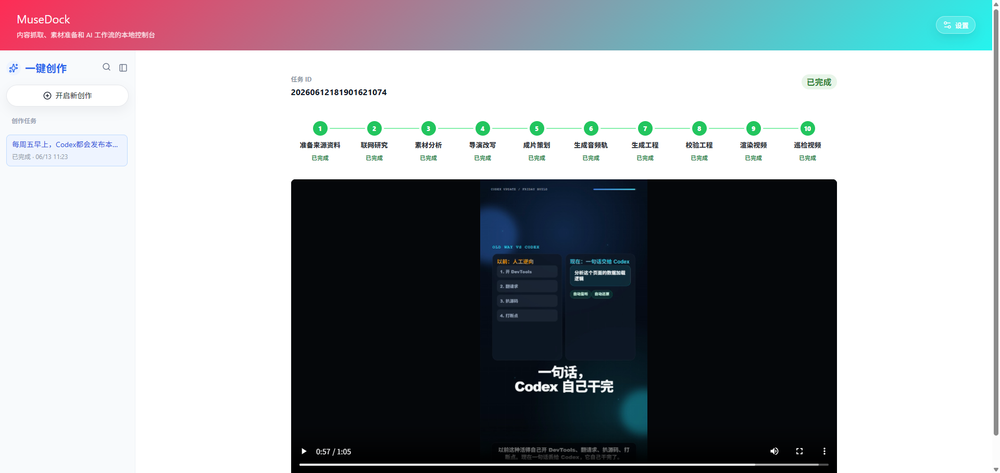

# MuseDock

MuseDock 是一个本地优先的短视频采集、素材准备与 AI 成片工作台。它把抖音/小红书内容抓取、评论缓存、媒体素材处理、音频转写、一键创作任务、导演策划、TTS 口播、HyperFrames 工程生成、工程校验、MP4 渲染和视频质检放在同一个 Web GUI 里，适合把分散的短视频素材沉淀为可复用、可检查、可继续打磨的本地创作资产。

当前主入口是 **一键创作**：在首页用一句话、抖音 ID 或抖音链接创建创作任务；任务创建后进入独立详情路由，页面展示任务状态、横向生成步骤条，并在视频生成完成后直接播放最终 MP4。





## 核心亮点

- **一键创作任务**：从一句创作方向、抖音 ID 或抖音链接开始，自动串联来源准备、联网研究、素材分析、导演改写、成片策划、音频生成、工程生成、校验、渲染和巡检。
- **任务路由化**：创作任务详情使用 `/creative/:workflowId`，创建任务和点击任务列表都会跳转到对应详情页，刷新和分享任务 URL 更自然。
- **横向进度步骤条**：任务详情页用横向步骤条展示十个生成阶段，完成态保留步骤条并在下方直接显示最终视频。
- **本地视频预览**：渲染完成后页面直接显示 MP4 播放器，视频文件由本地 API 提供，不需要离开工作台检查产物。
- **高级成片工作台**：仍保留 `/hyperframes-freeform/:aweme_id/:run_id` 的自由工程编辑能力，可查看导演策划、生成音频轨、编辑 HyperFrames 文件、校验工程、渲染视频和抽帧质检。
- **素材前置链路**：支持抖音扫码登录、关键词搜索、视频 ID/链接抓取、作者主页抓取、评论和二级评论缓存、媒体下载、关键帧抽取与音频转写。
- **本地优先数据**：采集记录、评论、素材、Agent 运行记录、TTS、工程文件、质检报告和渲染产物都保存在本地目录，便于复盘和二次加工。

## 页面与工作流

### 一键创作

一键创作是默认首页：

```text
/creative
/creative/:workflowId
```

推荐流程：

1. 打开 `/creative`，输入视频方向、抖音 ID 或抖音链接。
2. 选择是否“联网获取最新资料”。
3. 提交任务后自动进入 `/creative/:workflowId`。
4. 在任务详情页查看横向步骤条和当前状态。
5. 渲染完成后直接在详情页播放最终视频。
6. 左侧任务列表可重新打开历史创作任务；“开启新创作”会回到 `/creative`。

一键创作阶段：

| 阶段 | 说明 |
| --- | --- |
| 准备来源资料 | 根据文本、抖音 ID 或链接准备创作上下文 |
| 联网研究 | 可选地补充最新资料 |
| 素材分析 | 汇总来源素材和后续生成所需上下文 |
| 导演改写 | 创建导演任务并重写内容方向 |
| 成片策划 | 生成结构化成片策划 |
| 生成音频轨 | 生成 TTS 口播音频 |
| 生成工程 | 生成 HyperFrames 自由工程 |
| 校验工程 | 执行 lint、validate、inspect |
| 渲染视频 | 渲染最终 MP4 |
| 巡检视频 | 抽帧检查最终画面 |

### 高级成片

高级成片工作台适合继续人工打磨工程：

```text
/hyperframes-freeform/:aweme_id
/hyperframes-freeform/:aweme_id/:run_id
```

页面能力：

- 读取素材运行记录和创建 HyperFrames 自由成片记录。
- 查看 AI 生成的导演简报 JSON。
- 生成或复用高级成片 TTS 音频轨。
- 加载、编辑并保存白名单内工程文件，例如 `index.html`、`design.md`、`hyperframes.json`。
- 执行工程校验、视频渲染和抽帧质检。
- 预览生成的 MP4 和质检联系表。

生成文件通常位于：

```text
data/media/douyin/<aweme_id>/agent_runs/<run_id>-hyperframes-freeform/
```

常见产物：

```text
index.html
design.md
hyperframes.json
package.json
meta.json
assets/narration.wav
output.mp4
checks/
inspect/contact_sheet.jpg
```

### 采集与素材

MuseDock 保留完整素材前置链路：

- 抖音扫码登录、关键词搜索、视频 ID/链接抓取、作者主页视频抓取。
- 小红书关键词搜索、笔记详情和历史记录入口。
- 抖音一级评论与二级评论缓存，结果写入本地 SQLite。
- 视频下载、音频抽取、关键帧抽取、素材状态查看。
- 小米 MiMo ASR 音频转写，支持大音频压缩、切片转写和结果合并。

## 技术栈

- 前端：React、React Router、Vite
- UI：Tailwind CSS、本地 shadcn 风格组件、lucide-react
- 后端：Node.js 22、Express
- 数据库：SQLite、better-sqlite3
- 浏览器自动化：Playwright、Chrome CDP
- 媒体处理：ffmpeg、ffprobe、`@ffmpeg-installer/ffmpeg`
- AI 能力：OpenAI-compatible 文字模型、小米 MiMo ASR/TTS
- 视频工程：HyperFrames CLI、HTML/CSS/GSAP

## 环境要求

- Node.js 22
- npm
- Google Chrome
- ffmpeg
- ffprobe

项目在 `package.json#engines` 中约束 Node.js 22。切换 Node 版本后建议重新安装依赖：

```powershell
npm install
```

如果 `better-sqlite3` 出现 ABI 不匹配，可执行：

```powershell
npm rebuild better-sqlite3
```

`ffmpeg` 会优先读取 `FFMPEG_PATH`，其次使用项目依赖内置路径，最后尝试系统 `PATH`。`ffprobe` 用于读取 TTS 分段音频时长，建议安装到系统 `PATH`，或通过 `FFPROBE_PATH` 指定。

## 安装与启动

```powershell
npm install
npm run build:frontend
npm run start
```

启动后打开：

```text
http://localhost:3000
```

开发前端时可单独启动 Vite：

```powershell
npm run dev:frontend
```

Vite 默认地址：

```text
http://localhost:5173
```

## 常用命令

```powershell
# 启动 Express 服务和已构建前端
npm run start

# 启动 Vite 前端开发服务
npm run dev:frontend

# 构建前端
npm run build:frontend

# 运行完整回归测试
npm test
```

常用专项测试：

```powershell
node tests/test-one-click-creative-page.mjs
node tests/test-persistent-routes.mjs
node tests/test-creative-workflows.js
node tests/test-creative-workflow-routes.js
node tests/test-hyperframes-freeform-agent.js
node tests/test-hyperframes-freeform-project.js
node tests/test-hyperframes-freeform-quality.js
node tests/test-hyperframes-studio-page.mjs
```

## 环境变量

| 变量 | 说明 | 默认值 |
| --- | --- | --- |
| `MEDIACRAWLER_DB_PATH` | SQLite 数据库路径 | `data/mediacrawler.db` |
| `OPENAI_API_KEY` | OpenAI-compatible 服务 API Key | 空 |
| `ASR_API_KEY` | ASR 服务 API Key | 空 |
| `ASR_PROVIDER` | ASR 服务提供商，MiMo 填 `mimo` | 空 |
| `MIMO_API_KEY` | 小米 MiMo API Key，未配置时可回退读取 `ASR_API_KEY` | 空 |
| `MIMO_BASE_URL` | 小米 MiMo API Base URL | `https://api.xiaomimimo.com/v1` |
| `MIMO_ASR_MODEL` | 小米 MiMo ASR 模型 ID | `mimo-v2.5-asr` |
| `MIMO_TTS_MODEL` | 小米 MiMo TTS 模型 ID | `mimo-v2.5-tts` |
| `ASR_LANGUAGE` | MiMo ASR 识别语言，支持 `auto`、`zh`、`en` | `auto` |
| `FFMPEG_PATH` | 手动指定 ffmpeg 可执行文件路径 | 空 |
| `FFPROBE_PATH` | 手动指定 ffprobe 可执行文件路径 | 空 |

文字模型按 OpenAI-compatible `POST /chat/completions` 调用。DeepSeek、OpenAI 或自定义兼容服务都可以通过设置页配置供应商、Base URL、模型 ID 和 API Key。

## 本地数据

MuseDock 会在本地生成运行数据：

- `data/mediacrawler.db`：SQLite 数据库
- `data/creative-workflows/`：一键创作任务记录
- `data/media/douyin/<aweme_id>/`：抖音视频素材目录
- `data/media/douyin/<aweme_id>/transcript.json`：音频转写结果
- `data/media/douyin/<aweme_id>/agent_runs/`：高级成片运行结果、TTS 音频、字幕时间轴、HyperFrames 工程、质检报告和 MP4
- `data/config/agent_templates.json`：本地保存的 Agent 模板覆盖配置
- `data/config/ai-models.json`：本地 AI 模型配置
- `chrome-user-data/`：Chrome CDP 使用的本地浏览器数据
- `douyin-cookies.json`：抖音 Cookie 持久化文件

这些文件通常不适合提交到公开仓库。协作或开源前请确认 `.gitignore` 已排除本地数据库、浏览器缓存、Cookie、媒体产物和本地任务记录。

## 目录结构

```text
.
+-- frontend-react/      # React + Vite 前端源码
|   +-- src/pages/       # 页面入口，一键创作页在 OneClickCreativePage.jsx
|   +-- src/components/  # 通用组件和 hyperframes-studio 工作台组件
+-- frontend-dist/       # 前端构建产物
+-- server/              # Express 服务、路由、抓取器和业务服务
|   +-- routes/          # API 路由
|   +-- scraper/         # 抖音、小红书抓取逻辑
|   +-- services/        # 数据存储、媒体处理、AI 配置、Agent、创作任务和视频工程服务
|   +-- resources/       # HyperFrames 技能与提示上下文资源
|   +-- state/           # 运行时 Cookie 状态
+-- data/                # SQLite 数据库、本地媒体素材、本地配置和任务记录
+-- docs/                # 项目文档、截图、计划和交接记录
+-- tests/               # 回归测试脚本
```

## API 概览

### 一键创作

- `POST /api/creative-workflows`：创建一键创作任务
- `GET /api/creative-workflows/:workflow_id`：读取一键创作任务状态和结果

### 高级成片

- `POST /api/agents/douyin/:aweme_id/hyperframes-freeform-runs`：新建高级成片运行记录
- `POST /api/agents/douyin/:aweme_id/runs/:run_id/hyperframes-freeform/brief`：生成导演策划
- `POST /api/agents/douyin/:aweme_id/runs/:run_id/hyperframes-freeform/audio`：生成高级成片音频轨
- `POST /api/agents/douyin/:aweme_id/runs/:run_id/hyperframes-freeform/project`：生成 HyperFrames 自由工程
- `POST /api/agents/douyin/:aweme_id/runs/:run_id/hyperframes-freeform/check`：校验工程
- `POST /api/agents/douyin/:aweme_id/runs/:run_id/hyperframes-freeform/render`：渲染自由工程 MP4
- `POST /api/agents/douyin/:aweme_id/runs/:run_id/hyperframes-freeform/inspect`：执行抽帧质检
- `GET /api/agents/douyin/:aweme_id/runs/:run_id/hyperframes-freeform/files/:file_name`：读取工程文件或视频产物
- `PUT /api/agents/douyin/:aweme_id/runs/:run_id/hyperframes-freeform/files/:file_name`：保存工程文本文件

### 抖音

- `POST /api/douyin/qrcode-login`：启动扫码登录
- `GET /api/douyin/login-status`：检查扫码登录结果
- `GET /api/douyin/check-login`：检查当前登录态
- `GET /api/douyin/search?keyword=...&max=20`：关键词搜索
- `GET /api/douyin/aweme?ids=...`：按视频 ID 或链接抓取详情
- `GET /api/douyin/creator?sec_uid=...&max=20`：抓取作者主页视频
- `GET /api/douyin/comments?aweme_id=...`：抓取评论和二级评论
- `GET /api/douyin/comments/local?aweme_id=...`：读取本地评论缓存

### 素材

- `POST /api/media/douyin/:aweme_id/prepare`：准备视频、音频和关键帧
- `GET /api/media/douyin/:aweme_id/status`：查看素材状态
- `POST /api/media/douyin/:aweme_id/transcribe`：触发音频转写
- `POST /api/media/douyin/:aweme_id/open`：打开素材目录或目标文件
- `GET /api/media/douyin/:aweme_id/tasks`：读取素材任务列表
- `GET /api/media/douyin/:aweme_id/tasks/:task_id`：读取素材任务状态

### AI Agent

- `GET /api/agents/templates`：读取可编辑任务 Agent 模板列表
- `GET /api/agents/templates/:id`：读取单个任务 Agent 模板
- `PUT /api/agents/templates/:id`：保存任务 Agent 模板覆盖配置
- `DELETE /api/agents/templates/:id/override`：恢复任务 Agent 默认配置
- `POST /api/agents/messages/preview`：预览任务 Agent messages
- `POST /api/agents/douyin/:aweme_id/runs`：执行抖音素材的 Agent 任务
- `GET /api/agents/douyin/:aweme_id/runs`：读取素材的 Agent 运行记录
- `GET /api/agents/douyin/:aweme_id/runs/:run_id`：读取单次 Agent 运行详情
- `POST /api/agents/douyin/:aweme_id/runs/:run_id/tts`：生成 TTS 音频和字幕时间轴
- `POST /api/agents/douyin/:aweme_id/runs/:run_id/storyboard`：生成 AI 分镜
- `POST /api/agents/douyin/:aweme_id/runs/:run_id/hyperframes/project`：生成旧版 HyperFrames 视频工程
- `POST /api/agents/douyin/:aweme_id/runs/:run_id/hyperframes/render`：渲染旧版 MP4

### 配置与历史

- `GET /api/history/douyin`：读取抖音抓取记录，并附带素材、转写和评论缓存状态
- `GET /api/history/douyin/keywords`：读取抖音历史关键词
- `DELETE /api/history/douyin`：删除抖音历史记录
- `GET /api/history/xhs`：读取小红书抓取记录
- `GET /api/config/ai-models`：读取 AI 模型配置
- `POST /api/config/ai-models`：保存 AI 模型配置
- `GET /api/config/cookies`：读取 Cookie 配置
- `POST /api/config/cookies`：保存 Cookie 配置

## 测试与验证

完整回归测试：

```powershell
npm test
```

前端发布前请运行：

```powershell
npm run build:frontend
```

一键创作和路由改动建议至少运行：

```powershell
node tests/test-one-click-creative-page.mjs
node tests/test-persistent-routes.mjs
node tests/test-creative-workflows.js
node tests/test-creative-workflow-routes.js
```

## 路线图

- 继续完善一键创作任务详情页的视频预览、失败诊断和任务恢复体验。
- 增加真实任务队列和后端进度推送，替代部分前端轮询与估算状态。
- 增强高级成片页的工程预览、差异检查和版本回退能力。
- 扩展更多高级成片风格预设和可复用 HyperFrames 技能。
- 补齐小红书评论、素材准备和 AI 成片工作流。
- 增加端到端测试、CI 和更清晰的部署文档。

## 免责声明

MuseDock 仅用于学习、研究和本地内容工作流整理。使用者应遵守目标平台的服务条款、robots 协议、版权规则和所在地法律法规。请勿将本项目用于未授权的数据采集、隐私侵犯、批量骚扰或其他不当用途。

## License

MuseDock 基于 [Apache License 2.0](./LICENSE) 开源。
