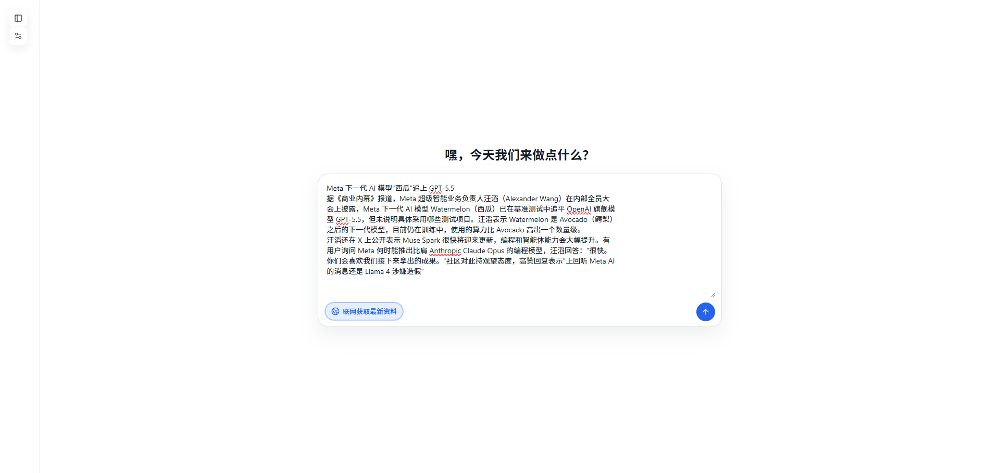
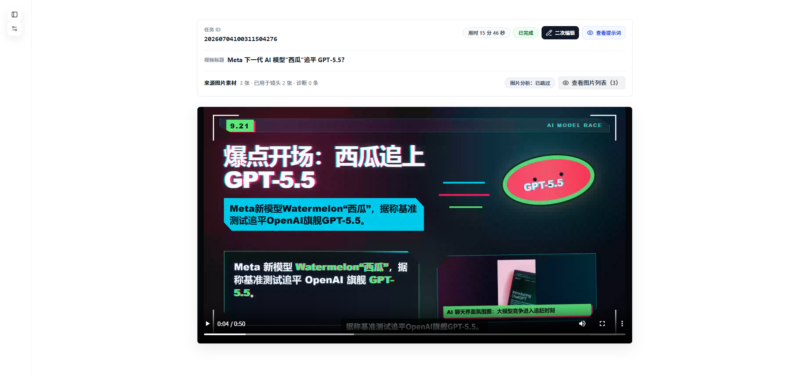
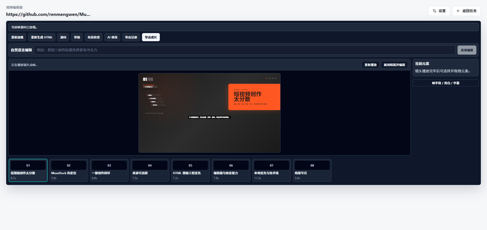

# MuseDock

MuseDock 是一个本地优先的 AI 短视频创作与编辑工作台，支持 **HyperFrames 动态视频** 与 **线稿白板动画** 两种创作模式。可以从选题、文章、GitHub、抖音链接或图片开始组织动态视频，也可以输入主题、正文或 SRT 字幕，制作按叙事顺序连续落墨的手绘动画。

MuseDock 保留**素材来源、制作过程和阶段产物**，方便查看、修改与恢复。HyperFrames 以图片素材为画面主体，用 HTML/CSS/GSAP 完成排版、标注和镜头动效，并提供工程编辑器；线稿白板动画从内容与分镜确认开始，生成完整旁白、场景线稿、落墨动画和最终成片。两种模式都在本机完成视频渲染与合成。

<p align="center">
  
</p>

<table>
  <tr>
    <td width="50%" align="center"><br>任务详情 · 来源追踪与成片预览</td>
    <td width="50%" align="center"><br>html-video 工程编辑器</td>
  </tr>
</table>

## 快速开始

需要 Node.js `>=22 <23`、Google Chrome 和 `ffprobe`。采集与渲染直接复用系统 Chrome，无需下载 Playwright 浏览器；`npm install` 会安装项目使用的 `ffmpeg`，也可以通过环境变量改用本机版本。

```powershell
npm install
npm run dev                        # 打开 http://localhost:5173
```

首次使用先打开设置中心，至少配置一个分析模型；需要配音、图片生成或联网补图时，再分别配置 TTS、图片模型和 Pexels。切换过 Node 版本时，`better-sqlite3` 可能需要执行 `npm rebuild better-sqlite3`。

`ffmpeg` 查找顺序为 `FFMPEG_PATH` → 项目内置 → 系统 `PATH`；`ffprobe` 建议装进 `PATH` 或用 `FFPROBE_PATH` 指定。

使用线稿白板动画时，还需要 Python 3.10+ 和中文字体，并在项目根目录执行 `npm run setup:whiteboard` 初始化独立媒体环境。模型要求和操作步骤见下文[线稿白板动画](#线稿白板动画)。

## 桌面版（Electron）

```powershell
npm run dist   # 产物：dist-electron/MuseDock Setup <version>.exe
```

- 桌面版和浏览器模式共用同一个 Express server：Electron 内部默认跑在 `http://127.0.0.1:38017`（端口被占用时自动换空闲端口），只监听本机回环地址，不对局域网开放；`npm start` 的浏览器模式不受影响，仍默认 `0.0.0.0:3000`。
- 桌面版数据（数据库、Cookie、素材、配置、日志）写入 `%APPDATA%/musedock`，与开发模式的仓库目录互相独立。
- 依赖系统安装的 Google Chrome；ffmpeg 已内置在安装包里。
- 打包时 electron-builder 会把 `node_modules` 里的 `better-sqlite3` 原地换成 Electron ABI，`postdist` 钩子会自动 `npm rebuild better-sqlite3` 恢复；打包前先停掉本地 server，否则文件占用会导致 EPERM 失败。
- `npm run electron`（开发壳）直接用本地 node_modules（node ABI），触发抖音数据存储时会报 ABI 错误；需要时先 `npx electron-rebuild -w better-sqlite3`，用完 `npm rebuild better-sqlite3` 恢复。

## 主要入口

```text
/creative              # 选择创作模式并新建任务（根路径跳转到这里）
/creative/:workflowId  # 任务详情、进度、恢复建议和结果预览
/editor/:workflowId    # HyperFrames HTML 视频工程编辑器
/settings              # 模型、创作默认值、系统检查和数据清理
```

## 创作模式

在 `/creative` 首页选择创作模式，再填写对应的输入和制作设置。

| 模式 | 支持输入 | 制作方式与结果 |
| --- | --- | --- |
| **HyperFrames 动态视频** | 选题、文章/公众号/GitHub/抖音链接、图片 | 自动整理来源与素材，生成配音、动态镜头和可继续编辑的 HTML 视频工程。 |
| **线稿白板动画** | 主题、正文、带时间轴的 SRT 字幕 | 确认内容与分镜后，逐幕生成线稿与连续落墨动画，在任务详情中审阅、播放并下载成片。 |

## 核心能力

- **从材料开始创作**：HyperFrames 支持选题文本、文章/公众号/GitHub/抖音链接，以及 PNG、JPEG、WebP 图片上传；上传图片可以标记为“必须使用”。白板模式支持主题生成、正文保留或润色，以及 SRT 字幕输入。
- **来源与研究分开管理**：原始来源负责事实依据，联网研究负责补充最新信息；文章和 GitHub 图片可进入素材池，Pexels 只作视觉补充，不冒充来源证据。
- **素材主导的画面规划**：HyperFrames 走 `asset_first` 链路，按“来源图 → 生成图 → 补充图”的语义选择素材；支持单图主视觉、多图接力镜头、主体焦点分析，以及平移、缩放等确定性镜头运动。
- **可编辑的 HTML 视频工程**：HyperFrames 的每个镜头保留视觉计划、HTML 帧、旁白、字幕、音效、时间轴和质检结果；可在 `/editor` 修改文案与位置、运行布局质检、让 AI 改帧并重新导出。
- **连续落墨的白板动画**：提供六种暖米黄纸底视觉模板，支持横屏、竖屏、画笔显隐和字幕烧录；从完整旁白、线稿、落墨编排到单幕与最终视频，均可查看阶段产物并确认后继续。
- **自动音效增强**：HyperFrames 生成时可按分镜、字幕和画面语义从本地 `assets/sfx` 白名单自动编排短音效，导出时由 ffmpeg 混入最终音轨；编辑器里可查看并删除单条音效，编排或混音失败会降级为无音效成片。
- **长任务可观察、可恢复**：前端按创作模式实时显示阶段进度、产物与待确认事项；失败后可复用仍有效的已完成产物，从可恢复阶段继续。
- **数据默认留在本地**：任务、模型配置、Cookie、素材、音频、工程和导出文件默认写入本地目录；仅在调用已配置的模型、研究、素材或来源服务时发送相应请求。

## HTML 视频工程（HyperFrames）

HyperFrames 模式适合以素材编排、排版标注和动态镜头为主的视频。AI 负责内容结构与 HTML/CSS/GSAP 画面，确定性代码负责素材绑定、图片接力、焦点镜头、字幕时间窗、画布校验、渲染和合成。

```text
选题 / 链接 / 图片
  -> 来源准备与联网研究
  -> 素材提取、分析与可选生图
  -> 成片策划、旁白与分镜
  -> 视觉计划、素材绑定与焦点镜头
  -> HTML/CSS/GSAP 帧 + TTS / 字幕 / 自动音效
  -> 系统 Chrome 渲染 -> ffmpeg 合成
  -> 时长、素材使用与画面质检 -> 导出
```

`project.output.resolution` 是输出画幅的权威来源，生成 HTML 必须带 `data-hv-canvas`、`data-width`、`data-height` 画布契约。

## 线稿白板动画

白板模式以暖米黄纸张为画布，按旁白和分镜顺序逐步绘出内容，适合知识讲解、人物故事、文化叙事与流程说明。它使用独立的 Python 绘制核心和 `ffmpeg` 渲染，在任务详情页管理方案、场景与媒体产物。

首次使用先安装 Python 3.10+，然后在项目根目录执行：

```powershell
npm run setup:whiteboard
```

命令会在应用数据目录的 `data/runtime/whiteboard/` 创建独立 Python 环境，并安装固定版本的 NumPy、OpenCV 和 Pillow。还需确保 `ffmpeg`、`ffprobe` 和中文字体可用；Windows 默认使用微软雅黑，其他环境可通过 `MUSEDOCK_WHITEBOARD_FONT` 指定字体文件。

使用步骤：

1. 在设置中心配置**图片生成模型**和**支持图片输入的分析模型**。启用旁白时，TTS 选择 **豆包或 MiniMax**，白板字幕使用同次语音生成返回的原生时间信息。
2. 在创作首页选择“线稿白板动画”，输入主题、正文或粘贴 SRT。正文可以选择“保留原文，仅安排分镜”或“保留事实，润色口播”。
3. 选择画幅、旁白语言、视觉模板以及画笔、字幕和后续确认方式，点击“启动白板创作 Agent”。
4. 在任务详情中检查正文、全部分镜与制作设置，可通过对话提出修改意见；确认后点击“确认并开始制作视频”，也可先“仅确认，稍后制作”。
5. 在产物区试听旁白、查看线稿与落墨预览、播放单幕和最终视频，并按所选确认方式推进后续制作。

```text
主题 / 正文 / SRT
  -> 内容与分镜 -> 用户确认内容与制作方案
  -> 完整旁白与字幕 / 无旁白的计划时间轴或 SRT 时间轴
  -> 逐幕线稿 -> 落墨编排 -> 单幕动画
  -> 最终合成与检查 -> 预览和下载
```

- **画幅与语言**：支持横屏 `16:9`（1920×1080）、竖屏 `9:16`（1080×1920），以及简体中文、美国英语、英国英语旁白；画幅在创建任务时确定。
- **六种视觉模板**：暖米黄极简粗线、暖米黄铅笔素描、粗线扁平国风、清新治愈手账、复古报纸拼贴、漫画墨线解释。
- **制作设置**：可显示或隐藏画笔、开启或关闭字幕烧录，独立选择旁白与 BGM；图片逐幕独立生成。
- **确认方式**：默认“由我逐阶段确认”，也可选择“授权 AI 在允许范围内推进”。首次内容与制作方案仍须用户确认；自动推进时按阶段执行技术检查或视觉审阅，未通过则等待用户处理。
- **旁白与静音**：主题、正文和 SRT 均可选择“不使用旁白”，无需配置 TTS。主题与正文按已确认的目标时长和文本长度安排字幕与分镜；SRT 保留输入时间轴。无旁白时可单独开启 BGM，两者都关闭即为完全静音。豆包完整旁白支持 120 秒以内方案。

最终视频为 60 fps 的 H.264 MP4；启用旁白时同时提供完整 WAV 音频和 SRT 字幕。任务详情还可下载线稿、落墨标注 JSON 与单幕视频。修改方案或指定幕后，系统重新检查受影响的产物，复用仍有效的上游结果。

更详细的语音配置、环境说明和恢复方式见[白板制作说明](./server/resources/whiteboard/README.md)。

## 当前边界

- 项目仍处于早期开发阶段，两种创作模式共用 `/creative` 入口；白板产物在任务详情中管理，HTML 工程编辑器 `/editor/:workflowId` 用于 HyperFrames。
- 不是通用爬虫控制台，采集只服务短视频创作任务。
- 文章/GitHub 来源只处理正文和图片，不做任意网页截图，也不提取网页里的视频。
- 视频不是纯离线生成：调用分析模型、图片模型、TTS、联网研究、Pexels 或来源平台时，仍受对应服务配置、网络和配额限制。
- HyperFrames 渲染使用系统 Chrome；两种模式均依赖 `ffmpeg` 和 `ffprobe`，白板模式另需 Python 媒体环境与字体。缺失时相关烟测或导出会跳过或失败。

## 技术栈

React 19 + React Router 7 + Vite 8、Tailwind CSS + shadcn/ui；Node.js 22 + Express；SQLite/better-sqlite3 + 本地 JSON；HyperFrames 使用 HTML/CSS/GSAP + playwright-core（驱动系统 Chrome），白板使用 Python + NumPy/OpenCV/Pillow，两者共用 ffmpeg/ffprobe；Electron 桌面壳；OpenAI Responses / Anthropic Messages 分析模型，小米 MiMo ASR/TTS 与白板使用的豆包/MiniMax TTS。

## 常用命令

```powershell
npm run dev            # 后端 + Vite 前端
npm run dev:frontend   # 只启动前端开发服务
npm run build:frontend # 构建前端产物到 frontend-dist
npm run start          # 启动后端并托管 frontend-dist（http://localhost:3000）
npm run electron       # 用 Electron 壳跑本地代码（需先 build:frontend）
npm run dist           # 打包 Windows 安装包到 dist-electron/
npm run setup:whiteboard # 初始化白板动画 Python 媒体环境
npm test               # 完整测试
npm run test:filter -- creative-workflows  # 按文件名过滤测试
```

真实渲染烟测默认跳过，需本机装好 Chromium/ffmpeg/ffprobe 后显式开启：

```powershell
$env:RUN_HTML_VIDEO_REAL_RENDER='1'
node tests/test-html-video-vertical-mvp-smoke.js
node tests/test-html-video-real-render-smoke.js
```

## 质量评测闭环

固定选题集批量跑一键创作，自动指标（时长偏差、抽帧视觉质检）+ 视觉模型看抽帧拼图打分，输出单次报告和跨 run 曲线，用来度量每次 prompt / 规则改动对成片质量的影响：

```powershell
npm run dev                                        # 先启动后端
npm run eval:quality -- --label baseline           # 全量跑（选题集见 scripts/quality-eval/topics.json）
npm run eval:quality -- --filter howto-sleep       # 只跑部分选题
npm run eval:quality -- --rescore baseline         # 不重新生成，只重新打分出报告
```

结果写入 `data/quality-eval/<label>/report.md`，跨 run 曲线在 `data/quality-eval/history.md`。同标签重跑会跳过已完成选题（断点续跑）；视觉打分复用设置中心的分析模型（需支持图片输入），不可用时自动降级为纯自动指标。

## 重要环境变量

模型、ASR/TTS、Pexels 补图这些**优先在设置中心（`/settings`）配置**，会写入本地 `data/config/`。分析模型仅支持 OpenAI Responses（`/v1/responses`）和 Anthropic Messages（`/v1/messages`）协议；OpenAI-compatible Chat Completions 网关不再作为分析模型入口。下面这些没有界面入口，只能用环境变量控制：

| 变量 | 说明 | 默认值 |
| --- | --- | --- |
| `MEDIACRAWLER_DB_PATH` | SQLite 数据库路径 | `data/mediacrawler.db` |
| `MUSEDOCK_DATA_DIR` | 所有可写数据（DB/Cookie/素材/配置）的根目录，Electron 打包后指向 `%APPDATA%/musedock` | 仓库根目录 |
| `MUSEDOCK_PORT` | 后端监听端口 | `3000`（Electron 内默认 `38017`，被占用自动换） |
| `MUSEDOCK_HOST` | 后端监听地址 | `0.0.0.0`（Electron 内为 `127.0.0.1`） |
| `ASR_LANGUAGE` | MiMo ASR 识别语言，支持 `auto`、`zh`、`en` | `auto` |
| `FFMPEG_PATH` | 手动指定 ffmpeg 可执行文件路径 | 空 |
| `FFPROBE_PATH` | 手动指定 ffprobe 可执行文件路径 | 空 |
| `MUSEDOCK_PYTHON` | 首次执行 `setup:whiteboard` 时用于创建虚拟环境的 Python 3.10+ 解释器 | `python` |
| `MUSEDOCK_WHITEBOARD_PYTHON` | 白板运行时使用的 Python 解释器，需已安装白板依赖 | 应用数据目录中的 `data/runtime/whiteboard/` 虚拟环境 |
| `MUSEDOCK_WHITEBOARD_FONT` | 白板绘制与字幕使用的字体文件路径 | Windows：微软雅黑；其他平台：NotoSansCJK-Regular.ttc |
| `RUN_HTML_VIDEO_REAL_RENDER` | 设置为 `1` 时运行真实渲染烟测 | 空 |

> headless / CI 等无界面场景，也可以用环境变量直接提供凭据：`OPENAI_API_KEY`、`ASR_API_KEY`、`ASR_PROVIDER`、`MIMO_API_KEY`、`MIMO_BASE_URL`、`MIMO_ASR_MODEL`、`MIMO_TTS_MODEL`、`PEXELS_API_KEY`（或 `PEXELS_API_KEYS`）。它们仅在设置中心对应项为空时作为回退生效。

## 目录结构

```text
frontend-react/   # React + Vite 前端（pages / components / api）
server/           # Express 服务：routes / services / templates / resources / scraper
server/resources/whiteboard/ # 白板视觉模板、Python 绘制核心、依赖与制作说明
electron/         # Electron 主进程（桌面壳，复用 server）
assets/sfx/       # 自动音效增强使用的本地短音效白名单与素材
data/             # 本地数据库、配置（config/）、任务和素材（media/）
tests/            # Node assert 测试脚本
```

运行时会生成 `data/mediacrawler.db`、`chrome-user-data/`、`douyin-cookies.json`、`frontend-dist/` 等本地数据，注意别提交到公开仓库。

## 开发与协作

日常开发在 `dev` 分支进行，面向用户文案用中文，通用控件优先 shadcn/ui。完整规则见 [AGENTS.md](./AGENTS.md)。

## 使用须知

本项目仅供个人学习、研究和已获授权范围内的内容创作。使用采集能力时请遵守目标平台服务条款和当地法律法规，只采集你有权访问的内容，不要用于大规模抓取或商业化倒卖；因使用本项目产生的后果由使用者自行承担。

## 友情链接

[Linux.Do](https://linux.do/) — 技术氛围浓厚的开源社区，欢迎大家加入。

## License

MuseDock 基于 [Apache License 2.0](./LICENSE) 开源。
