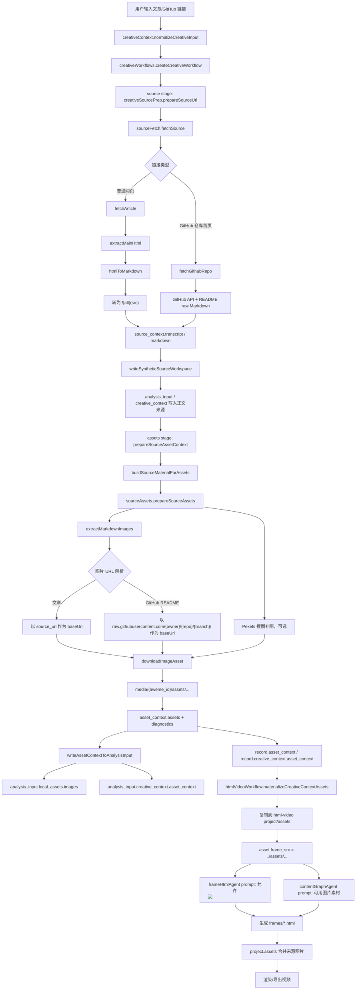

# 文章/GitHub 来源图片素材产品化分析

日期：2026-07-02

## 结论

当前项目已经有一条从文章/GitHub 链接提取 Markdown 图片、下载到本地、写入 `asset_context`、复制进 html-video 工程并暴露给 AI 的链路。问题不在“完全没有提取图片”，而在这条链路还没有变成用户可见、可追踪、可质检的产品能力。

最小产品化方向是：复用现有 `asset_context`，在 API/UI 层补一个稳定的 `asset_manifest` 视图；任务详情页展示素材准备结果；渲染后扫描最终 HTML 是否引用了来源图片；先做软性质量提示，再按模式逐步升级为门禁。不要重写 Markdown 图片提取，不要优先做网页截图，也不要把普通文章/GitHub 图片素材和抖音视频素材混为一条链路。

## 现有实际流程图



## 已做到什么

### 来源抓取

- `server/services/source/sourceFetch.js` 已有 `fetchSource`，会把 URL 分类为普通文章或 GitHub 仓库。
- 普通文章走 `fetchArticle`，读取 HTML 后通过 `extractMainHtml` 和 `htmlToMarkdown` 生成 Markdown。
- `htmlToMarkdown` 和 `inlineToMarkdown` 已把 `` 转成 Markdown 图片语法 ``。
- GitHub 仓库走 `fetchGithubRepo`，读取仓库元信息、顶层目录和 README raw Markdown；README 内原有 Markdown 图片会保留下来。
- GitHub 只支持仓库首页，不支持分支、目录、文件页；代码里会返回“不支持指定 GitHub 分支、目录或文件”的中文提示。

### 图片提取与下载

- `server/services/source/sourceAssets.js` 已有 `extractMarkdownImages`，可从 Markdown 提取图片，去重，并解析相对 URL。
- 普通文章图片以文章 URL 作为 base URL 解析。
- GitHub README 相对图片会通过 `githubRawBaseUrl` 解析到 `raw.githubusercontent.com/{owner}/{repo}/{branch}/...`。
- `downloadImageAsset` 已下载图片到本地 `assets` 目录，并生成 `id/type/source/url/path/local_path/alt/mime/bytes/title/attribution` 等字段。
- 下载有基础安全保护：拒绝 `data/blob/file/javascript`、本机/内网地址、DNS 解析到内网、超大图片、非图片内容和 SVG。
- `prepareSourceAssets` 默认最多取 6 张文章图片，文章图不足时可通过 Pexels 补 3 张搜索图。
- 如果文章图片都下载失败，且之前还没跑过搜索，会再尝试搜索补图。
- 失败原因会进入 `diagnostics`，例如下载失败、未配置 `PEXELS_API_KEY`、图片过大、内网地址等。

### 写入创作上下文

- `server/services/creative/creativeSourcePrep.js` 的 `prepareSourceAssetContext` 已在非抖音来源上调用 `prepareSourceAssets`。
- `buildSourceMaterialForAssets` 会从 `source_context` 或文本输入构造图片提取所需的 `kind/url/title/description/markdown/metadata`。
- `writeAssetContextToAnalysisInput` 会把图片路径写入：
  - `analysis_input.local_assets.images`
  - `analysis_input.local_assets.source_assets`
  - `analysis_input.creative_context.asset_context`
- 同时也会更新：
  - `record.asset_context`
  - `record.creative_context.asset_context`
- `creativeWorkflows.createWorkflowSummary` 会把 `asset_context` 返回给任务查询结果。

### 工作流阶段

- `server/services/creative/creativeWorkflows.js` 已有 `assets` 阶段，位于 `research` 之后、`agent_run` 之前。
- `assets` 阶段会调用 `prepareSourceAssetContext`。
- 抖音来源会跳过图片补图，返回“抖音来源已使用原视频素材，跳过图片补图。”这和文章/GitHub 图片链路是两回事。

### html-video 工程接入

- `server/services/creative-video/html-video/htmlVideoWorkflow.js` 的 `materializeCreativeContextAssets` 会把 `creative_context.asset_context.assets` 复制到 html-video 工程的 `assets` 目录。
- 复制成功后会把素材改写为工程内路径：
  - `path: assets/xxx`
  - `frame_src: ../assets/xxx`
- `projectAssetsFromCreativeContext` 会把这些素材合并进 `project.assets`，让工程层也有资产记录。

### AI prompt 暴露

- `contentGraphAgent.summarizeCreativeContextForPrompt` 会把最多 8 张可用图片素材写进 prompt，格式包含图片说明、来源和 `HTML引用=...`。
- `contentGraphAgent` 明确告诉模型：图片可用于来源证据、截图展示或解释效果；优先 article 来源；Pexels/search 只做补充；不要纯图片轮播；含文字截图用 `object-fit: contain`。
- `frameHtmlAgent` 明确允许 ``，禁止外链图片 URL。
- `frameHtmlAgent` 也要求文章截图或含文字图片完整展示，使用 `object-fit: contain`，不要裁成不可读背景。
- `creativeSpecAgent` 也已经提示 `creativeContext.asset_context.assets` 是可用图片素材清单，并要求不要硬塞图片、不要纯图片轮播。

### 测试覆盖

- `tests/test-source-assets.js` 覆盖 Markdown 图片提取、相对 URL 解析、下载、Pexels 补图、缺少 Pexels key、内网拒绝、重定向拒绝、大小限制、AVIF 扩展名、GitHub README 相对图片 raw URL、文章图全失败后的搜索 fallback。
- `tests/test-creative-workflows.js` 覆盖 source_url 工作流中 `asset_context` 写入 `analysis_input.creative_context.asset_context` 和 `analysis_input.local_assets.images`。
- `tests/test-source-grounding-prompts.js` 覆盖 scene spec/content graph prompt 中来源事实约束和可用图片素材提示。
- `tests/test-html-video-frame-html-agent.js` 覆盖 frame HTML prompt 中可用图片、禁止外链图片、`object-fit: contain` 和不要纯图片轮播等规则。

## 还没做到什么

### 还没有稳定的 `asset_manifest` 产品产物

当前 `asset_context` 已经能承载素材状态，但更像内部上下文，不像一个面向用户和质量检查的正式 artifact。

缺口包括：

- 没有独立、稳定、可版本化的 `asset_manifest` 或 manifest 视图。
- 没有明确区分“候选图片”“下载成功图片”“下载失败图片”“进入工程图片”“最终被使用图片”。
- 下载失败目前主要在 `diagnostics` 里，UI 不容易按素材粒度展示。
- 图片没有宽高、预览 URL、是否透明、是否动图、是否截图/文章图/图库图等更适合产品展示的字段。

### 用户界面基本看不到这条链路

`frontend-react/src/components/creative/CreativeTaskDetail.jsx` 当前主要展示任务状态、进度、恢复建议、视频预览和继续编辑入口，没有展示 `workflow.asset_context`。

编辑器侧也没有明显读取 `project.assets` 或 `asset_context` 来展示来源图片、下载失败、被使用/未使用状态。

所以即使后端准备了图片，用户也很可能不知道系统已经做过这些事。

### 最终视频不保证一定使用来源图片

现在图片进入 prompt 和工程，但使用权交给模型：

- content graph 说“适合时优先使用”“不适合当前叙事时可以不用”。
- frame HTML prompt 说“本帧内容适合引用时，可以使用”。
- 没有渲染后扫描最终帧 HTML 是否引用了 `../assets/...`。
- 没有统计每张素材使用了几次、在哪些帧使用。
- 没有“文章/GitHub 来源至少使用 1-2 张有效图片”的硬性验收。

因此当前状态是：AI 可用，但不一定用。

### 普通文章/GitHub 没有视频素材提取

文章/GitHub `source_url` 当前只走正文和图片素材：

- 不下载网页里的 `<video>`。
- 不提取 GitHub README 中的视频链接或演示视频。
- 不抽帧。
- 不做任意网页截图。

抖音来源的视频下载、抽音频、抽帧、转写是另一条 `mediaPipeline.prepareDouyinMedia` 链路，不应和文章/GitHub 图片素材混为一谈。

### HTML 图片提取仍是基础版

当前 `` 转 Markdown 只取 `src` 和 `alt`，足够撑起现有链路，但不是完整网页图片抽取器。可能漏掉：

- 懒加载字段：`data-src`、`data-original`、`data-lazy-src`。
- `srcset` 中更高质量图片。
- CSS background image。
- 被登录、反爬、动态渲染隐藏的图片。

这些不是当前最小闭环的优先项。先把已经能提取的图片展示、追踪和质检起来。

## 为什么用户会感觉图片没被用上

按现有代码判断，最常见原因不是“没提取”，而是以下几类：

1. 图片已提取、已下载、已传给 AI、已复制到工程，但模型没选择使用。  
   这是最可能的情况。prompt 允许不用，且没有使用门禁。

2. 图片提取到了候选，但下载失败。  
   失败会进入 `asset_context.diagnostics`，但 UI 没展示，用户只会看到成片没图。

3. 文章 HTML 图片不是标准 `` 或 GitHub README 图片路径不适合 raw 解析。  
   现有提取器不覆盖懒加载、`srcset`、CSS 背景图和动态渲染。

4. Pexels 未配置或搜索补图为空。  
   缺少 `PEXELS_API_KEY` 不会让任务失败，只会跳过补图并写 diagnostics。

5. 图片复制进 html-video 工程失败。  
   `materializeCreativeContextAssets` 只有源文件存在时才复制，复制失败会跳过该素材；目前没有把“进入工程失败”做成显眼状态。

6. 任务详情页/编辑器不展示素材状态。  
   用户看不到“已准备 N 张”“哪些失败”“哪些最终被用”，自然会把体验理解成“图片能力没生效”。

## 关于旧文案“图片素材将在下一阶段开放”

这句文案仍存在于：

- `server/services/creative/creativeContext.js`
- `server/services/creative/creativeWorkflows.js`
- 旧设计/计划文档
- 相关测试断言

它的真实含义是：手动传入 `assetIds` 的上传/选择入口尚未开放。它不代表文章/GitHub 自动提取图片没做。

但这句对用户会误导，因为现在系统确实已经有自动来源图片管线。建议改成更精确的表达：

```text
暂不支持手动选择图片素材；文章或 GitHub 链接中的图片会自动尝试提取。
```

如果是在接口校验失败里，可以更短：

```text
暂不支持手动传入 assetIds，请先移除手动素材后重试。文章/GitHub 链接图片会自动提取。
```

这不是第一优先级代码改动，但应作为文案修正进入最小闭环。

## 最小产品化方案

### 1. 保留 `asset_context`，增加 `asset_manifest` 视图

不建议立刻大改底层字段名。`asset_context` 已被工作流、analysis input、prompt 和测试使用，直接重命名会制造无用迁移。

更小的做法：

- 后端继续写 `asset_context`。
- 在任务详情 API 或前端 selector 中派生 `asset_manifest`。
- 后续如果要落盘，再把 manifest 作为 `asset_context.manifest` 或单独 `asset_manifest.json`。

建议 manifest 视图字段：

```json
{
  "status": "ready",
  "summary": "已准备 3 张图片素材。",
  "items": [
    {
      "id": "article_01",
      "type": "image",
      "source": "article",
      "label": "架构图",
      "original_url": "https://example.com/arch.png",
      "local_path": ".../assets/article-image-01.png",
      "project_path": "assets/article-image-01.png",
      "frame_src": "../assets/article-image-01.png",
      "mime": "image/png",
      "bytes": 12345,
      "status": "ready",
      "used": false,
      "used_in_frames": []
    }
  ],
  "failures": [
    {
      "url": "https://example.com/bad.png",
      "stage": "download",
      "message": "图片下载失败：HTTP 404"
    }
  ],
  "search": {
    "success": false,
    "skipped": true,
    "message": "未配置 PEXELS_API_KEY，已跳过 AI 搜图补图。"
  }
}
```

第一版不用补宽高和缩略图生成；用现有 `local_path/path/url/alt/diagnostics/search` 就能搭起展示。

### 2. 任务详情页展示素材准备结果

在 `CreativeTaskDetail` 里加一个轻量“来源图片素材”区块即可，不需要编辑器大改。

建议展示：

- 状态：未准备 / 已准备 N 张 / 未发现可用图片 / 部分失败。
- 图片缩略图：优先展示下载成功的本地工程资源或后端预览 URL。
- 来源标签：文章图片、GitHub README 图片、Pexels 补图。
- alt/title：作为图片说明。
- 下载失败：折叠展示 URL 和中文失败原因。
- 搜图状态：未配置 Pexels、已跳过、搜索失败、补图 N 张。

用户视角文案示例：

```text
已从来源中准备 3 张图片素材，其中 2 张来自文章，1 张来自 Pexels 补图。
有 1 张图片下载失败：远端返回 HTTP 404。
```

### 3. 编辑器展示“工程素材”和使用状态

编辑器里可以先只读展示，不做素材管理：

- 左侧或属性面板增加“来源素材”分组。
- 展示进入 `project.assets` 的图片。
- 标记“已用于 2 个镜头 / 未使用”。
- 点击素材可以定位到引用它的帧；未使用则只提示“本次生成未引用”。

这一步的核心不是让用户手动拖拽素材，而是让用户知道系统有没有用上来源图片。

### 4. 渲染后扫描最终 HTML 的素材引用

最小实现不需要视觉识别。扫描项目帧 HTML 即可：

- 遍历 `project.frames[].html_path` 或 `frames/*.html`。
- 对每个 `asset_context.assets[].frame_src/path` 做字符串匹配。
- 同时匹配 URL 编码和相对路径变体。
- 生成 `used_in_frames`、`usage_count`、`unused_assets`。
- 写回 workflow result 的 `asset_manifest` 或 `asset_usage_report`。

这能回答“AI 到底有没有用图”。先扫 HTML，不需要扫最终 mp4。

### 5. 质量门禁先软后硬

不建议第一版就把“没用图片”作为全局失败条件。原因：

- 有些文章确实没有可读图片。
- GitHub README 里的 badge/logo 可能不适合成片。
- 现有 prompt 明确允许“不适合当前叙事时不用”。
- 直接硬失败会让成功率下降，但用户未必知道怎么修。

推荐分级：

第一阶段：软提示。

```text
系统已准备 4 张来源图片，但最终镜头未引用。建议在编辑器中加入来源截图或重新生成图文证据帧。
```

第二阶段：按模式启用质量建议。

- source_url + article/GitHub + `asset_context.status=ready` + article 来源图片 >= 1
- 如果最终 0 引用，标记 `warning`，不阻断导出。

第三阶段：只对明确承诺“来源图片/图文证据”的模板或模式做硬门禁。

- 例如未来“文章解读图文视频”“口播模式 + 来源图片浮层”。
- 规则可设为至少使用 1 张 article 图片；长视频可建议 2 张。
- Pexels/search 图片不应满足“来源证据”硬门禁，只能算补充视觉。

## 推荐落地顺序

1. 文档化现有能力。  
   先把“已实现链路”和“不保证使用”的边界写清楚，避免重复实现 Markdown 图片提取。

2. UI 展示素材。  
   任务详情页读取现有 `asset_context`，展示已提取图片、失败 diagnostics、Pexels 状态。最少改动，用户立刻能感知能力存在。

3. 使用追踪。  
   渲染后扫描 frame HTML，生成 `asset_usage_report` 或派生到 `asset_manifest.items[].used/used_in_frames`。

4. 质量门禁。  
   先做 warning，不阻断；稳定后再对承诺使用来源图片的模式启用硬门禁。

5. 再考虑图片提取增强。  
   根据真实失败案例补 `data-src/srcset` 等，不要一开始做大而全网页解析。

6. 最后再考虑截图/视频素材提取。  
   普通文章/GitHub 的网页截图、README 视频、demo GIF/video 解析都应排在素材可见性和使用追踪之后。抖音视频素材准备继续保持独立链路。

## 不建议做的事

- 不要把 OpenMontage 代码或 schema 直接搬进来。
- 不要重写 `extractMarkdownImages`。
- 不要把 `asset_context` 大规模重命名为 `asset_manifest`。
- 不要第一步做任意网页截图。
- 不要把 Pexels 补图当成来源证据。
- 不要把文章/GitHub 图片素材和抖音视频下载、抽帧、转写混成同一个概念。
- 不要在用户看不到素材状态前就做复杂素材管理器。

## 最小闭环定义

一个足够小、但产品上完整的闭环应该是：

```text
用户输入文章/GitHub 链接
-> 系统读取正文和 Markdown 图片
-> 下载成功/失败都进入 asset_context
-> 任务详情页展示图片素材和失败原因
-> html-video 生成时仍按现有 prompt 使用素材
-> 渲染后扫描 HTML，标记哪些图片被使用
-> 若完全未使用，给出中文 warning 和可操作建议
```

这样不增加新依赖，不改主链路，不重新实现提取器，但能把已有能力从“后台暗线”变成“可见、可审计、可逐步质检”的产品能力。
