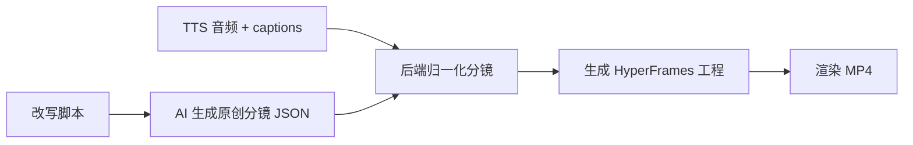

# HyperFrames AI Storyboard Video Implementation Plan

> **For agentic workers:** REQUIRED SUB-SKILL: Use superpowers:subagent-driven-development (recommended) or superpowers:executing-plans to implement this plan task-by-task. Steps use checkbox (`- [ ]`) syntax for tracking.

**Goal:** Build an AI storyboard video flow that turns `rewrite_script`, `tts.wav`, and `tts.captions` into an original HyperFrames MP4 without reusing source video visuals.

**Architecture:** AI generates only visual storyboard intent and maps scenes to `caption_indexes`; it must not generate `start` or `end` times. The backend normalizes storyboard scenes against `tts.captions`, computes all scene timing from captions, writes a HyperFrames project, then renders MP4 with `npx hyperframes render`.

**Tech Stack:** Node.js 22, Express, existing `aiTextModel`, existing `agentRuns`, existing `tts.captions`, HyperFrames CLI, React AI 工作台.

---

## Supersedes

This plan supersedes:

```text
docs/superpowers/plans/2026-06-09-hyperframes-original-caption-video.md
```

The old plan intentionally skipped AI storyboard generation. This upgraded plan adds AI storyboard generation while keeping one hard boundary:

```text
AI decides what to show.
tts.captions decides when it shows.
```

## Non-Goals

- Do not use original video, original video frames, downloaded keyframes, or screenshots as final video visuals.
- Do not let AI output final `start`, `end`, or `duration`.
- Do not implement image generation yet.
- Do not build a visual editor.
- Do not implement word-level subtitle highlighting yet.
- Do not change the existing crawl, media prepare, ASR, rewrite, or TTS flows except to consume their outputs.

## Target Flow



User-visible flow in AI 工作台:

1. Run `爆款拆解 + 改写脚本`.
2. Click `TTS 合成`.
3. Confirm `TTS 音频` and subtitle timeline appear.
4. Click `生成 AI 分镜`.
5. Click `生成视频工程`.
6. Click `渲染 MP4`.

## Target Data Shape

AI raw storyboard, saved for traceability:

```json
{
  "template": "ai_storyboard_cards",
  "style": {
    "visual_tone": "冷静、专业、有信息密度",
    "palette": ["#101216", "#fe2c55", "#25f4ee"],
    "motion": "轻微推进、重点词弹出"
  },
  "scenes": [
    {
      "index": 1,
      "caption_indexes": [1, 2],
      "headline": "第一秒先抓住冲突",
      "visual_type": "text_card",
      "layout": "center_focus",
      "background_prompt": "原创抽象科技感背景，不包含原视频画面",
      "emphasis_words": ["冲突", "第一秒"]
    }
  ]
}
```

Normalized storyboard, consumed by HyperFrames:

```json
{
  "template": "ai_storyboard_cards",
  "status": "done",
  "style": {
    "visual_tone": "冷静、专业、有信息密度",
    "palette": ["#101216", "#fe2c55", "#25f4ee"],
    "motion": "轻微推进、重点词弹出"
  },
  "scenes": [
    {
      "index": 1,
      "caption_indexes": [1, 2],
      "start": 0,
      "end": 3.75,
      "duration": 3.75,
      "headline": "第一秒先抓住冲突",
      "visual_type": "text_card",
      "layout": "center_focus",
      "background_prompt": "原创抽象科技感背景，不包含原视频画面",
      "emphasis_words": ["冲突", "第一秒"],
      "captions": [
        { "index": 1, "start": 0, "end": 1.25, "text": "第一句。" },
        { "index": 2, "start": 1.25, "end": 3.75, "text": "第二句。" }
      ]
    }
  ],
  "message": "AI 分镜已生成。",
  "updated_at": "2026-06-09T00:00:00.000Z"
}
```

Run JSON should store:

```json
{
  "storyboard_raw": {},
  "storyboard": {},
  "video": {
    "status": "rendered",
    "template": "ai_storyboard_cards",
    "project_dir": "data/media/douyin/<aweme_id>/agent_runs/<run_id>-hyperframes",
    "output_path": "data/media/douyin/<aweme_id>/agent_runs/<run_id>-hyperframes/output.mp4",
    "output_url": "/api/agents/douyin/<aweme_id>/runs/<run_id>/hyperframes/files/output.mp4"
  }
}
```

## File Structure

- Create `server/services/storyboardSchema.js`
  - Validates AI storyboard JSON.
  - Normalizes scenes against `tts.captions`.
  - Computes scene timing from captions.
  - Provides fallback storyboard when AI output is unusable.

- Create `server/services/storyboardAgent.js`
  - Builds the text-model prompt.
  - Calls existing `aiTextModel.callTextModel`.
  - Parses JSON and delegates normalization to `storyboardSchema`.

- Create or update `server/services/hyperframesProject.js`
  - Generates HyperFrames project from normalized storyboard.
  - Writes `storyboard.json`, `captions.json`, `project.json`, `index.html`.
  - Copies `tts.path` to `assets/narration.wav`.

- Create or update `server/services/hyperframesRenderer.js`
  - Runs `npx hyperframes render`.
  - Supports injected command runner for tests.

- Modify `server/services/agentRuns.js`
  - Adds `createDouyinRunStoryboard`.
  - Adds `createDouyinRunHyperframesProject`.
  - Adds `renderDouyinRunHyperframesVideo`.
  - Adds `resolveDouyinRunHyperframesFile`.

- Modify `server/routes/agents.js`
  - Adds storyboard route.
  - Adds HyperFrames project route.
  - Adds HyperFrames render route.
  - Adds generated MP4 file route.

- Modify `frontend-react/src/api/client.js`
  - Adds storyboard/project/render helpers.

- Modify `frontend-react/src/pages/AiWorkspace.jsx`
  - Adds buttons: `生成 AI 分镜`, `生成视频工程`, `渲染 MP4`.
  - Shows storyboard scenes and MP4 preview.

- Modify `frontend-react/src/styles.css`
  - Adds compact storyboard/video panel styles.

- Add tests:
  - `test-storyboard-schema.js`
  - `test-storyboard-agent.js`
  - `test-hyperframes-project.js`
  - `test-hyperframes-renderer.js`
  - Extend `test-agent-runs.js`

## Task 1: Storyboard Schema RED Test

**Files:**

- Create: `test-storyboard-schema.js`
- Create later: `server/services/storyboardSchema.js`

- [ ] **Step 1: Write failing test**

Create `test-storyboard-schema.js`:

```js
const assert = require('assert');
const schema = require('./server/services/storyboardSchema');

function run() {
  const captions = [
    { index: 1, start: 0, end: 1.25, duration: 1.25, text: '第一句。' },
    { index: 2, start: 1.25, end: 3.75, duration: 2.5, text: '第二句。' },
    { index: 3, start: 3.75, end: 5, duration: 1.25, text: '第三句。' },
  ];

  const normalized = schema.normalizeStoryboard({
    storyboard: {
      template: 'ai_storyboard_cards',
      style: {
        visual_tone: '专业',
        palette: ['#101216', '#fe2c55'],
        motion: '轻微推进',
      },
      scenes: [
        {
          index: 1,
          caption_indexes: [1, 2],
          headline: '抓住冲突',
          visual_type: 'text_card',
          layout: 'center_focus',
          background_prompt: '原创抽象背景',
          emphasis_words: ['冲突'],
          start: 999,
          end: 1000,
        },
        {
          index: 2,
          caption_indexes: [99],
          headline: '非法引用',
        },
      ],
    },
    captions,
  });

  assert.equal(normalized.status, 'done');
  assert.equal(normalized.template, 'ai_storyboard_cards');
  assert.equal(normalized.scenes.length, 2);
  assert.deepStrictEqual(normalized.scenes[0].caption_indexes, [1, 2]);
  assert.equal(normalized.scenes[0].start, 0);
  assert.equal(normalized.scenes[0].end, 3.75);
  assert.equal(normalized.scenes[0].duration, 3.75);
  assert.equal(normalized.scenes[0].captions.length, 2);
  assert.deepStrictEqual(normalized.scenes[1].caption_indexes, [3]);
  assert.equal(normalized.scenes[1].start, 3.75);
  assert.equal(normalized.scenes[1].end, 5);

  const fallback = schema.normalizeStoryboard({
    storyboard: { scenes: [] },
    captions,
  });
  assert.equal(fallback.status, 'done');
  assert.equal(fallback.scenes.length, 2);
  assert.deepStrictEqual(fallback.scenes[0].caption_indexes, [1, 2]);
  assert.deepStrictEqual(fallback.scenes[1].caption_indexes, [3]);
}

try {
  run();
  console.log('storyboard schema tests passed');
} catch (error) {
  console.error(error);
  process.exit(1);
}
```

- [ ] **Step 2: Run RED**

Run:

```bash
node test-storyboard-schema.js
```

Expected: fail with module-not-found for `./server/services/storyboardSchema`.

## Task 2: Implement Storyboard Schema

**Files:**

- Create: `server/services/storyboardSchema.js`

- [ ] **Step 1: Implement schema normalization**

Create `server/services/storyboardSchema.js`:

```js
const DEFAULT_TEMPLATE = 'ai_storyboard_cards';
const DEFAULT_STYLE = {
  visual_tone: '清晰、原创、适合短视频口播',
  palette: ['#101216', '#fe2c55', '#25f4ee'],
  motion: '轻微推进、重点词弹出',
};

function roundTime(value) {
  return Math.round(Number(value || 0) * 1000) / 1000;
}

function asArray(value) {
  return Array.isArray(value) ? value.filter(Boolean) : [];
}

function normalizeCaption(caption) {
  return {
    index: Number(caption.index),
    start: roundTime(caption.start),
    end: roundTime(caption.end),
    duration: roundTime(caption.duration || Number(caption.end || 0) - Number(caption.start || 0)),
    text: typeof caption.text === 'string' ? caption.text : '',
  };
}

function sanitizeText(value, fallback = '') {
  return typeof value === 'string' && value.trim() ? value.trim() : fallback;
}

function makeFallbackScenes(captions) {
  const scenes = [];
  for (let index = 0; index < captions.length; index += 2) {
    const group = captions.slice(index, index + 2);
    scenes.push({
      index: scenes.length + 1,
      caption_indexes: group.map(item => item.index),
      headline: group[0]?.text || `第 ${scenes.length + 1} 幕`,
      visual_type: 'text_card',
      layout: scenes.length % 2 === 0 ? 'center_focus' : 'split_emphasis',
      background_prompt: '原创抽象动态图文背景，不包含原视频画面',
      emphasis_words: [],
    });
  }
  return scenes;
}

function normalizeStoryboard({ storyboard = {}, captions = [] } = {}) {
  const normalizedCaptions = asArray(captions)
    .map(normalizeCaption)
    .filter(item => Number.isFinite(item.index) && item.text && item.end > item.start);
  const captionByIndex = new Map(normalizedCaptions.map(item => [item.index, item]));
  const used = new Set();
  const sourceScenes = asArray(storyboard.scenes).length ? asArray(storyboard.scenes) : makeFallbackScenes(normalizedCaptions);
  const scenes = [];

  for (const source of sourceScenes) {
    const indexes = asArray(source.caption_indexes)
      .map(item => Number(item))
      .filter(index => captionByIndex.has(index) && !used.has(index));
    if (!indexes.length) continue;
    indexes.sort((a, b) => a - b);
    for (const index of indexes) used.add(index);
    const sceneCaptions = indexes.map(index => captionByIndex.get(index));
    const start = sceneCaptions[0].start;
    const end = sceneCaptions[sceneCaptions.length - 1].end;
    scenes.push({
      index: scenes.length + 1,
      caption_indexes: indexes,
      start,
      end,
      duration: roundTime(end - start),
      headline: sanitizeText(source.headline, sceneCaptions[0].text),
      visual_type: sanitizeText(source.visual_type, 'text_card'),
      layout: sanitizeText(source.layout, scenes.length % 2 === 0 ? 'center_focus' : 'split_emphasis'),
      background_prompt: sanitizeText(source.background_prompt, '原创抽象动态图文背景，不包含原视频画面'),
      emphasis_words: asArray(source.emphasis_words).map(item => String(item).trim()).filter(Boolean).slice(0, 6),
      captions: sceneCaptions,
    });
  }

  const uncovered = normalizedCaptions.filter(caption => !used.has(caption.index));
  for (const fallback of makeFallbackScenes(uncovered)) {
    const sceneCaptions = fallback.caption_indexes.map(index => captionByIndex.get(index)).filter(Boolean);
    if (!sceneCaptions.length) continue;
    const start = sceneCaptions[0].start;
    const end = sceneCaptions[sceneCaptions.length - 1].end;
    scenes.push({
      ...fallback,
      index: scenes.length + 1,
      start,
      end,
      duration: roundTime(end - start),
      captions: sceneCaptions,
    });
  }

  return {
    status: scenes.length ? 'done' : 'failed',
    template: sanitizeText(storyboard.template, DEFAULT_TEMPLATE),
    style: {
      ...DEFAULT_STYLE,
      ...(storyboard.style && typeof storyboard.style === 'object' ? storyboard.style : {}),
    },
    scenes,
    message: scenes.length ? 'AI 分镜已生成。' : '分镜生成失败：没有可用字幕。',
    updated_at: new Date().toISOString(),
  };
}

module.exports = {
  DEFAULT_TEMPLATE,
  DEFAULT_STYLE,
  normalizeStoryboard,
  makeFallbackScenes,
};
```

- [ ] **Step 2: Run GREEN**

Run:

```bash
node test-storyboard-schema.js
```

Expected: `storyboard schema tests passed`.

## Task 3: Storyboard Agent RED Test

**Files:**

- Create: `test-storyboard-agent.js`
- Create later: `server/services/storyboardAgent.js`

- [ ] **Step 1: Write failing agent test**

Create `test-storyboard-agent.js`:

```js
const assert = require('assert');
const storyboardAgent = require('./server/services/storyboardAgent');

async function run() {
  const calls = [];
  const result = await storyboardAgent.createStoryboard({
    rewriteScript: '第一句。第二句。',
    captions: [
      { index: 1, start: 0, end: 1.25, duration: 1.25, text: '第一句。' },
      { index: 2, start: 1.25, end: 3.75, duration: 2.5, text: '第二句。' },
    ],
    aiTextModel: {
      callTextModel: async options => {
        calls.push(options);
        return {
          success: true,
          model: { provider: 'OpenAI', model_id: 'gpt-test' },
          text: JSON.stringify({
            template: 'ai_storyboard_cards',
            style: { visual_tone: '专业' },
            scenes: [
              {
                caption_indexes: [1, 2],
                headline: '核心观点',
                visual_type: 'text_card',
                layout: 'center_focus',
                background_prompt: '原创抽象背景',
                emphasis_words: ['观点'],
              },
            ],
          }),
        };
      },
    },
  });

  assert.equal(result.success, true);
  assert.equal(result.storyboard.status, 'done');
  assert.equal(result.storyboard.scenes[0].start, 0);
  assert.equal(result.storyboard.scenes[0].end, 3.75);
  assert.equal(result.raw.scenes.length, 1);
  assert.match(calls[0].messages[0].content, /不要输出 start/);
  assert.match(calls[0].messages[0].content, /不要引用原视频/);

  const malformed = await storyboardAgent.createStoryboard({
    rewriteScript: '第一句。第二句。',
    captions: [
      { index: 1, start: 0, end: 1, duration: 1, text: '第一句。' },
      { index: 2, start: 1, end: 2, duration: 1, text: '第二句。' },
    ],
    aiTextModel: {
      callTextModel: async () => ({ success: true, text: 'not json' }),
    },
  });
  assert.equal(malformed.success, true);
  assert.equal(malformed.storyboard.scenes.length, 1);
  assert.equal(malformed.raw_parse_failed, true);
}

run().then(() => {
  console.log('storyboard agent tests passed');
}).catch(error => {
  console.error(error);
  process.exit(1);
});
```

- [ ] **Step 2: Run RED**

Run:

```bash
node test-storyboard-agent.js
```

Expected: fail with module-not-found for `./server/services/storyboardAgent`.

## Task 4: Implement Storyboard Agent

**Files:**

- Create: `server/services/storyboardAgent.js`

- [ ] **Step 1: Create agent service**

Create `server/services/storyboardAgent.js`:

```js
const defaultAiTextModel = require('./aiTextModel');
const storyboardSchema = require('./storyboardSchema');

function buildStoryboardMessages({ rewriteScript, captions }) {
  return [
    {
      role: 'system',
      content: [
        '你是 MuseDock 的原创短视频分镜 Agent。',
        '只输出 JSON，不要输出 Markdown、解释或代码块。',
        '你只能决定画面结构、标题、布局、强调词和原创视觉提示。',
        '不要输出 start、end、duration，最终时间轴由后端根据 captions 计算。',
        '不要引用原视频、原视频帧、截图、原作者画面或搬运素材。',
        'JSON 必须包含 template, style, scenes。',
        '每个 scene 必须包含 caption_indexes, headline, visual_type, layout, background_prompt, emphasis_words。',
      ].join('\n'),
    },
    {
      role: 'user',
      content: [
        '任务：根据改写脚本和字幕索引生成原创分镜。',
        '',
        '改写脚本：',
        rewriteScript || '',
        '',
        '字幕时间轴：',
        JSON.stringify(captions, null, 2),
        '',
        '要求：',
        '- caption_indexes 必须引用现有字幕 index。',
        '- 每个字幕 index 最多被一个 scene 使用。',
        '- 每个 scene 可以覆盖 1 到 3 条连续字幕。',
        '- visual_type 优先使用 text_card, quote_card, step_card, contrast_card。',
        '- background_prompt 必须描述原创抽象/图文背景，不得描述原视频画面。',
      ].join('\n'),
    },
  ];
}

function parseJson(text) {
  try {
    return { parsed: true, value: JSON.parse(text) };
  } catch {
    return { parsed: false, value: {} };
  }
}

async function createStoryboard(options = {}) {
  const captions = Array.isArray(options.captions) ? options.captions : [];
  const rewriteScript = typeof options.rewriteScript === 'string' ? options.rewriteScript : '';
  if (!captions.length) {
    return {
      success: false,
      message: '生成 AI 分镜失败：请先完成 TTS 合成并生成字幕时间轴。',
      storyboard: storyboardSchema.normalizeStoryboard({ storyboard: {}, captions }),
      raw: {},
      raw_parse_failed: false,
    };
  }

  const modelService = options.aiTextModel || defaultAiTextModel;
  const messages = buildStoryboardMessages({ rewriteScript, captions });
  const modelResult = await modelService.callTextModel({
    messages,
    temperature: 0.35,
    configPath: options.configPath,
    textConfig: options.textConfig,
    fetchImpl: options.fetchImpl,
  });

  if (!modelResult.success) {
    return {
      success: false,
      message: modelResult.message || '生成 AI 分镜失败。',
      model: modelResult.model || {},
      storyboard: storyboardSchema.normalizeStoryboard({ storyboard: {}, captions }),
      raw: {},
      raw_parse_failed: false,
    };
  }

  const parsed = parseJson(modelResult.text);
  const storyboard = storyboardSchema.normalizeStoryboard({
    storyboard: parsed.value,
    captions,
  });

  return {
    success: true,
    message: parsed.parsed ? 'AI 分镜已生成。' : 'AI 分镜返回不是有效 JSON，已使用默认分镜。',
    model: modelResult.model || {},
    storyboard,
    raw: parsed.value,
    raw_parse_failed: !parsed.parsed,
  };
}

module.exports = {
  buildStoryboardMessages,
  createStoryboard,
};
```

- [ ] **Step 2: Run GREEN**

Run:

```bash
node test-storyboard-agent.js
```

Expected: `storyboard agent tests passed`.

## Task 5: HyperFrames Project Uses Storyboard

**Files:**

- Create or modify: `test-hyperframes-project.js`
- Create or modify: `server/services/hyperframesProject.js`

- [ ] **Step 1: Write or update project test**

Ensure `test-hyperframes-project.js` asserts:

```js
assert.match(html, /data-composition-id="ai-storyboard-cards"/);
assert.match(html, /核心观点/);
assert.match(html, /assets\/narration.wav/);
assert.doesNotMatch(html, /video\.mp4|frame-0001|frames\//);
```

The run fixture must include:

```js
storyboard: {
  template: 'ai_storyboard_cards',
  style: { visual_tone: '专业', palette: ['#101216', '#fe2c55'] },
  scenes: [
    {
      index: 1,
      caption_indexes: [1, 2],
      start: 0,
      end: 3.75,
      duration: 3.75,
      headline: '核心观点',
      visual_type: 'text_card',
      layout: 'center_focus',
      background_prompt: '原创抽象背景',
      emphasis_words: ['观点'],
      captions: [
        { index: 1, start: 0, end: 1.25, text: '第一句。' },
        { index: 2, start: 1.25, end: 3.75, text: '第二句。' },
      ],
    },
  ],
}
```

- [ ] **Step 2: Implement project generator**

`server/services/hyperframesProject.js` should:

- Require `run.tts.path`.
- Require `run.storyboard.scenes`.
- Copy narration to `assets/narration.wav`.
- Write `storyboard.json`.
- Write `captions.json`.
- Write `project.json`.
- Write `index.html`.
- Use `run.storyboard.scenes` for visual cards.
- Use `scene.start` and `scene.duration`, computed by schema, for `data-start` and `data-duration`.
- Not reference source video or frames.

If the previous non-storyboard HyperFrames plan was partially implemented, update it instead of duplicating a second generator.

- [ ] **Step 3: Run project test**

Run:

```bash
node test-hyperframes-project.js
```

Expected: `hyperframes project tests passed`.

## Task 6: Renderer

**Files:**

- Create or modify: `test-hyperframes-renderer.js`
- Create or modify: `server/services/hyperframesRenderer.js`

Follow the renderer section from:

```text
docs/superpowers/plans/2026-06-09-hyperframes-original-caption-video.md
```

Keep the renderer simple:

```text
npx hyperframes render
```

with `cwd` set to the generated project directory.

Run:

```bash
node test-hyperframes-renderer.js
```

Expected: `hyperframes renderer tests passed`.

## Task 7: Agent Run Integration

**Files:**

- Modify: `server/services/agentRuns.js`
- Modify: `server/routes/agents.js`
- Modify: `test-agent-runs.js`

- [ ] **Step 1: Add Agent methods**

Add to `agentRuns.js`:

```js
createDouyinRunStoryboard(awemeId, runId, options = {})
createDouyinRunHyperframesProject(awemeId, runId, options = {})
renderDouyinRunHyperframesVideo(awemeId, runId, options = {})
resolveDouyinRunHyperframesFile(awemeId, runId, fileName, options = {})
```

`createDouyinRunStoryboard` must:

- Load run JSON.
- Require `run.result.rewrite_script`.
- Require `run.tts.captions`.
- Call `storyboardAgent.createStoryboard`.
- Save `storyboard_raw`, `storyboard`, and `storyboard_model`.
- Return Chinese success/failure messages.

`createDouyinRunHyperframesProject` must:

- Require `run.storyboard.scenes`.
- Call `hyperframesProject.createOriginalCaptionProject`.
- Save `run.video.status = "project_ready"`.

`renderDouyinRunHyperframesVideo` must:

- Require project directory.
- Call `hyperframesRenderer.renderHyperframesProject`.
- Save `run.video.status = "rendered"` and `output_url`.

- [ ] **Step 2: Add routes**

Add routes:

```text
POST /api/agents/douyin/:aweme_id/runs/:run_id/storyboard
POST /api/agents/douyin/:aweme_id/runs/:run_id/hyperframes/project
POST /api/agents/douyin/:aweme_id/runs/:run_id/hyperframes/render
GET  /api/agents/douyin/:aweme_id/runs/:run_id/hyperframes/files/:file_name
```

- [ ] **Step 3: Extend test-agent-runs.js**

Test:

- Storyboard route and service save normalized scenes.
- AI-generated invalid times are ignored.
- HyperFrames project route returns `project_ready`.
- Render route returns `rendered`.
- MP4 file URL is under the run route.

Run:

```bash
node test-agent-runs.js
```

Expected: `agent run tests passed`.

## Task 8: Frontend API And UI

**Files:**

- Modify: `frontend-react/src/api/client.js`
- Modify: `frontend-react/src/pages/AiWorkspace.jsx`
- Modify: `frontend-react/src/styles.css`

- [ ] **Step 1: Add API helpers**

Add:

```js
createDouyinRunStoryboard(awemeId, runId)
createDouyinRunHyperframesProject(awemeId, runId)
renderDouyinRunHyperframesVideo(awemeId, runId)
```

- [ ] **Step 2: Add UI actions**

Under the TTS audio/timeline section, add:

- `生成 AI 分镜`
- `生成视频工程`
- `渲染 MP4`

Button enablement:

- `生成 AI 分镜`: enabled when `activeRun.tts.captions.length > 0`.
- `生成视频工程`: enabled when `activeRun.storyboard.scenes.length > 0`.
- `渲染 MP4`: enabled when `activeRun.video.project_dir` exists.

- [ ] **Step 3: Show storyboard**

Show a compact list:

```text
分镜 01  00:00.00 - 00:03.75
核心观点
字幕 1, 2
```

- [ ] **Step 4: Show video**

If `activeRun.video.output_url` exists, show:

```jsx
<video controls src={activeRun.video.output_url} />
```

- [ ] **Step 5: Build frontend**

Run:

```bash
npm run build:frontend
```

Expected: build succeeds.

## Task 9: Package Test Script

**Files:**

- Modify: `package.json`

Add tests to `npm test`:

```text
node test-storyboard-schema.js
node test-storyboard-agent.js
node test-hyperframes-project.js
node test-hyperframes-renderer.js
```

Run:

```bash
npm test
```

Expected: all tests pass.

## Task 10: Manual Verification

- [ ] Restart backend on port 3000.
- [ ] Open `http://127.0.0.1:3000/ai`.
- [ ] Load a run that already has `rewrite_script`, `tts.path`, and `tts.captions`.
- [ ] Click `生成 AI 分镜`.
- [ ] Confirm scenes appear and each scene shows caption indexes/time range.
- [ ] Click `生成视频工程`.
- [ ] Confirm project directory exists:

```text
data/media/douyin/<aweme_id>/agent_runs/<run_id>-hyperframes/
```

- [ ] Confirm project contains:

```text
index.html
storyboard.json
captions.json
project.json
assets/narration.wav
```

- [ ] Click `渲染 MP4`.
- [ ] Confirm `output.mp4` exists and preview loads.
- [ ] Confirm generated HTML/MP4 does not reference original video or frame assets.

## Verification Checklist

- [ ] `node test-storyboard-schema.js`
- [ ] `node test-storyboard-agent.js`
- [ ] `node test-hyperframes-project.js`
- [ ] `node test-hyperframes-renderer.js`
- [ ] `node test-agent-runs.js`
- [ ] `npm test`
- [ ] `npm run build:frontend`
- [ ] AI 工作台 can generate storyboard.
- [ ] AI 工作台 can generate HyperFrames project.
- [ ] AI 工作台 can render MP4.
- [ ] Storyboard timing is computed from `tts.captions`, not AI raw output.
- [ ] Final video does not use original video or keyframe assets.
