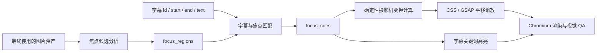
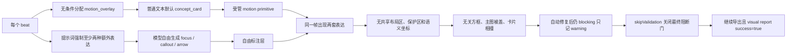
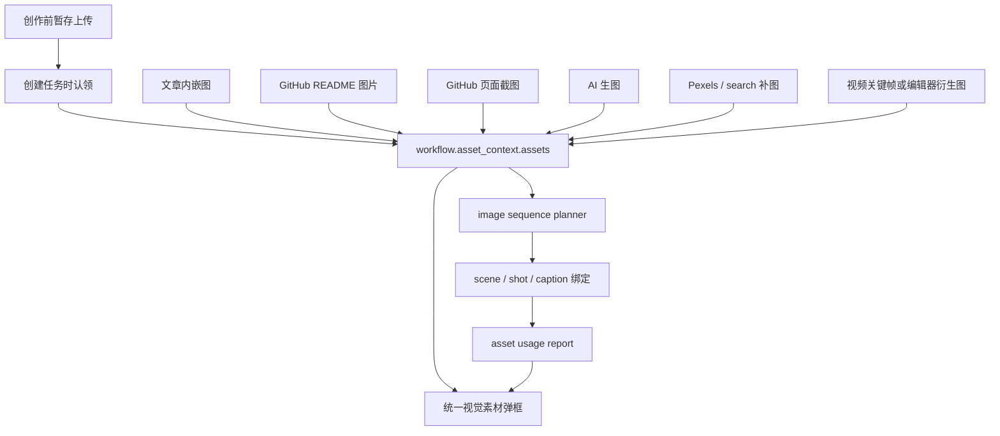
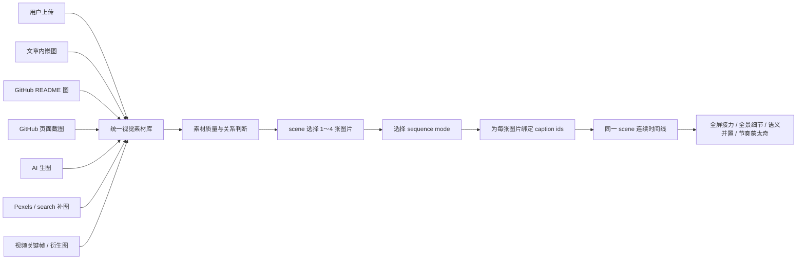
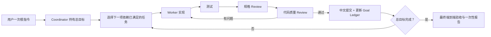

# asset_first 全屏图片摄影机聚焦：放大/缩小、字幕同步与焦点可信度总结

> 日期：2026-07-16
> 分支：`dev`
> 当前代码基线：`3a23622`（`origin/dev`）
> 关联文档：`docs/superpowers/plans/2026-07-14-asset-first-overlay-layout-root-cause-summary.md`
> Loop Engineering 设计：[`2026-07-16-asset-first-agent-loop-design.md`](../specs/2026-07-16-asset-first-agent-loop-design.md)
> 文档性质：产品目标、当前能力、技术可行性、可信度边界与推荐数据契约总结。overlay P0 已完成；统一素材、多图编排、焦点摄影机和 Agent Loop 仍是设计，不代表已经实施。

## 1. 背景与目标

当前 asset-first 画面质量问题的根因之一，是图片之上同时出现受管 motion primitive 和模型自由生成的方框、箭头、callout、局部放大框等第二套表达层。这些元素没有可靠的图片坐标，也没有统一布局所有权，容易产生：

- 方框没有圈中旁白重点；
- 卡片覆盖图片主体；
- diagram 与 cause chain 重复表达；
- 图片、字幕、卡片、箭头互相遮挡；
- 模型为满足“至少两种表达层”要求而添加无意义装饰。

新的产品目标是：

```text
图片覆盖全屏并承担主视觉
动画只引导观众看当前重点
重点字幕同步突出
默认不叠概念卡、流程卡、装饰方框或自由箭头
```

典型示例：一张 GitHub 仓库主页截图全屏展示；旁白读到 Star 数量时，镜头自动平移并放大到页面右上角的 Stars 区域，同时突出字幕中的“Star 数量”。该示例只是通用能力的一种应用，系统不得硬编码 GitHub、Stars 或右上角。

## 2. 结论摘要

图片放大、缩小、平移和字幕同步在当前 HTML/Chromium 渲染架构中完全可行。动画执行本身不是难点，真正需要补充的是两类结构化数据：

1. 图片中有哪些可聚焦区域，以及它们在哪里；
2. 哪一段字幕或旁白应该触发哪个焦点区域。

推荐的数据流：



核心可信度判断：

- AI 输出的焦点区域只能作为候选，不能直接当作绝对真值；
- AI 自报的 `0.92` 等 confidence 不是经过校准的真实准确率；
- DOM、人工标注或可验证 OCR 坐标可以高信任使用；
- AI-only 粗略区域只能做宽松、低倍率镜头推近，不能画紧框；
- 无法验证、存在歧义或焦点被裁切时，不执行局部聚焦；
- 没有焦点坐标时，默认只做整图轻运动和字幕重点高亮。

## 3. 遮挡事故与根因总结

本章压缩总结 [`2026-07-14-asset-first-overlay-layout-root-cause-summary.md`](./2026-07-14-asset-first-overlay-layout-root-cause-summary.md) 的真实任务证据和当前代码结论，用于约束摄影机聚焦不能成为第三套叠加层。

### 3.1 原始任务证据

分析对象：创作任务 `20260713143149061712`，最终成片约 83.5 秒，共 15 个 Frame HTML。原始分析实际检查了：

- 用户提供的 5 张问题截图；
- 按 `0.5s` 间隔抽取的约 167 个时间点；
- 6 张覆盖整片的接触表；
- `project.json` 和 `content-graph.json`；
- 15 个最终 Frame HTML；
- 工作流中的布局 QA 诊断；
- 最终 `visual-report.json`。

结构扫描结果：

| 指标 | 结果 |
|---|---:|
| Frame HTML 数量 | 15 |
| 含 `data-mp-overlay` 的帧 | 15/15 |
| 受管 overlay 根节点 | 15 |
| 含自由标注角色的帧 | 14/15 |
| 自由标注角色总数 | 50 |

自由标注角色包括：

- `highlight`
- `focus`
- `callout`
- `arrow`
- `annotation`
- `emphasis`
- `path`

这说明问题不是单个 Frame CSS 偶发写错，而是几乎全片同时存在“受管 primitive + 模型自由标注”两套表达层。

### 3.2 五类典型问题

1. 生成图片上出现没有真实坐标依据的黄色焦点框；
2. UI 截图上同时出现多个 focus-box、标签、箭头和概念卡；
3. diagram 节点已经表达重点，又叠加 focus-ring 和概念卡；
4. `concept_card` 覆盖 UX 主图片和图片内标注；
5. `cause_chain` 覆盖 base diagram 自己的结果卡。

第 5 类尤其说明：“一帧只有一个 overlay owner”本身挡不住 `base diagram + 一个受管 overlay`。base diagram 不是第二个 overlay owner，因此还必须在 visual plan 层阻止 diagram 重复分配同义 primitive。

### 3.3 完整根因链



### 3.4 根因一：每个 beat 必有 motion overlay

当前 [`motionPrimitiveCatalog.js`](../../../server/services/creative-video/html-video/motionPrimitiveCatalog.js) 的 `selectMotionPrimitive()`：

- `steps` → `three_step_flow`
- `comparison/data` → `stat_compare`
- `quote` → `key_marker`
- 3+ cards → `checklist`
- 命中因果词 → `cause_chain`
- 其他全部 → `concept_card`

当前 [`visualPlanService.js`](../../../server/services/creative-video/html-video/visualPlanService.js) 又对每个 beat 无条件写入 `beat.motion_overlay`。测试仍断言“每个 beat 必须有 `motion_overlay.preset`”。

因此，“每帧必有卡片”是当前正式行为，不是模型偶然发挥。

### 3.5 根因二：提示词强制自由表达层

当前 [`framePromptBuilder.js`](../../../server/services/creative-video/html-video/framePromptBuilder.js) 仍要求：

```text
在图片主体之上叠加标题、关键词浮层、框选高亮、箭头标注、局部放大、步骤编号、数据卡或字幕节奏点，至少使用其中 2 种。
```

并且仍声明“没有表达层的帧不合格”。这会促使模型在受管 primitive 之外，再生成自由 focus/callout/arrow。

所以仅把 `selectMotionPrimitive()` 改为返回 null 不够；如果不同时删除上述 prompt，黄色框和自由箭头仍可能继续出现。

### 3.6 根因三：图片标注没有语义坐标

原任务图片资产包含路径、来源、alt、生成 prompt、模型信息和时间，但不包含：

- `focus_regions`
- `focal_points`
- `bounding_boxes`
- 目标对象标签与坐标；
- 图片区域与字幕/旁白的绑定。

在 `object-fit: contain/cover` 下，图片还会产生缩放、letterbox 或 crop 偏移。模型直接猜固定 CSS 坐标既不能证明语义正确，也没有执行正确的原图到画布映射。

### 3.7 根因四：现有 QA 看不见多数图形遮挡

当前 overlay 静态校验主要检查：

- 整屏覆盖；
- 字幕安全区；
- overlay 高度；
- 无法静态解析的定位语法。

它不理解：

- overlay 是否覆盖主视觉；
- 两个表达层是否重复；
- 方框是否圈中语义目标；
- 箭头是否指向正确对象；
- 卡片是否盖住图片关键区域。

当前 [`layoutQaService.js`](../../../server/services/creative-video/html-video/layoutQaService.js) 又主要检查文字出框和文字相交。`aria-hidden` 或纯图形装饰通常不会进入候选，因此空黄色框、纯图形箭头和图片遮挡多数不可见。

### 3.8 根因五：已发现 blocking 仍被放行

当前 [`frameHtmlPhase.js`](../../../server/services/creative-video/html-video/frameHtmlPhase.js) 会：

1. 运行一次 Playwright 布局 QA；
2. 把 blocking issue 反馈给模型修复一次；
3. 再运行一次布局 QA；
4. unresolved 仍存在时写入 `frame_layout_qa_unresolved`；
5. 诊断仍是 `severity: warning`、`fallback_allowed: true`；
6. 工作流继续进入渲染和导出。

原任务还启用了 `skipValidation=true`：

- 最终工程布局 QA 被关闭；
- 成片视觉 QA 降级为 `safetyOnly`；
- 最终 `visual-report.json` 的 `success=true` 只代表轻量安全检查通过，不代表遮挡和语义焦点正确。

当前应用默认 `skipValidation=false`，但本地配置覆盖值仍可能把它打开。必须区分应用默认值和本地实际运行值。

### 3.9 单链路重构没有自动修复画面质量

2026-07-14 至 2026-07-16 已经完成：

- 删除 `hf_first / asset_first` 双策略；
- 删除 `visual_strategy`、`generation_mode`；
- 主流程收敛为 `asset_first + per_scene + raw_html`；
- 删除整片模板、场景模板、双 registry、模板 Agent 和模板编辑链路；
- 拆分多个超大前后端文件；
- 保留 motion primitives 和现有画面质量行为。

该重构降低了修复复杂度，但遵循行为不变原则，因此仍保留：

- 每 beat 必有 overlay；
- 普通文本默认 concept card；
- 至少两种自由表达；
- 模型漏写 primitive 后确定性注入；
- unresolved warning 放行；
- `skipValidation` 关闭最终布局门。

因此，单链路化是画面质量 P0 的前置清理，不是 P0 本身。

### 3.10 对摄影机聚焦方案的硬约束

图片摄影机聚焦不能直接叠加在旧契约上。否则会变成：

```text
全屏图片平移缩放
+ 受管 concept/cause/checklist 卡片
+ 模型自由方框和箭头
+ 系统字幕
```

正确顺序必须是：

1. 让 motion overlay 可为空；
2. 删除“至少两种额外表达”和“没有表达层不合格”；
3. 图片帧默认禁止自由 focus/callout/arrow；
4. diagram 不再叠同义 primitive；
5. 自动修复后仍 blocking 时真正停止；
6. 恢复完整 QA；
7. 图片场景再以 `visual_base.camera.focus_cues` 承担镜头引导；
8. 摄影机 cue 和字幕高亮共用同一时间绑定。

最终表达所有权：

```text
有图片：全屏图片摄影机 + 系统字幕高亮，motion_overlay = null
无图片：结构化 diagram 自身动画 + 系统字幕高亮，不叠同义卡片
```

## 4. 与方框方案的区别

### 4.1 默认不画方框

没有结构化坐标时，禁止：

- 图片内硬边框；
- focus-box；
- 箭头指向；
- 局部放大镜窗口；
- 根据图片描述猜测 `left/top/right/bottom`；
- 让 Frame HTML 模型自行决定目标位置。

硬方框要求非常高的坐标精度。偏移几十像素就会明显框错，尤其在 `object-fit: cover` 发生裁切时，原图坐标和画布坐标并不一致。

### 4.2 摄影机聚焦允许合理误差

摄影机聚焦不需要紧贴目标边界。它只要求目标进入放大后画面的视觉安全区，并保留足够上下文。因此，同一个 AI-only 粗略区域：

- 不适合画紧框；
- 可能适合做 `1.15～1.5` 倍的温和推近；
- 经过 OCR/DOM 验证后，可以提高到 `1.6～3.0` 倍；
- 区域不可信时，完全可以安全降级为不聚焦。

### 4.3 优先使用镜头语言

即使将来有可靠坐标，也优先使用：

- 向重点区域平滑推近；
- 平移到安全中心；
- 调整 `transform-origin`；
- 轻微压暗焦点之外的区域；
- 焦点区域短暂提亮或增强清晰度；
- 字幕关键词同步变色、加粗和轻微放大。

硬边框只应保留给边界明确的 UI 控件、截图区域或数据图表，并且必须来自可靠坐标。

## 5. 当前项目已经具备的能力

### 5.1 来源图片多模态分析

当前 [`sourceImageAnalysis.js`](../../../server/services/source/sourceImageAnalysis.js) 已能调用多模态模型分析来源文章图片，并输出：

- `visual_type`
- `summary`
- `contains_text`
- `text_readability`
- `best_usage`
- `fit`
- `should_use`
- `relevance_keywords`
- `avoid_reason`

当前限制：

- 最多分析 6 张来源图片；
- 单张图片上限 8MB；
- 只分析 `source === 'article'` 的图片；
- search/Pexels 图片会跳过；
- 当前没有 OCR 文本框；
- 当前没有 `focus_regions`；
- 当前没有 bbox/point/region 验证；
- 当前没有焦点与字幕的绑定。

因此，现有图片分析可以作为能力入口或复用参考，但不能直接视为已经具备可靠焦点定位。

### 5.2 字幕时间

当前 [`captionLayer.js`](../../../server/services/creative-video/html-video/captionLayer.js) 已标准化每段字幕的：

- `id`
- `start`
- `end`
- `duration`
- `text`

字幕层通过 `data-start`、`data-end` 和浏览器时钟控制显示，因此已经具备“在某段旁白时间触发画面行为”的时间基础。

当前字幕主要是句级或短句级时间，不应假装具备逐字级时间。第一版重点字幕高亮可以在整个字幕段有效期间保持，不必做复杂卡拉 OK 逐字动画。

### 5.3 HTML/CSS/GSAP 与 Chromium 渲染

当前 Frame HTML 和 Playwright/Chromium 渲染链可以执行：

- CSS `transform`；
- `scale()`；
- `translate()`；
- `transform-origin`；
- CSS keyframes；
- GSAP timeline；
- 按秒触发动画；
- 最终使用 Chromium 录制并由 `ffmpeg` 编码。

所以摄影机平移和缩放不需要新渲染引擎，也不需要新增大型动画依赖。

### 5.4 现有 storyboard 有时间绑定概念，但当前链路没有焦点坐标

项目的 storyboard schema 中已经出现：

- `zoom_focus`
- `highlight`
- `caption_highlight`
- `caption_block_id`

这说明“字幕驱动视觉 beat”不是全新的产品概念。但当前一键生成进入 html-video scene spec 时，主要下传场景 kind、旁白、字幕和 `visual_text`，没有把图片焦点坐标或可执行摄影机轨迹带入当前 asset-first Frame HTML 链路。

因此可以复用“caption id 驱动 visual beat”的方法，但不能误认为现有 `zoom_focus` 已经解决图片区域定位。

### 5.5 当前 AI 生图已经是 asset-first 主链路能力

项目并不是只有来源图和搜索补图。当前 [`generatedImagePlanner.js`](../../../server/services/creative/generatedImagePlanner.js) 会从缺少强来源素材、但需要具象主视觉的场景中选择生图目标；[`generatedImagePhase.js`](../../../server/services/creative-video/html-video/generatedImagePhase.js) 会调用已配置的图片模型，为每个计划场景取一张生成结果，并登记为：

```json
{
  "id": "gen_<scene_id>",
  "type": "image",
  "source": "generated",
  "generation": {
    "scene_id": "scene_03",
    "prompt": "...",
    "model_info": {},
    "generated_at": "..."
  }
}
```

生成成功的图片会追加到 `creativeContext.asset_context.assets`，随后由内容图、visual plan、Frame HTML 和 asset usage report 消费。现有内容图规则也明确：

- generated 图片是具象主视觉；
- 优先绑定到 `generation.scene_id` 对应场景；
- `usage` 应使用 `subject`；
- AI 生图不是来源事实证据。

因此，新版多图和摄影机设计必须保留 AI 生图，并把它视为统一素材库的正式来源之一。用户上传、GitHub 截图和文章图能够覆盖某个场景时，应避免重复生成同义图片；没有可靠来源图但需要具象主视觉时，AI 生图仍是主要补全方式，而不是最后才考虑的装饰能力。

### 5.6 当前 Pexels/search 已经承担补图能力

当前 [`sourceAssets.js`](../../../server/services/source/sourceAssets.js) 会：

1. 从文章或 GitHub README Markdown 提取内嵌图片；
2. 下载可用来源图片；
3. 来源图片不存在或全部下载失败时，调用 `searchPexelsImages()`；
4. 将搜索结果下载并登记为 `source = search`；
5. 记录未配置、鉴权失败、限流、请求失败和下载失败诊断。

当前 Pexels/search 的职责边界是：

```text
可作为 background / supporting / atmosphere
不可作为来源事实证据
不能用通用图库图片证明文章、仓库或产品的具体事实
```

文章“不截整页”不等于文章只能输出文字。文章仍可以：

- 使用文章内嵌真实图片；
- 缺少具象主视觉时触发 AI 生图；
- 使用 Pexels/search 补充背景和氛围；
- 抽象结构内容使用 diagram；
- 将提炼后的重点写入旁白和重点字幕。

### 5.7 当前任务视觉素材弹框已有统一展示雏形

当前 [`SourceImageAssetsPanel.jsx`](../../../frontend-react/src/components/creative/SourceImageAssetsPanel.jsx) 已经会合并：

```text
asset_context.assets
+ asset_usage_report.assets
```

并且已经认识以下来源标签：

```text
article
generated / ai_generated
github / github_readme / readme
pexels / search
upload
```

它也能显示：

- 素材缩略图；
- 图片分析状态；
- 最终是否引用；
- 被哪些 Frame 使用；
- 素材处理诊断。

但当前顶层 Tab 只有：

```text
real       真实素材
generated  AI 生图
search     补图
video      视频
```

这四类不足以区分用户上传、来源提取、页面截图、AI 生图、图库补图和衍生素材；当前 `source` 也主要是自由字符串和前端显示映射，不是完整的统一资产协议。任务摘要中的紧凑版视觉素材面板当前还只在任务完成后显示，这与“任务一创建即可查看已上传素材，运行中持续追加自动素材”的目标不一致。

## 6. 当前缺口

完整能力仍缺少：

1. 最终使用图片的宽高和显示策略；
2. 图片焦点候选的通用结构；
3. 焦点来源和可信度等级；
4. DOM/OCR/检测器/AI 结果的验证状态；
5. 字幕关键词与焦点区域的绑定；
6. 全屏 cover/contain 后的坐标换算；
7. 避开字幕安全区的摄影机目标中心；
8. 防止平移缩放后露出黑边的边界约束；
9. 多个连续焦点之间的镜头轨迹；
10. 错误焦点、过度放大和镜头抖动的视觉 QA；
11. 无可靠焦点时的明确降级行为。
12. 创作开始前的图片暂存上传与任务创建时认领；
13. 用户上传图片的 `required/preferred` 约束；
14. 用户上传、来源提取、页面截图、AI 生图、Pexels/search 和衍生素材的统一来源协议；
15. 任务创建后即可打开、并在任务运行中持续更新的视觉素材弹框；
16. 所有可引用图片必须先登记到 `asset_context.assets` 的后端不变量；
17. 素材来源、证据属性、镜头用途和最终引用状态的分维表达；
18. required 素材最终未进入成片时的阻断校验。

## 7. 推荐数据契约

### 7.1 图片级 focus_regions

每张真正可能用于局部聚焦的图片保存可复用焦点候选：

```json
{
  "focus_regions": [
    {
      "id": "region_stars",
      "label": "Stars 数量",
      "aliases": ["star", "stars", "星标", "收藏数量"],
      "region": {
        "x": 0.79,
        "y": 0.08,
        "width": 0.15,
        "height": 0.07
      },
      "focus_point": {
        "x": 0.865,
        "y": 0.115
      },
      "method": "ocr",
      "confidence_level": "high",
      "verification": {
        "status": "verified",
        "method": "text_match",
        "evidence": "Stars"
      }
    }
  ]
}
```

约束：

- `x/y/width/height` 全部使用相对原图的 `0～1` 归一化坐标；
- `focus_point` 默认取 region 中心，但允许验证器提供更合适的视觉中心；
- `aliases` 用于字幕和旁白匹配；
- `method` 必须标明坐标来源；
- `confidence_level` 使用 `high/medium/low`，避免把未经校准的模型自评分伪装成统计概率；
- `verification.status` 明确区分已验证、仅候选和拒绝；
- 原始模型分数可以保留在 diagnostics，但不作为唯一自动执行条件。

推荐 `method` 枚举：

```text
manual
dom
ocr
detector
vision
generation_metadata
```

### 7.2 beat/frame 级 focus_cues

字幕与焦点区域的绑定建议进入图片主视觉，而不是继续塞进卡片型 `motion_overlay`：

```json
{
  "visual_base": {
    "type": "image",
    "asset_id": "article_01",
    "fit": "camera",
    "camera": {
      "initial_view": "overview",
      "focus_cues": [
        {
          "caption_id": "cap_03",
          "keyword": "Star 数量",
          "region_id": "region_stars",
          "effect": "camera_zoom",
          "zoom": "auto",
          "return_policy": "hold_or_next"
        }
      ]
    }
  },
  "motion_overlay": null
}
```

设计原因：

- 摄影机移动属于图片主视觉自身的行为；
- `motion_overlay` 当前代表额外卡片 primitive，语义不同；
- 图片场景可以存在 `visual_base.camera.focus_cues`，同时保持 `motion_overlay = null`；
- 不需要为了摄影机能力恢复已删除的视觉策略或模板分支。

### 7.3 时间来源

`focus_cue` 优先引用 `caption_id` 或更细的 `phrase_caption_id`，不重复写死 `start_sec/end_sec`。运行时从字幕数据派生真实时间：

```text
cue.caption_id
→ caption.start / caption.end
→ camera animation start / hold / transition
```

优点：

- TTS 时长变化后不需要重写摄影机计划；
- 字幕重新切分时可以重新匹配；
- checkpoint/resume 更容易判断哪些产物需要重建；
- 不会出现字幕和镜头时间分别维护后发生漂移。

### 7.4 任务统一视觉素材库

创作输入区只是用户上传素材的入口，不是任务素材库本身。任务创建成功后，应立即建立该任务自己的 `asset_context`；所有已经成为任务可用文件的图片，都必须登记到同一个 `asset_context.assets`，并在任务视觉素材弹框中可见。



这里的“任务创建后所有图片进入弹框”具体表示：

- 创建任务时，已上传图片立即被任务认领并显示；
- 文章图、README 图、页面截图、AI 生图和 Pexels 补图在各自产出成功后实时追加；
- 任务运行期间即可查看，不等待任务完成；
- 只有成功形成可用图片文件的结果才计入素材数；
- 生图失败、下载失败和截图失败没有图片文件，保留在同一弹框的 diagnostics 区域，不伪造素材卡片；
- 最终引用报告生成后，素材卡片追加 scene、shot、caption 和可见时长信息。

### 7.5 不扩大单一 source 枚举

不建议继续把所有信息塞入一个不断膨胀的 `source`：

```text
upload / article / github / github_screenshot / generated / pexels / video_frame / ...
```

来源、媒体类型、用户约束、事实可信度、处理状态和镜头用途是不同维度。第一版统一资产记录建议拆为以下最小字段：

| 字段 | 职责 | 建议值 |
|---|---|---|
| `media_type` | 文件类型 | `image`、`video` |
| `origin` | 稳定来源大类 | `user_upload`、`source_extract`、`page_capture`、`ai_generated`、`stock_search`、`derived` |
| `origin_detail` | 具体来源 | `article_embedded`、`github_readme`、`github_repository_page`、`pexels`、`video_keyframe`、`editor_crop` |
| `provider` | 实际提供者或工具 | `local`、`github`、`chromium`、图片模型标识、`pexels` |
| `requirement` | 用户使用约束 | `required`、`preferred`、`optional` |
| `evidence_class` | 是否可以支撑事实 | `direct_source`、`user_supplied`、`synthetic`、`contextual`、`derived_source` |
| `status` | 素材处理状态 | `ready`、`rejected`；处理中和失败主要由阶段状态/diagnostics 表达 |

稳定的 `origin` 只保留六类：

```text
user_upload   用户主动提供
source_extract 从输入来源提取
page_capture  系统主动截取页面
ai_generated  AI 图片模型生成
stock_search  第三方图库或搜索补充
derived       从已登记素材派生
```

具体网站、页面和派生方式进入 `origin_detail`，避免以后增加一个网站就修改顶级业务枚举。

### 7.6 requirement 与“必须使用”

创作输入区每张上传缩略图提供明确的“必须使用”控件。不要只显示一个没有文字的裸 checkbox，避免与普通选中状态混淆。建议显示：

```text
☑ 必须使用
```

规则：

```text
未勾选上传图 → requirement = preferred
已勾选上传图 → requirement = required
系统提取/截图/生图/搜索结果 → 默认 requirement = optional
```

- `required`：最终必须实际出现在成片中；未使用必须阻断 QA，不能静默忽略；
- `preferred`：高优先级候选，但不匹配当前叙事或质量不足时可以不用；
- `optional`：系统自动准备的候选素材。

不应让所有上传图片默认 required，否则用户一次上传大量备选图就会迫使系统制造无意义轮播。AI 生图和 Pexels/search 也不得自动标记 required。

### 7.7 evidence_class 与事实边界

| `evidence_class` | 典型来源 | 事实边界 |
|---|---|---|
| `direct_source` | 文章原图、README 图、可验证页面截图 | 可以作为来源证据 |
| `user_supplied` | 用户上传图片 | 可以按用户意图使用，但系统不自动证明其真实性 |
| `synthetic` | AI 生图 | 只能作主视觉或解释图，不作事实证据 |
| `contextual` | Pexels/search | 只能作背景、氛围和弱补充，不作事实证据 |
| `derived_source` | 来源视频关键帧、来源图裁剪 | 继承父素材来源，并保留 `parent_asset_id` |

这比一个简单的全局优先级更可靠。多图 scene 可以混合不同来源，但每张图片必须承担不同 role、reason 和 caption binding，不能为凑数量全部塞入。

### 7.8 镜头 role 属于 usage，不属于素材固有属性

同一张图片可能在不同位置承担 overview、detail、evidence 或 background，因此镜头用途不能只写死在素材记录上。每次使用单独保存：

```json
{
  "asset_id": "upload_01",
  "scene_id": "scene_03",
  "shot_id": "shot_02",
  "caption_ids": ["cap_07", "cap_08"],
  "role": "detail",
  "reason": "旁白正在解释页面右上区域的指标",
  "visible_duration_sec": 3.2,
  "camera": {
    "focus_region_id": "region_metric"
  }
}
```

第一版允许的 shot role 可保持小集合：

```text
overview
detail
subject
evidence
background
compare_left
compare_right
montage
```

### 7.9 统一素材记录示例

用户上传图：

```json
{
  "id": "upload_01",
  "media_type": "image",
  "origin": "user_upload",
  "origin_detail": "creative_input",
  "provider": "local",
  "requirement": "required",
  "evidence_class": "user_supplied",
  "status": "ready",
  "path": "assets/upload-image-01.png",
  "mime": "image/png",
  "bytes": 1837421,
  "width": 1920,
  "height": 1080,
  "title": "GitHub 项目主页截图",
  "created_at": "2026-07-16T10:00:00+08:00"
}
```

AI 生图：

```json
{
  "id": "gen_scene_03",
  "media_type": "image",
  "origin": "ai_generated",
  "origin_detail": "scene_main_visual",
  "provider": "configured_image_model",
  "requirement": "optional",
  "evidence_class": "synthetic",
  "status": "ready",
  "generation": {
    "scene_id": "scene_03",
    "prompt": "...",
    "model_info": {}
  }
}
```

Pexels 补图：

```json
{
  "id": "search_02",
  "media_type": "image",
  "origin": "stock_search",
  "origin_detail": "pexels",
  "provider": "pexels",
  "requirement": "optional",
  "evidence_class": "contextual",
  "status": "ready",
  "attribution": {
    "photographer": "...",
    "source_url": "..."
  }
}
```

第一版不需要为了新字段重建另一套 Asset 类或 registry。现有 `asset_context.assets` 继续作为唯一清单，在现有对象上增加规范字段，并在读取旧任务时兼容推导 `origin`。

### 7.10 视觉素材弹框分组

当前四个 Tab 调整为展示层筛选：

```text
全部
用户上传
来源素材
页面截图
AI 生图
搜索补图
视频与关键帧
```

映射：

| Tab | 条件 |
|---|---|
| 全部 | 所有视觉素材 |
| 用户上传 | `origin = user_upload` |
| 来源素材 | `origin = source_extract` |
| 页面截图 | `origin = page_capture` |
| AI 生图 | `origin = ai_generated` |
| 搜索补图 | `origin = stock_search` |
| 视频与关键帧 | `media_type = video` 或 `origin_detail = video_keyframe` |

这些 Tab 只用于查看，不参与业务决策。每张卡片至少显示：

- 来源与具体来源；
- `必须使用 / 优先使用 / 可选`；
- 图片分析状态；
- `已规划 / 已用于镜头 / 最终未引用`；
- 引用的 scene、shot 和 caption；
- AI 生图对应 scene；
- 页面截图来源 URL；
- Pexels 作者和归属信息；
- 衍生素材的父素材；
- required 未使用时的阻断状态。

### 7.11 后端不变量

第一版必须把以下规则作为后端不变量，而不是只靠前端标签：

> 任何可以被 content graph、visual plan、image sequence 或 Frame HTML 引用的本地图片，都必须先存在于 `workflow.asset_context.assets` 中，并具有唯一 `asset_id`。

具体约束：

1. 禁止阶段直接生成文件路径后绕过 `asset_context` 传给 Frame HTML；
2. 用户上传图片在创建 workflow 时完成“暂存上传 → 任务认领”；
3. 文章图、README 图、GitHub 截图、AI 生图和搜索补图成功落盘后立即登记；
4. 视频关键帧和裁切副本成为独立可引用文件时，登记新 asset 并保留 `parent_asset_id`；
5. 删除素材前检查 required、scene、shot 和最终引用关系；
6. 最终 QA 校验所有引用 asset id 均存在；
7. 最终 QA 校验所有实际使用图片均已登记；
8. 最终 QA 校验全部 required asset 都有真实可见时长；
9. 不允许 required 只写入 HTML 路径但实际不可见、被完全遮挡或显示时间为零。

## 8. 焦点可信度模型

### 8.1 不能直接信任 AI bbox

多模态模型可以较好地理解“图中哪个区域与 Stars 相关”，但精确坐标能力受以下因素影响：

- 模型是否真正支持稳定视觉定位；
- 图片分辨率和压缩质量；
- 文字是否足够清晰；
- 页面是否有多个同名元素；
- 图片是否被缩放或拼接；
- 目标是否很小；
- 模型输出坐标格式是否稳定；
- 输入图片在模型侧是否被再次缩放；
- 模型是否把语义相关对象和真实目标位置混淆。

模型返回：

```json
{
  "confidence": 0.94
}
```

并不代表真实准确率为 94%。它通常只是模型自我评估，没有经过 MuseDock 场景校准。

### 8.2 四级信任

| 等级 | 典型来源 | 自动行为 | 建议倍率 |
|---|---|---|---:|
| A：确定坐标 | DOM、用户手工标注、编辑器点击、系统自产布局坐标 | 可精准平移和较高倍率放大；UI 必要时可使用细框 | `2.0～3.0` |
| B：可验证坐标 | 唯一 OCR 文本匹配、唯一 UI 检测目标、已验证裁剪 | 自动聚焦；扩大 padding；不画紧框 | `1.6～2.4` |
| C：AI 粗略区域 | 多模态模型大致定位、自然图像主体 | 只做宽松温和推近；不快速横移；不画框 | `1.15～1.5` |
| D：不可信 | 多目标歧义、目标过小、图片模糊、结果冲突、分析失败 | 不做局部聚焦；只保留整图轻运动和字幕高亮 | `1.0～1.08` |

### 8.3 语义准确与几何准确必须分开

语义准确：

```text
旁白中的“Star 数量”是否匹配到正确的图片对象
```

几何准确：

```text
该对象从原图坐标映射到最终画布的位置是否正确
```

几何换算可以由程序确定性完成；语义识别不能仅靠数学保证。只有语义匹配和几何换算同时通过，才允许高倍率局部聚焦。

### 8.4 AI-only 区域使用宽松裁剪

对于 AI-only region，不以模型 bbox 作为紧边界，而应：

1. 取区域中心作为粗略焦点；
2. 将 region 向四周扩大 `1.5～2.0` 倍；
3. 限制最大 zoom；
4. 保留目标周围上下文；
5. 目标靠近边缘时降低倍率；
6. 无法确认时直接降级。

这样即使 AI 坐标存在一定偏差，目标仍可能处于画面安全区，而不会产生明显“镜头推错地方”的问题。

## 9. 焦点区域的获取方式

### 9.1 DOM 坐标

如果图片由系统控制的浏览器页面生成，并且截图时仍能访问 DOM：

```js
element.getBoundingClientRect()
```

可以提供最可靠的坐标。适用：

- 系统自动截取网页；
- 可访问的 GitHub 页面；
- 系统控制的产品页面；
- 内部预览页面；
- 已知 DOM 元素。

限制：离线截图、第三方下载图片和普通照片没有 DOM。

### 9.2 OCR 文本定位

适用：

- GitHub、后台、软件 UI；
- 数据面板；
- 含文字截图；
- 图表标签；
- 终端报错；
- 按钮、菜单、数字指标。

流程：

```text
字幕关键词/aliases
→ OCR 文本块
→ 唯一或高分匹配
→ 合并文字、图标和附近数字区域
→ 形成 B 级 focus region
```

OCR 比纯多模态 bbox 更适合定位“Stars”“价格”“登录”“错误信息”等文字目标。

### 9.3 专用目标检测或分割

适用：

- 人脸；
- 产品主体；
- 常见物体；
- Logo；
- 具有稳定视觉类别的目标。

如果项目未来已有合适模型或现有依赖可以复用，可以作为 B/C 级来源。不要仅为 P0 少量场景立即引入沉重视觉依赖。

### 9.4 多模态模型

适合承担：

- 判断字幕重点对应哪个图片对象；
- 提供目标标签和 aliases；
- 提供大致位置；
- 判断 region 是否含目标；
- 在多个候选之间给出语义排序。

不适合无条件承担：

- 像素级紧框；
- 无验证的高倍率 zoom；
- 多个相似小目标的精确区分；
- 根据描述猜测最终 CSS 坐标。

### 9.5 用户或编辑器标注

如果用户在编辑器中点击或拖选目标区域，可以得到 A 级坐标。该能力适合后续手工修正，不是自动生成第一版的前置条件。

## 10. 候选区域验证

### 10.1 基础确定性校验

所有 region 至少检查：

- `x/y/width/height` 都是有限数；
- 坐标位于 `0～1`；
- `width/height > 0`；
- 区域不超过图片边界；
- 区域不能过小到无法辨认；
- 区域不能大到接近整图而失去聚焦意义；
- focus point 位于 region 内；
- 映射到最终画布后不会完全被裁掉；
- 目标中心不会落入字幕遮挡区。

### 10.2 OCR/DOM 交叉验证

若 region 声称目标是文字或 UI：

- region 内应该能找到相应 OCR 文本；
- 或 region 与 DOM 元素坐标有足够相交；
- 多个同名候选时必须结合上下文或位置提示消歧；
- 无法唯一匹配时降级为 C/D 级。

### 10.3 裁剪复核

可以对候选 region 扩大后裁一张小图，验证裁剪图中是否仍包含目标：

```text
整图提出候选
→ region 扩大 1.5～2 倍
→ 生成候选 crop
→ OCR/检测器/必要时多模态复核
→ verified / rejected
```

复核应按“每张最终使用图片一次”执行，而不是每个 beat 或每句旁白重新调用模型。

### 10.4 失败即降级

以下任一情况不执行局部聚焦：

- 分析关闭或失败；
- region 缺失；
- region 越界；
- 多个候选分数接近；
- OCR/DOM 与 AI 结论冲突；
- 目标会被 cover 裁掉大部分；
- 需要超过允许倍率才能看清；
- 聚焦后必然被字幕遮挡；
- 相邻 cue 会造成高频来回横移。

降级结果不是错误，而是合法输出：

```text
整图轻微推近或保持静态
字幕关键词正常高亮
不画框、不猜位置
```

## 11. 全屏图片显示策略

### 11.1 普通照片和接近目标比例的图片

使用单层摄影机：

```text
viewport：全屏裁切容器
image：cover 填满
camera transform：作用于 image
```

适用：

- AI 生图；
- 人物照片；
- 产品图；
- 风景图；
- 与目标画幅比例接近的图片。

### 11.2 横版截图进入竖屏

GitHub、后台和桌面软件截图通常是横版。如果直接在 `9:16` 画面中 `cover`，左右信息会被裁掉，右上角 Stars 甚至可能在初始画面外。

推荐同图双层：

```text
背景层：同一图片 cover，全屏、放大、模糊、压暗
前景层：同一图片 contain，完整可读，承担摄影机平移缩放
```

这样视觉上仍然是图片全屏覆盖，但截图主体不会因初始 cover 被破坏。局部聚焦只移动前景层，背景层保持稳定，避免运动过程中露出黑边。

### 11.3 含文字图片

只要图片包含必须阅读的文字，默认优先保证内容完整：

- 初始视图使用 contain 前景；
- 背景用同图 cover 填满；
- 重点出现时对前景做局部 zoom；
- 不用 cover 直接裁掉文字；
- 不把截图当纯装饰背景。

## 12. 多图入场与场景内编排（第一版）

### 12.1 需求纠正

“图片入场应该有多种”不是指给同一张图片准备一组固定入场特效，而是：

```text
一个 scene / 一段连续旁白
→ 可以绑定多张图片
→ 每张图片按对应字幕语义进入
→ 图片可以依次全屏接力、全景与细节衔接、语义并置或形成短蒙太奇
→ 所有图片共享同一条连续 scene 时间线
→ 不能一张图渲染成一个 beat MP4 后再硬切下一张
```

用户已经确认：以下四种多图编排全部进入第一版。

1. 全屏接力；
2. 全景与细节；
3. 语义并置；
4. 节奏蒙太奇。

“全部进入第一版”表示四种编排语义和确定性运行能力都要具备，不表示每个 scene 同时使用四种，也不表示随机抽一种特效。系统必须根据当前字幕语义、图片关系、场景时长和素材数量选择一种主要编排。

### 12.2 当前为什么会直接跳到下一帧

当前 html-video 默认 `continuity_mode = beat_mp4`：

1. 每个 beat 独立生成 Frame HTML；
2. 每个 Frame HTML 独立通过 Chromium 录制成 MP4；
3. [`projectOrchestrator.js`](../../../server/services/creative-video/html-video/projectOrchestrator.js) 收集所有 beat MP4；
4. [`ffmpegComposer.js`](../../../server/services/creative-video/html-video/ffmpegComposer.js) 使用 concat demuxer 或 concat filter 顺序拼接；
5. 相邻视频之间没有画面重叠，也没有 xfade/match transition；
6. [`rawHtmlFrameBuilder.js`](../../../server/services/creative-video/html-video/rawHtmlFrameBuilder.js) 默认写入：

```json
{
  "transition_in": { "type": "cut", "duration_sec": 0, "params": {} },
  "transition_out": { "type": "cut", "duration_sec": 0, "params": {} }
}
```

虽然 [`projectSchema.js`](../../../server/services/creative-video/html-video/projectSchema.js) 会保留 `transition_in/out`，但当前视频合成器没有根据这些字段生成画面转场。因此它们目前主要是 schema 字段，不是已生效能力。

当前 Frame HTML prompt 又要求每帧必须从动画时间线开场，但同一 continuity group 的后续 beat 同时被要求“禁止 base 层重新入场”。这导致两个层面不一致：

```text
单个 Frame HTML 内：模型可能设计入场
Frame MP4 与下一个 Frame MP4 之间：仍然硬切
```

多图编排不能只靠增加 prompt 文案修复，必须让相关图片在同一个 scene 级 HTML/时间线中共同存在，或让最终合成器真正支持有重叠时长的转场。对于需要字幕精确驱动的多图镜头，优先使用同一 scene HTML 时间线更稳定。

### 12.3 第一版数据模型

多图仍然属于唯一的主视觉所有者，因此建议保留在 `visual_base` 内，而不是创建多个并列 overlay：

```json
{
  "visual_base": {
    "type": "image_sequence",
    "sequence_mode": "fullscreen_relay",
    "shots": [
      {
        "id": "shot_01",
        "asset_id": "article_01",
        "caption_ids": ["cap_01"],
        "role": "overview",
        "enter": { "effect": "fade_scale", "duration_sec": 0.55 },
        "hold": { "until": "next_shot" },
        "exit": { "effect": "crossfade", "duration_sec": 0.45 },
        "camera": { "initial_view": "overview", "focus_cues": [] }
      },
      {
        "id": "shot_02",
        "asset_id": "article_02",
        "caption_ids": ["cap_02"],
        "role": "detail",
        "enter": { "effect": "guided_pan", "duration_sec": 0.6 },
        "hold": { "until": "caption_end" },
        "exit": { "effect": "hold", "duration_sec": 0 },
        "camera": {
          "initial_view": "overview",
          "focus_cues": [
            {
              "caption_id": "cap_02",
              "region_id": "region_stars",
              "effect": "camera_zoom"
            }
          ]
        }
      }
    ]
  },
  "motion_overlay": null
}
```

单图场景可以规范化为只有一个 shot 的 `image_sequence`，避免同时维护完全不同的单图和多图渲染器。现有 `visual_base.type=image + asset_id` 可以作为输入兼容简写，在进入编排阶段时统一转换成一个 shot。

### 12.4 shot 字段职责

每个 shot 最少包含：

- `id`：场景内稳定 shot id；
- `asset_id`：素材集中的图片 id；
- `caption_ids`：该图片承担哪些字幕段；
- `role`：`overview/detail/evidence/supporting/compare_left/compare_right/montage`；
- `enter`：图片如何进入当前 scene 时间线；
- `hold`：保持到字幕结束、下一个 shot 或场景结束；
- `exit`：如何退出或与下一张重叠；
- `camera.focus_cues`：该图片内部的局部摄影机聚焦；
- `fit`：普通照片、截图双层或其他确定性显示策略；
- `requirement`：从素材继承 `required/preferred/optional`；`required` 时最终成片必须实际展示；
- `reason`：该图片与当前字幕的语义关系，供诊断和人工检查。

不能让 Frame HTML 模型临时从全部素材中自由挑图并自己决定时间。素材选择、字幕绑定和 sequence mode 应在生成 HTML 前成为结构化输入。

### 12.5 时间由字幕派生

shot 不应主要依赖模型自由输出绝对时间。推荐：

```text
shot.caption_ids
→ 找到最早 caption.start
→ 找到最晚 caption.end
→ 派生 shot active window
```

基本计算：

```text
shotStart = min(boundCaptions.start)
shotEnd   = max(boundCaptions.end)
enterStart = max(0, shotStart - enterLeadSec)
```

建议第一版：

- `enterLeadSec`：`0～0.18s`；
- 入场时长：`0.35～0.8s`；
- 最短稳定可读时间：普通图片不少于 `1.0s`；
- 含文字截图不少于 `1.8～2.5s`；
- 下一张进入时与上一张重叠 `0.25～0.65s`；
- 字幕很短且无法保证稳定展示时，合并 shot 或减少图片数量；
- TTS/字幕时长变化后重新派生，不使用旧绝对时间。

### 12.6 A：全屏接力

语义：多张图片按旁白顺序依次成为全屏主视觉。

适用：连续案例、不同阶段、不同产品画面、多张氛围图片，以及同一主题的多个证据或结果。

```text
图片 A 全屏进入并保持
→ 图片 B 在下一段字幕开始时进入
→ A 与 B 短暂重叠并完成 crossfade / push / mask handoff
→ 图片 C 接力
```

约束：

- 任一时刻只有一张图片承担主要可读内容；
- 含文字截图之间优先 crossfade 或轻推，不使用快速旋转；
- 同一场景内不重新生成独立标题页；
- 不在每张图片上叠一张 concept card；
- 下一张加载完成前不得让上一张消失，避免白屏。

### 12.7 B：全景与细节

语义：一张图片建立整体上下文，另一张图片补充细节、局部证据或更清晰视图。

适用：

- GitHub 仓库全景 + Stars/README/代码细节截图；
- 产品首页 + 功能详情；
- 完整图表 + 数据局部；
- 完整 UI + 按钮/设置面板；
- 原始图片 + 结果图片。

```text
overview 图片先全屏建立上下文
→ detail 图片作为前景层进入
→ 背景 overview 轻微压暗或保持
→ detail 可以继续执行 focus cue
→ 结束时 detail 保持、退出或回到 overview
```

detail 可以是独立图片，也可以是同一图片的预裁剪派生资产；两者使用同一 shot 契约，不为 GitHub 或 UI 写专用分支。

### 12.8 C：语义并置

语义：两张图片的关系本身就是旁白要表达的内容。

只适用于真实的 A vs B、前 vs 后、问题 vs 结果、旧方案 vs 新方案、原图 vs 处理后等关系。

```text
图片 A 先进入
→ 图片 B 在对应字幕进入
→ 最终稳定为左右、上下或前后切换的对比构图
→ 字幕高亮真实比较词
```

约束：

- 没有真实对比语义时禁止使用；
- 两张图片不能表达同一个意思却被强行左右分栏；
- 两边尺寸、裁切和文字可读性要相对平衡；
- 不额外叠 `stat_compare` 卡片重复表达。

### 12.9 D：节奏蒙太奇

语义：多张图片随连续短语依次进入，形成快速但可理解的视觉概览。

适用：多个案例、多个成果、列举应用场景、氛围建立、章节开场/总结和并列短语。

```text
图片 A 进入
→ 图片 B 在第二个短语进入并短暂共存
→ 图片 C 在第三个短语进入
→ 最终形成短暂堆叠、网格或连续全屏切换
```

第一版限制：

- 每个 montage `2～4` 张图片；
- 不用于需要长时间阅读的 GitHub/后台完整截图；
- 每张图片必须绑定不同字幕短语或明确语义；
- 不使用随机漂浮、无限堆叠或无法回收的卡片布局；
- 图片数量超过可用字幕节奏时必须减少，而不是平均硬塞。

### 12.10 入场不是固定动画

四种 sequence mode 描述“多张图片之间如何组织”，不是规定每张图片只能使用一个固定 CSS 动画。

第一版保留一个小而明确的入场动效集合：

```text
fade_scale       柔和显现并轻推近
guided_pan       从语义方向轻移入场
mask_reveal      遮罩揭示
crossfade        与上一张交叉淡化
layered_enter    前景图片在稳定背景上进入
hold             不重新入场，延续上一状态
```

选择规则：

- 照片默认 `fade_scale`；
- 有可靠焦点方向时可用 `guided_pan`；
- 图表、章节、作品展示可用 `mask_reveal`；
- 全屏接力默认 `crossfade`；
- 全景与细节默认 `layered_enter`；
- 同一图片连续 cue 使用 `hold`，不重复入场。

不要无限扩展转场库。第一版的变化主要来自 sequence mode、图片内容和字幕节奏，而不是几十种特效名称。

### 12.11 scene 内连续编排与跨 scene 转场分开

```text
scene 内：多张图片的语义时间线
scene 之间：章节/主题切换
```

scene 内多图：

- 由 caption id 驱动；
- 需要同一 HTML/scene timeline；
- 图片可以短暂重叠；
- 可以执行 camera focus；
- 不能经过独立 beat MP4 硬切。

scene 之间：

- 默认可以保持干净 cut；
- 风格或章节变化时使用短 crossfade/dip；
- 不需要每个 scene 都强制华丽转场；
- 跨 scene 转场不得吞掉字幕时间或改变总时长。

因此，“实现多图入场”不等于先给 ffmpeg 加几十种 `xfade`。第一优先级是让同一 scene 的多张图片进入同一可执行时间线。跨 scene 的合成转场可以作为独立能力补充。

### 12.12 与当前 asset 规划的冲突

当前 [`contentGraphAgent.js`](../../../server/services/creative-video/html-video/contentGraphAgent.js) 明确要求“每个 node 最多引用 1 张图片”；当前 [`visualPlanService.js`](../../../server/services/creative-video/html-video/visualPlanService.js) 也从 `asset_refs` 中只取一个 asset 作为 `visual_base.asset_id`。

第一版多图编排要求修改该契约：

```text
统一 asset_context 汇集 upload / source / capture / generated / search / derived
→ scene/node 可以引用多张候选图片
→ visual plan 根据字幕语义挑选 1～4 张
→ 生成 image_sequence.shots
→ 每个 shot 绑定 caption ids
```

不能简单删除“最多 1 张”后让模型无限输出。必须同时设置：

- 普通 scene 默认最多 3 张；
- montage 最多 4 张；
- 每张图片必须有不同 role/reason/caption binding；
- 重复、低相关或无足够展示时间的图片被剔除；
- 用户上传图能够覆盖场景时避免生成同义 AI 图片；
- 来源图片能够支撑事实时优先使用来源图片；
- generated 图片承担缺少来源图时的具象主视觉，但不作证据；
- Pexels/search 只承担 background/supporting，不作证据；
- `requirement = required` 的图片必须进入最终 HTML 和渲染结果；
- asset usage report 从“是否引用”扩展到“在哪个 shot、显示了多久”。

### 12.13 与摄影机焦点的关系

多图 sequence 决定“现在显示哪一张图片”；focus cue 决定“当前图片内部看哪里”。执行顺序：

```text
先让 shot 入场并稳定
→ 再对该 shot 执行 camera focus
→ 下一张 shot 开始入场时停止或完成当前 focus
```

禁止：

- 图片还没完成入场就高倍率 zoom；
- 两张图片同时执行相反方向的大幅平移；
- 已经退出的 shot 继续响应 caption cue；
- focus cue 指向另一个 shot 的 region；
- montage 中每张图都执行复杂局部聚焦。

### 12.14 第一版 QA

数据与规划检查：

- sequence mode 必须是四种允许值之一；
- shots 数量符合各 mode 上限；
- 每个 shot 的 asset id 存在；
- caption ids 必须属于当前 scene；
- shot 时间窗不能为负或倒序；
- 引用 `requirement = required` 素材的 shot 必须被物化；
- compare mode 必须正好有两侧主图；
- montage 必须有 2～4 张图；
- overview_detail 至少包含 overview 和 detail；
- 无足够时长时确定性减少图片数量。

渲染检查：

- 第一张图在场景开始时可见，不出现白屏；
- 下一张图加载完成后上一张才退出；
- 同 scene 相邻图片不存在裸 `cut`，除非计划明确允许；
- 入场过程不露黑边；
- 含文字截图至少达到最短可读时长；
- 字幕与 shot 激活窗口一致；
- shot 切换不遮挡字幕；
- 图片层级在退出后正确回收；
- 场景末尾没有残留半透明图片；
- 最终 duration 不因重叠转场缩短或变长；
- 0.5 秒接触表能看到连续视觉演进，而不是每个 beat 突然换画面。

资产使用报告建议新增：

```json
{
  "asset_id": "article_01",
  "shot_id": "shot_01",
  "scene_id": "scene_01",
  "caption_ids": ["cap_01"],
  "visible_duration_sec": 3.2,
  "sequence_mode": "fullscreen_relay"
}
```

## 13. 坐标映射与摄影机计算

### 13.1 初始显示比例

设：

- 原图：`iw × ih`
- 画布：`W × H`

`cover`：

```text
baseScale = max(W / iw, H / ih)
```

`contain`：

```text
baseScale = min(W / iw, H / ih)
```

显示尺寸：

```text
renderWidth  = iw × baseScale
renderHeight = ih × baseScale
```

默认居中偏移：

```text
offsetX = (W - renderWidth) / 2
offsetY = (H - renderHeight) / 2
```

### 13.2 焦点区域映射

归一化 region：

```text
x, y, width, height
```

映射到初始显示图：

```text
regionLeft   = offsetX + x × iw × baseScale
regionTop    = offsetY + y × ih × baseScale
regionWidth  = width × iw × baseScale
regionHeight = height × ih × baseScale
```

焦点中心：

```text
focusX = regionLeft + regionWidth / 2
focusY = regionTop + regionHeight / 2
```

### 13.3 安全目标中心

镜头不应把目标移动到几何正中心后再被底部字幕遮挡。应定义字幕之外的 `camera_safe_rect`：

```text
left:   画面安全边距
right:  画面安全边距
top:    标题/状态安全边距
bottom: 字幕安全区顶部
```

目标中心默认放到 `camera_safe_rect` 的中心或略偏上位置。

### 13.4 自动 zoom

基于 region 大小和安全区域计算候选倍率：

```text
zoomByWidth  = safeWidth  / regionWidth
zoomByHeight = safeHeight / regionHeight
candidateZoom = min(zoomByWidth, zoomByHeight) × fillFactor
```

然后按可信度限幅：

```text
A 级：1.0～3.0
B 级：1.0～2.4
C 级：1.0～1.5
D 级：不执行局部 zoom
```

`fillFactor` 应小于 1，确保 region 周围保留上下文，而不是把目标撑满整个画面。

### 13.5 平移

设最终目标中心为 `targetX/targetY`，最终总缩放为 `targetScale`，则摄影机平移应使焦点中心进入目标位置。最终实现可用 transform matrix 或等价的 scale/translate 组合，但必须统一变换顺序，避免先后顺序导致坐标漂移。

### 13.6 边界限制

单层 cover 模式下必须 clamp：

- 左右边界不能露出图片外区域；
- 上下边界不能露黑；
- 目标区域不能被字幕安全区遮挡；
- 如果无法同时满足，降低 zoom 或放弃 cue。

双层截图模式允许前景 contain 层露出背景，因为背景由同图 cover 填满，但仍应避免前景主体完全移出画面。

## 14. 镜头节奏

推荐默认节奏：

```text
场景开始：展示全景
重点字幕开始：平滑移动并放大
重点字幕持续：保持焦点稳定
出现下一个焦点：直接平滑转向下一个区域
没有下一个焦点：保持或在场景结束前回到全景
```

不推荐：

```text
每句话都放大 → 缩小 → 放大 → 缩小
```

这种机械往返会产生眩晕、抖动和明显模板感。

推荐时间参数：

- 聚焦过渡：约 `0.45～0.8s`；
- 保持：覆盖当前字幕剩余时间；
- 相邻焦点转移：约 `0.5～0.9s`；
- 场景末尾回全景：只有剩余时间足够时执行；
- 同一 region 连续 cue：合并，不重复缩放；
- 很短字幕：不执行大幅摄影机运动，只做字幕高亮。

## 15. 重点字幕同步

### 15.1 第一版采用段内高亮

当前字幕是句级/短句级时间，因此第一版建议：

```text
字幕段出现
→ 匹配 focus cue.keyword
→ 对字幕原文中真实存在的词包高亮 span
→ 在当前字幕段期间保持高亮
```

高亮可以使用：

- 强调色；
- 字重提高；
- `1.05～1.10em` 轻微放大；
- 很短的上浮/缩放入场；
- 稳定底板，不让整行文字跳动。

### 15.2 不插入旁白中不存在的词

如果 `keyword` 不在字幕原文里：

- 尝试 aliases；
- 仍无匹配则不高亮；
- 不向字幕硬插入新词；
- 不在图片旁再弹一份重复关键词。

### 15.3 摄影机与字幕共用 cue

同一条 `focus_cue` 同时驱动：

- 摄影机聚焦；
- 字幕关键词高亮。

不能分别让两个 Agent 独立猜时间，否则会出现镜头已移动但字幕还没说到重点，或字幕已经结束镜头才开始聚焦。

## 16. GitHub Stars 通用示例

图片分析结果：

```json
{
  "id": "region_stars",
  "label": "Stars 数量",
  "aliases": ["star", "stars", "星标"],
  "region": {
    "x": 0.79,
    "y": 0.08,
    "width": 0.15,
    "height": 0.07
  },
  "method": "ocr",
  "confidence_level": "high",
  "verification": {
    "status": "verified",
    "method": "text_match",
    "evidence": "Stars"
  }
}
```

字幕：

```json
{
  "id": "cap_03",
  "start": 4.2,
  "end": 6.8,
  "text": "这个项目目前已经获得超过一万个 Star。"
}
```

焦点 cue：

```json
{
  "caption_id": "cap_03",
  "keyword": "一万个 Star",
  "region_id": "region_stars",
  "effect": "camera_zoom",
  "zoom": "auto",
  "return_policy": "hold_or_next"
}
```

运行节奏：

```text
0.0～4.2s：完整 GitHub 页面概览
4.2～4.8s：平滑移动到 Stars 区域并放大
4.8～6.8s：保持区域清晰可见；字幕“一万个 Star”同步高亮
6.8s 后：有下一个焦点则直接转向；没有则保持或在场景末尾回全景
```

若 OCR 未找到 Stars，但多模态模型只给出“右上角”粗略区域：

```text
降为 C 级
zoom 限制在 1.15～1.5
扩大上下文
不画框
```

若无法确认：

```text
不局部聚焦
全景保持
只高亮字幕
```

## 17. 通用匹配，不硬编码场景

焦点匹配基于：

- `focus_region.label`
- `focus_region.aliases`
- 当前字幕文本；
- `visual_text.keywords`
- 图片分析的 `relevance_keywords`
- region 的 verification evidence；
- 可选的位置提示。

示例：

```text
字幕：“看右上角的 Star 数量”
region aliases：star / stars / 星标
→ 匹配 region_stars
```

```text
字幕：“这里显示当前套餐价格”
region aliases：价格 / price / 套餐
→ 匹配 region_price
```

```text
字幕：“第三步是部署”
region aliases：第三步 / 部署 / deploy
→ 匹配 region_step_3
```

匹配器不包含 GitHub、Stars、价格或第三步的硬编码分支。业务词只存在于每张图片的分析结果和当前字幕中。

## 18. 分析调用与成本边界

不建议每条旁白或每个 beat 额外调用一次模型。推荐：

```text
内容图确定最终使用图片
→ 每张实际使用图片最多分析一次
→ 一次返回多个 focus_regions
→ 同场景/同图片的全部字幕复用
```

如果需要裁剪复核，也按每个候选 region 或存在歧义的 region 执行，而不是无条件逐 beat 重复分析。

缓存键至少应包含：

- 图片内容 hash；
- 分析契约版本；
- 模型/provider 标识；
- 分析 prompt 版本。

图片不变且契约不变时可以复用。图片文件变化、分析版本变化或用户手工覆盖时重新生成。

## 19. 与当前 overlay P0 的关系

图片摄影机聚焦不能替代遮挡止血，但可以成为图片场景的长期表达方式。当前 `dev` 已完成 overlay P0，摄影机聚焦应直接建立在该新基线上。

推荐最终语义：

### 有图片

```text
全屏图片主视觉
+ visual_base.camera.focus_cues
+ 系统字幕重点高亮
+ motion_overlay = null
```

### 无图片

```text
结构化 diagram 主视觉
+ diagram 内部动画
+ 系统字幕重点高亮
+ 不叠第二张同义 primitive 卡
```

当前已经完成：

- motion overlay 可为空；
- 删除“至少使用两种额外表达”；
- 禁止自由 focus/callout/arrow；
- 单一表达所有者；
- unresolved blocking 真正阻断。

后续真实任务必须保持完整 QA，不得通过本地 `skipValidation` 绕过新质量门。

不能在旧的“每帧必有卡片”契约上再增加摄影机聚焦，否则会变成：

```text
全屏图片移动
+ 概念卡
+ 自由方框
+ 字幕
```

这会重新制造多层表达冲突。

## 20. 视觉 QA 与验收指标

### 20.1 数据契约测试

- 所有被引用的 `asset_id` 必须存在于统一 `asset_context.assets`；
- 任务认领的上传素材必须在任务创建后立即可查询；
- 新产出的截图、AI 生图、搜索补图和关键帧必须追加到同一素材清单；
- `origin/origin_detail/requirement/evidence_class` 必须是允许值；
- `required` 素材必须具有至少一个有效 shot 和正数可见时长；
- AI 生图和 Pexels/search 不得标记为来源事实证据；
- 衍生素材必须保留合法 `parent_asset_id`；
- region 坐标必须位于 `0～1`；
- 非法、NaN、负尺寸、越界 region 被拒绝；
- focus point 必须位于合法区域；
- 未验证 region 不得升级为 A/B 级；
- 无 region 时输出合法降级结果；
- caption id 不存在时不执行 cue；
- aliases 匹配不区分大小写并支持中英文；
- 多个同名候选无法消歧时不自动聚焦。

### 20.2 摄影机数学测试

- cover/contain 映射正确；
- 横图、竖图、方图均正确；
- 目标位于四角和中心时均能进入安全区；
- clamp 后不露黑边；
- 字幕安全区不覆盖目标；
- 超大/超小 region 的 zoom 正确限幅；
- A/B/C 等级使用不同最大倍率；
- 连续同 region cue 合并；
- 短字幕不触发剧烈运动。

### 20.3 渲染测试

- 场景开始显示完整概览；
- 到 caption start 后才开始聚焦；
- caption end 前保持稳定；
- 下一个 cue 能平滑转向；
- 场景结束前不发生突跳；
- 30fps/不同帧率下时间一致；
- `skipValidation=false` 时进入完整视觉 QA；
- 渲染输出无黑边、闪白和图片加载延迟。

### 20.4 视觉准确性指标

不要只看模型自报 confidence。对真实样本人工标注后统计：

- `target_visible_rate`：聚焦后目标完整可见率；
- `target_safe_center_rate`：目标中心进入安全中心区比例；
- `wrong_target_rate`：聚焦到错误同名/相似对象的比例；
- `caption_occlusion_rate`：目标被字幕遮挡比例；
- `blank_edge_rate`：平移缩放露出空白比例；
- `excessive_zoom_rate`：倍率过大导致无法理解上下文比例；
- `camera_jitter_rate`：短时间来回移动比例；
- `fallback_rate`：因不可信而安全降级比例。

第一版应接受较高的安全降级率，不应为了降低 fallback 而放宽错误聚焦。

### 20.5 建议样本集

上线自动局部聚焦前，至少准备覆盖以下类型的真实样本：

- GitHub/网页截图；
- 软件和后台 UI；
- 终端报错；
- 数据面板；
- 图表；
- 横版截图进入竖屏；
- 普通人物/产品照片；
- AI 生成图片；
- 多个相似目标；
- 小目标和低清图片；
- 无法可靠聚焦的负样本。

## 21. 推荐实施范围

### 第一阶段：多图连续编排 + 截图类可靠聚焦

优先支持：

- 创作输入区暂存上传、缩略图和“必须使用”控件；
- 任务创建时认领上传素材并立即显示视觉素材弹框；
- 文章图、GitHub/README 图、GitHub 页面截图、AI 生图、Pexels/search 和衍生图进入统一 `asset_context`；
- 任务运行中持续追加素材和诊断，不等待任务完成；
- 统一 `origin/origin_detail/requirement/evidence_class` 字段；
- required 素材最终未使用时阻断；
- 同一 scene 使用 `1～4` 张图片；
- 全屏接力、全景与细节、语义并置、节奏蒙太奇四种 sequence mode；
- caption id 驱动 shot 入场、保持、退出和重叠；
- 同 scene 图片共享一个连续 HTML/scene timeline，不经过独立 beat MP4 硬切；
- 单图统一规范化成一个 shot 的 image sequence；
- 普通照片可以参与全屏接力和蒙太奇，但第一阶段不承诺精准局部焦点；
- `visual_type === screenshot`；
- `contains_text === true`；
- OCR/DOM/明确文字证据可验证；
- 单一匹配目标；
- A/B 级 region；
- 全屏双层截图显示；
- caption id 驱动 camera cue；
- 字幕段内关键词高亮；
- 无验证时自动降级。

多图编排本身进入第一阶段；高倍率局部摄影机聚焦先限于可验证截图。这样照片仍能通过接力、并置和蒙太奇进入成片，但不会因为缺少焦点坐标而被迫放大到未知位置。该范围既覆盖 GitHub、软件 UI、后台和数据截图，也覆盖普通图片的连续入场。

### 第二阶段：自然图片宽松聚焦

在第一阶段积累真实数据后再扩展：

- 人脸；
- 产品主体；
- Logo；
- 普通物体；
- AI 生成图片主体；
- C 级宽松焦点；
- 低倍率推近；
- 不画框。

### 暂不进入第一阶段

- 任意图片都承诺像素级准确；
- 逐 beat 新增 LLM 调用；
- 多目标复杂跟踪；
- 分割级蒙版；
- 手势式快速运镜；
- 自动生成硬边框；
- 为单个网站硬编码选择器；
- 新增大型视觉依赖但没有真实准确率基线。

## 22. 当前推荐决策

1. 图片场景采用“全屏图片 + 摄影机聚焦 + 字幕重点高亮”；
2. 默认不画方框；
3. 第一版同时支持全屏接力、全景与细节、语义并置和节奏蒙太奇；
4. 一个 scene 可以包含 `1～4` 个 shot，多张图片共享 scene 时间线；
5. 单图也统一为一个 shot 的 image sequence，避免两套运行时；
6. shot 入场、保持和退出引用 caption id，由真实字幕时间派生；
7. scene 内图片不得通过独立 beat MP4 裸切；跨 scene 转场保持独立设计；
8. 摄影机数据属于 `visual_base`，不属于卡片型 `motion_overlay`；
9. focus region 是候选数据，不是无条件可信真值；
10. DOM/manual 为 A 级，OCR/验证目标为 B 级，AI-only 为 C 级，歧义/失败为 D 级；
11. A/B 级可以自动局部聚焦，C 级只做低倍率宽松推近，D 级不局部聚焦；
12. 每张最终使用图片最多分析一次，不逐 beat 调模型；
13. 横版截图进入竖屏时使用“背景 cover + 前景 contain 摄影机层”；
14. 同一 cue 同时驱动摄影机和字幕高亮；
15. 优先保证不聚焦错误，而不是强求每张图片都有局部动画；
16. 第一阶段所有图片都可参与多图编排，但精准局部聚焦先限于可验证截图。
17. 用户上传、来源提取、页面截图、AI 生图、Pexels/search 和衍生图片统一进入任务 `asset_context.assets`；
18. 任务创建后立即显示已认领的上传素材，运行中持续追加自动产出的图片；
19. 不扩张单一 `source` 枚举，使用 `origin/origin_detail/requirement/evidence_class` 分维表达；
20. 上传图片默认 `preferred`，用户勾选后为 `required`，系统自动素材默认 `optional`；
21. AI 生图是主视觉核心能力但不是证据，Pexels/search 是背景和氛围补充但不是证据；
22. 任何可被画面链路引用的图片都必须先登记到统一素材库；
23. required 素材没有真实可见 shot 或可见时长为零时，QA 必须阻断。

## 23. 多图片来源与多图入场的闭环关系

本版增加的多图片来源，正好为上一版已经确认的多图入场提供真实素材基础。两部分不是并列功能，而是同一条能力链的上下游：

```text
统一视觉素材库解决“有什么图”
image sequence planner 解决“用哪些图、图片之间是什么关系”
scene 时间线解决“这些图怎样连续进入画面”
```

完整关系：



### 23.1 图片来源与入场模式的典型对应

| 图片组合 | 更适合的编排模式 | 典型用途 |
|---|---|---|
| 用户上传的多张产品图 | `fullscreen_relay`、`rhythm_montage` | 依次展示产品、案例和效果 |
| GitHub 页面截图 + README 图片 | `overview_detail` | 先展示仓库概览，再进入功能或数据细节 |
| 多张文章内嵌图 | `fullscreen_relay`、`semantic_compare` | 按文章叙事顺序展示来源证据 |
| 来源截图 + AI 生图 | `overview_detail` | 真实截图交代事实，AI 图解释抽象概念 |
| 两张具有真实比较关系的来源图 | `semantic_compare` | 旧与新、问题与结果、处理前与处理后 |
| 多张 AI 生图 | `fullscreen_relay`、`rhythm_montage` | 连续表达不同场景、应用或阶段 |
| 多张 Pexels/search 补图 | `rhythm_montage`、背景接力 | 氛围建立和通用应用场景列举 |
| 来源视频关键帧 + 结果图 | `overview_detail`、`semantic_compare` | 原始内容与处理结果对照 |
| 完整截图 + 同图局部衍生图 | `overview_detail` | 完整页面进入后，再展示局部重点 |

这些是规划倾向，不是根据来源硬编码 sequence mode。最终仍应结合旁白语义、图片关系、图片质量、场景时长和字幕绑定决定。

### 23.2 素材多不等于强制多图

统一素材库提供候选，不代表每个 scene 都必须使用多张图片。规划顺序必须是：

```text
判断当前 scene 是否需要图片
→ 判断旁白是否包含多个视觉语义单元
→ 判断候选图片之间是否存在顺序、全景细节、比较或并列关系
→ 判断时长是否足以稳定展示
→ 决定使用一张还是 2～4 张
```

规则：

- 旁白只解释一个结论时，即使素材库有十张图，也可以只选一张；
- 旁白连续介绍三个应用场景时，可以选择三张图做节奏蒙太奇；
- 旁白先讲整体、再讲局部数据时，适合全景与细节；
- 两张图片没有真实对比关系时，不能因为数量是两张就强制左右并置；
- 展示时间不足时必须减少图片，而不是加速轮播；
- required 图片必须进入语义匹配的 shot，不能为了满足约束随意塞入无关 scene；
- 多图不是质量指标，语义清晰和可读时间优先于图片数量。

### 23.3 三层职责边界

统一素材库负责：

- 图片来自哪里；
- 文件是否可用；
- 是否为用户 required；
- 是否可以作为事实证据；
- 图片宽高、格式、缩略图和分析结果；
- 是否已经被规划和使用；
- 下载、生图、截图和分析失败诊断。

Image sequence planner 负责：

- 当前 scene 是否使用图片；
- 使用一张还是多张；
- 从统一素材库选择哪几张；
- 图片之间是什么语义关系；
- 使用哪一种 sequence mode；
- 每张图片绑定哪些 caption；
- 每张图片承担哪个 shot role；
- 每张图片至少显示多久；
- 当前 shot 是否需要局部摄影机聚焦。

Scene HTML 时间线负责：

- 图片什么时候进入、保持和退出；
- 相邻图片怎样短暂重叠；
- 执行 `crossfade`、`guided_pan`、`layered_enter` 等小型动效集合；
- 摄影机什么时候平移或放大；
- 字幕关键词什么时候高亮；
- 避免白屏、黑边、裸硬切和图层残留。

这三层不能互相越权。Frame HTML 不应重新从全部素材中自由挑图；素材库也不决定某张图片固定只能作为 overview 或 background。

### 23.4 GitHub 多来源示例

一个 GitHub 仓库输入可能准备：

```text
github_page_01       仓库主页截图，page_capture，direct_source
github_readme_01     README 产品图，source_extract，direct_source
github_readme_02     README 功能截图，source_extract，direct_source
gen_scene_01         抽象架构主视觉，ai_generated，synthetic
```

对应场景可以规划：

```json
{
  "sequence_mode": "overview_detail",
  "shots": [
    {
      "asset_id": "github_page_01",
      "role": "overview",
      "caption_ids": ["cap_01", "cap_02"]
    },
    {
      "asset_id": "github_readme_02",
      "role": "detail",
      "caption_ids": ["cap_03"]
    },
    {
      "asset_id": "gen_scene_01",
      "role": "subject",
      "caption_ids": ["cap_04"]
    }
  ]
}
```

如果来源截图和 README 图片已经完整覆盖旁白，则不生成 `gen_scene_01`。如果旁白还要解释无法由真实截图直接表达的抽象架构，AI 生图才补足 `subject` 角色。

### 23.5 AI 生图从“缺图补一张”升级为“补视觉角色”

现有 AI 生图主要按场景判断是否缺少具象主视觉。接入统一素材库和多图规划后，推荐顺序是：

```text
盘点 scene 已有 required 上传图和 direct_source 来源图
→ 判断 overview / detail / evidence / subject / background 哪些角色已覆盖
→ 只为真正缺失且适合生成的视觉角色规划 AI 生图
→ 生成成功后追加到统一素材库
→ 与其他来源图片共同进入 image sequence planner
```

AI 生图不是与来源图片争抢同一个位置，而是补足真实素材无法承担的具象解释角色。它仍然可以成为全屏主视觉，也可以参与全屏接力、全景与细节或蒙太奇，但 `evidence_class` 始终是 `synthetic`。

### 23.6 Pexels/search 不为凑数量补图

Pexels/search 只在以下情况进入多图规划：

- scene 需要通用环境或氛围铺垫；
- 旁白正在列举多个通用应用场景；
- 没有来源图片，同时该内容不值得专门 AI 生图；
- 使用后不会被误解为文章、仓库或产品的真实证据。

禁止：

```text
多图模式需要三张
→ 当前只有两张
→ 无条件搜索一张凑数
```

职责边界保持为：

```text
来源图负责事实
用户上传图负责用户明确希望表达的内容
AI 生图负责具象解释和主视觉
Pexels/search 负责背景、氛围和通用场景
```

### 23.7 第一版端到端链路

第一版完整顺序应固定为：

1. 用户上传图片，并设置 `preferred/required`；
2. 创建任务并认领上传素材；
3. 提取文章图片、GitHub README 图片等来源素材；
4. 对 GitHub 等明确允许的页面进行截图；
5. 分析已有素材能够覆盖哪些 scene 和视觉角色；
6. 为真正缺少具象主视觉的 scene 执行 AI 生图；
7. 必要时使用 Pexels/search 补背景或氛围；
8. 所有成功图片进入统一 `asset_context.assets`；
9. 每个 scene 从统一素材库选择 `1～4` 张图片；
10. 判断图片之间的顺序、全景细节、比较或并列关系；
11. 选择一种主要 sequence mode；
12. 为每张图片绑定 caption ids、role 和最短可见时间；
13. 在同一个 scene HTML 时间线中连续入场；
14. 对可靠焦点执行摄影机平移或缩放；
15. 同步突出重点字幕；
16. 输出包含 scene、shot、caption 和可见时长的 asset usage report；
17. QA 阻断 required 未使用、素材未登记、白屏、裸硬切和错误聚焦。

因此，多图片来源和多图入场应作为一条能力链实施，不能拆成两个互不认识的系统。继续使用现有 `asset_context.assets` 作为统一输入，让 image sequence planner 只消费该入口，是当前最短且正确的实现边界。

## 24. Loop Engineering（Agent Loop）介绍

这里的 Loop Engineering 指 **Codex 如何用一个根指令持续完成整个超大任务**，不是把 MuseDock 产品运行时改造成通用 Agent Runtime，也不是只为第一阶段写计划后让用户手工串联后续窗口。

一个指令启动的是多轮交付循环，而不是把全部内容塞进一次模型调用：



计划完成、单个任务完成、单个 Phase 完成、Review 通过、一次提交完成或上下文即将过长，都只是内部 checkpoint。Coordinator 必须更新 Goal Ledger、压缩上下文并自动继续下一任务，不能把阶段调度责任重新交给用户。

Loop 可以组合三类 Codex 协作：

1. 主任务内子 Agent，处理短期探索、测试和 Review；
2. 相互独立的并行顶层任务，处理长期且互不重叠的实现；
3. 跨任务消息和交接，由 Coordinator 读取状态、发送后续要求和收敛结果。

上下文不依赖一个无限增长的聊天窗口，而通过以下锚点传递：

```text
Goal Ledger
+ 当前分支和工作区状态
+ 规格与需求覆盖矩阵
+ 独立 Git 提交
+ 测试和 Review 证据
+ 每个任务的短 Handoff Packet
```

主任务只保留总目标、当前进度、未完成需求、阻塞和最近交接摘要；代码搜索输出、完整日志、大段 diff 和独立分析留在 Worker Thread 或文件中。不同 Agent 可以使用新的短上下文，但必须继承同一目标和验收门。

本任务的统一 Goal Loop 覆盖：

```text
实时基线审计
→ 统一视觉素材
→ 多图编排和 Scene 连续时间线
→ focus_regions / focus_cues / Camera Plan
→ QA、定向修复和恢复
→ 最终真实任务端到端验收
```

这些阶段全部在同一根指令授权下自动推进。只有出现真实需求歧义、缺少外部授权、不可逆操作或无法安全保留的重叠用户改动时才停下询问；普通测试失败、实现困难、上下文变长或 Phase 完成都不算阻塞。

可直接使用的根指令、Coordinator/Worker/Reviewer 权限、上下文压缩、双 Review、Git 边界、自动继续和完成条件见独立设计规格 [`2026-07-16-asset-first-agent-loop-design.md`](../specs/2026-07-16-asset-first-agent-loop-design.md)。

## 25. 最终判断

图片放大/缩小不是问题本身，未经验证的语义定位才是风险来源。

最短正确路径不是让 Frame HTML 模型自由猜一个 `transform-origin`，而是建立：

```text
图片级 focus_regions
+ 字幕级 focus_cues
+ 确定性坐标映射
+ 信任等级
+ 失败降级
+ 渲染 QA
```

AI 可以参与寻找焦点候选，但不能单独决定高倍率聚焦。对截图类内容，应优先使用 DOM/OCR 或裁剪验证；对 AI-only 区域，只允许低倍率、宽松、有上下文的镜头推近；无法验证时不聚焦，只突出字幕。

这一设计既能实现“说到哪里，镜头看到哪里”，又不会把之前的无关方框问题改造成新的“镜头放大错位置”问题。

同时，图片能力不是“用户上传或网页截图”两条新链路，而是对现有 asset-first 能力的统一：

```text
用户上传
+ 文章 / GitHub 来源图
+ 可验证页面截图
+ AI 生图
+ Pexels / search 补图
+ 视频关键帧和编辑器衍生图
→ 同一个任务视觉素材库
→ 同一个 image sequence planner
→ 同一个 asset usage report 和 QA
```

最短正确实现是在现有 `asset_context.assets`、素材文件接口、AI 生图追加逻辑、来源图/Pexels 下载逻辑和 `SourceImageAssetsPanel` 上扩展协议与展示，不创建第二套素材 registry。
