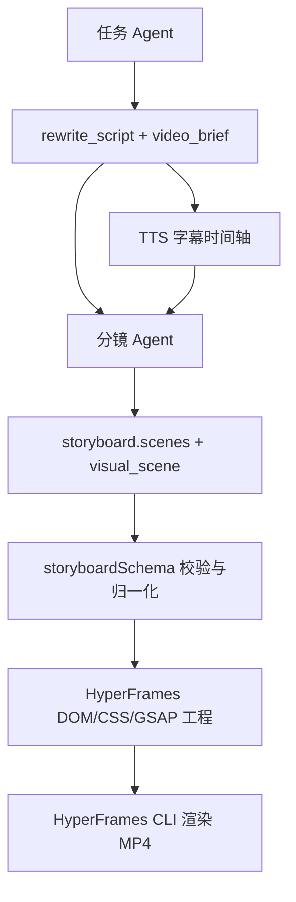

# HyperFrames 三层视频生成升级设计

## 背景

当前 MuseDock 的成片链路已经可以从任务 Agent、TTS 字幕、AI 分镜生成 HyperFrames MP4，但成片容易呈现为“长口播 + 半透明卡片轮播”。这不是单个 CSS 样式问题，而是三层契约过窄：

- 任务 Agent 主要输出完整口播稿，缺少明确的视频时长、节奏段落和镜头目标。
- 分镜 Agent 输出 `visual_type`、`layout`、`background_prompt` 等字段，但这些字段更像自然语言建议，不是稳定可渲染指令。
- HyperFrames 工程生成器主要按 `text_card`、`quote_card`、`step_card`、`contrast_card` 四种组件渲染，许多分镜视觉信息没有被真正消费。

本设计目标是把默认成片链路升级为“可控时长 + 导演级分镜 + 可执行视觉图层”，让项目默认生成的视频明显脱离简单 PPT 卡片感，同时保持本地优先、可测试、可回退。

## 目标

- 默认任务 Agent 能产出更短、更适合视频渲染的口播脚本，并附带结构化 `video_brief`。
- 分镜 Agent 输出稳定的 `visual_scene` DSL，用于描述可执行视觉对象和动效。
- HyperFrames 渲染器消费 `visual_scene`，渲染流程图、代码面板、UI 示意、对比图、概念图、时间线和金句爆点等多种画面。
- 保留旧分镜兼容：没有 `visual_scene` 的历史 run 仍可用旧卡片路径渲染。
- 所有用户可见文案保持中文。

## 非目标

- 第一阶段不接入图片生成、视频生成或外部素材生成服务。
- 不复用原视频画面、原视频帧、截图或搬运素材。
- 不重写 HyperFrames CLI 调用方式。
- 不引入复杂图形引擎，优先用 DOM、CSS、GSAP 完成。

## 总体架构

数据流保持现有主链路，但三层输出契约升级：



任务 Agent 负责内容节奏；TTS 仍然是最终时间轴来源；分镜 Agent 负责视觉编排；渲染器负责把结构化视觉指令转成可渲染画面。

## 脚本层设计

`viral_rewrite` 默认结果在兼容现有字段的基础上新增 `video_brief`：

```json
{
  "summary": "内容摘要",
  "viral_points": [],
  "audience": "目标用户",
  "comment_insights": [],
  "topics": [],
  "rewrite_script": "可 TTS 的中文口播稿",
  "titles": [],
  "video_brief": {
    "target_duration_sec": 60,
    "target_word_count": 220,
    "tone": "知识科普、节奏紧凑、有视觉冲击",
    "hook": "开头 3 秒的冲突或问题",
    "beats": [
      {
        "purpose": "hook",
        "summary": "先拆掉一个误解",
        "duration_sec": 5,
        "visual_intent": "用问题、错误认知或强对比打开"
      }
    ]
  }
}
```

默认 prompt 要明确：

- `rewrite_script` 优先控制在 45-75 秒口播范围，除非用户填写更长目标。
- 每句尽量短，适合字幕切分和视觉节奏。
- `video_brief.beats` 必须覆盖脚本主要段落，供分镜 Agent 使用。
- 不允许为了完整解释而无限拉长脚本；复杂内容要压缩成视频段落。

兼容策略：

- `normalizeViralRewriteResult` 支持 `video_brief`，旧结果没有该字段时返回默认空结构。
- TTS 仍只消费 `rewrite_script`，避免影响已存在的音频合成流程。

## 分镜层设计

现有 scene 字段继续保留：

```json
{
  "caption_indexes": [1, 2],
  "headline": "传统开发链路",
  "visual_type": "workflow",
  "layout": "vertical_flow",
  "background_prompt": "深色科技流程背景",
  "emphasis_words": ["产品需求", "设计界面", "前端页面"]
}
```

新增 `visual_scene`：

```json
{
  "visual_scene": {
    "composition": "vertical_flow",
    "objects": [
      { "id": "node-1", "type": "node", "text": "产品需求", "role": "primary" },
      { "id": "node-2", "type": "node", "text": "设计界面", "role": "primary" },
      { "id": "line-1", "type": "connector", "from": "node-1", "to": "node-2", "style": "neon_line" }
    ],
    "motion": [
      { "target": "node", "effect": "stagger_reveal", "delay": 0.1 },
      { "target": "connector", "effect": "draw_line", "delay": 0.3 }
    ],
    "focus": {
      "text": "流程太重",
      "style": "warning_pulse"
    }
  }
}
```

### 支持的 visual_type

- `workflow`：流程节点、连线、进度光线。
- `code_panel`：代码片段、终端输出、错误高亮、修复标记。
- `ui_mockup`：软件界面、表单、按钮、仪表盘示意。
- `split_compare`：左右对比、旧流程 vs 新流程、before/after。
- `concept_map`：中心概念、分支关键词、关系线。
- `timeline`：步骤进度、里程碑、倒计时。
- `quote_burst`：金句爆点、关键词冲击、短语逐个入场。
- `text_card`、`quote_card`、`step_card`、`contrast_card`：旧卡片兼容类型。

### 分镜 prompt 规则

分镜 Agent 要明确知道：

- `background_prompt` 是补充说明，`visual_scene` 才是渲染主契约。
- 每个 scene 必须优先输出可以被 DOM/CSS/GSAP 表达的对象，不写不可执行的摄影描述。
- `objects` 文案必须短，避免按钮、节点和标签溢出。
- 不要连续使用同一种构图。
- `caption_indexes` 仍然只引用现有字幕，时间轴仍由后端计算。

## Schema 与归一化

`storyboardSchema` 新增：

- `normalizeVisualScene(scene)`：清洗 `composition`、`objects`、`motion`、`focus`。
- `normalizeVisualObject(object)`：限制对象类型、文本长度、数量和字段。
- `normalizeVisualMotion(motion)`：只允许已支持动效。
- `makeFallbackVisualScene(scene)`：旧 scene 或无效 DSL 自动生成可渲染 fallback。

限制建议：

- 每个 scene 最多 8 个主要对象。
- 单个对象 `text` 最多 18 个中文字符。
- `motion` 最多 8 条。
- 未识别 `visual_type` 回退为 `quote_burst` 或 `text_card`。

校验失败不阻断整条链路，除非字段中出现乱码、空字幕、无音频等既有硬错误。

## 渲染层设计

`hyperframesProject` 拆出视觉渲染模块，避免单文件继续膨胀：

- `server/services/hyperframesVisualDsl.js`
  - 归一化渲染前 DSL。
  - 将旧 scene 转换为 fallback DSL。
- `server/services/hyperframesSceneRenderers.js`
  - `renderWorkflowScene`
  - `renderCodePanelScene`
  - `renderUiMockupScene`
  - `renderSplitCompareScene`
  - `renderConceptMapScene`
  - `renderTimelineScene`
  - `renderQuoteBurstScene`
- `server/services/hyperframesAnimations.js`
  - 输出按 scene 生成的 GSAP timeline 片段。

`hyperframesProject.buildIndexHtml` 保留为组装入口：

- 读取 scene。
- 获取或生成 `visual_scene`。
- 选择 scene renderer。
- 合并通用背景、字幕、安全区和 timeline。

### 渲染组件要求

- 所有组件必须适配 1080x1920 和 720x1280。
- 所有文本必须有最大宽度、换行策略和安全字号。
- 字幕条继续独立渲染，不能遮挡主体。
- 每个 scene 至少包含一个主体动效和一个背景动效。
- 首帧不能空白，第一幕主体应在 0 秒可见或在 0.05 秒内出现。

## 兼容与迁移

- 旧 run 的 `storyboard.scenes` 不修改。
- 新渲染器遇到旧字段时自动生成 fallback `visual_scene`。
- `project.json` 增加 `visual_dsl_version: 1`。
- 前端分镜编辑器第一阶段可以继续编辑旧字段；`visual_scene` 先作为高级字段隐藏或只读展示。
- 如果用户手动编辑旧字段，后端重新生成 fallback `visual_scene`。

## 错误处理

- 任务 Agent 返回无 `video_brief`：使用默认目标和空 beats。
- 分镜 Agent 返回无 `visual_scene`：自动 fallback。
- `visual_scene` 对象过多或文本过长：截断并记录 schema warning。
- 渲染器遇到未知类型：回退 `quote_burst`，返回中文 warning。
- HyperFrames CLI 失败：保留现有失败消息，并补充中文原因。

## 测试计划

新增或扩展以下测试：

- `test-agent-templates.js`
  - 默认 prompt 包含视频时长、beats、脚本压缩要求。
  - `normalizeViralRewriteResult` 保留并清洗 `video_brief`。
- `test-storyboard-agent.js`
  - 分镜 prompt 包含 `visual_scene` DSL 要求。
  - `video_brief` 会进入分镜 messages。
- `test-storyboard-schema.js`
  - 合法 `visual_scene` 保留。
  - 无效对象类型、过长文本、过多对象会归一化。
  - 旧 scene 能生成 fallback `visual_scene`。
- `test-hyperframes-project.js`
  - `workflow`、`code_panel`、`ui_mockup`、`split_compare` 输出对应 DOM class。
  - 旧 `text_card` 仍可渲染。
  - `project.json` 包含 `visual_dsl_version`。
- 可选手动验证
  - 用现有 `Vibe Coding` run 重新生成工程并渲染 MP4。
  - 抽取 0s、20s、60s 关键帧确认首帧不空、画面类型有变化、字幕可读。

## 实施顺序

1. 增加脚本层 `video_brief` 结构和 prompt 约束。
2. 增加分镜层 `visual_scene` prompt、schema 和 fallback。
3. 拆出 HyperFrames 视觉 DSL 与 scene renderer。
4. 为 7 类新 `visual_type` 实现 DOM/CSS/GSAP。
5. 保持旧卡片兼容路径。
6. 运行测试并用现有视频 run 做一次端到端验证。

## 风险

- 新 DSL 太自由会导致 renderer 难以稳定消费。缓解方式是限制对象类型、数量、文本长度和动效枚举。
- prompt 变复杂后模型可能返回不完整 JSON。缓解方式是 schema fallback 和测试覆盖。
- Renderer 组件变多后 CSS 可能膨胀。缓解方式是拆模块并保持每类组件边界清晰。
- 视觉效果仍可能不如外部图片生成。第一阶段目标是显著提升默认可控视频质量，而不是追求生成式影像上限。
