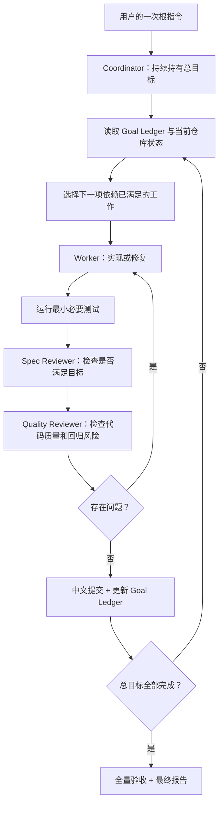
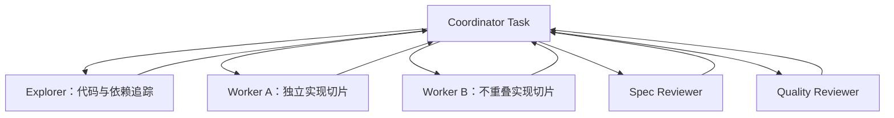

# asset-first Codex Delivery Loop Engineering 设计

> 日期：2026-07-16
> 分支：`dev`
> 基线：overlay P0 已完成；后续目标以关联总结中的未实施项为准
> 状态：执行循环设计已确认
> 关联总结：[`2026-07-16-asset-first-image-camera-focus-summary.md`](../plans/2026-07-16-asset-first-image-camera-focus-summary.md)

## 1. 这里所说的 Loop 是什么

本设计讨论的是 **Codex Delivery Loop（Codex 交付执行循环）**，不是 MuseDock 产品运行时内部的 Scene Agent Loop。

用户只给一次总指令：

```text
完整实现 asset-first 图片素材、多图编排、摄影机聚焦和 QA 目标，
自行拆分、实现、测试、Review、修复和提交，直到总目标完成。
```

Codex 收到指令后持续执行：

```text
理解总目标
→ 审计当前实现
→ 拆分依赖顺序
→ 选择下一项可执行工作
→ 实现
→ 测试
→ 规格 Review
→ 代码质量 Review
→ 修复 Review 问题
→ 提交
→ 压缩上下文并更新总账
→ 自动进入下一项
→ 直到整个目标完成
```

阶段完成不是返回用户的理由。计划写完、某个 Phase 完成、一次 Review 通过或一次提交完成，都只是 Loop 内部 checkpoint。

## 2. 一个指令不等于一个模型调用

“一个指令直接完成到目标”指的是：

- 用户只负责给出一次目标和授权边界；
- 一个协调任务持续持有总目标；
- 协调任务可以创建子 Agent、并行顶层任务或独立 worktree；
- 每个执行 Agent 可以使用新的短上下文；
- 阶段之间通过计划、提交、测试结果和交接摘要继续；
- Codex 不要求用户充当阶段调度器。

它不要求把全部代码、日志和历史塞进一次模型上下文，也不要求一次 API 请求永不结束。真正的 Loop 是 **一次目标授权，内部多轮执行**。

## 3. 设计目标

- 用户不需要为每个 Phase 重新开窗口、复制 Prompt 或确认继续；
- 总目标不会因上下文压缩、子任务结束或一次提交而丢失；
- 已完成工作有提交、测试和 Review 证据；
- 各阶段可以使用独立上下文，避免主任务上下文腐化；
- 多 Agent 并行只用于边界独立的工作；
- 同一代码所有权范围保持单写者；
- 每个任务完成后自动进入下一任务；
- 只有总目标完成或遇到真实用户阻塞才停止。

## 4. 非目标

本 Loop 不要求：

- 所有 Agent 共享完整上下文；
- 一个 Agent 记住全部终端日志；
- 多个 Agent 同时修改同一文件；
- 为执行 Loop 在 MuseDock 产品代码中新增 Agent 框架；
- 建立数据库、消息队列或向量记忆；
- 每个步骤都向用户申请批准；
- 以“计划已完成”代替代码交付；
- 以“测试未运行”或“建议下一步”提前结束。

## 5. 总体架构



Coordinator 是唯一总目标所有者。Worker 和 Reviewer 都是可替换的短生命周期执行者，不负责决定整个项目是否完成。

## 6. 两层执行循环

### 6.1 外层 Goal Loop

外层循环覆盖整个超大任务：

```text
while 总目标未完成:
    读取最新 Goal Ledger、Git 状态和已提交证据
    审计剩余需求与依赖
    选择下一项可交付任务或可并行任务组
    执行内层 Task Loop
    更新需求覆盖矩阵、提交和验证证据
    压缩当前阶段上下文
运行最终端到端验收
```

外层循环不能因为以下事件停止：

- 计划文档已经写好；
- 某个 Phase 已完成；
- 某个子 Agent 返回；
- 一次测试通过；
- 一次 Review 通过；
- 一次 Git 提交完成；
- 上下文即将变长；
- 下一任务需要新的 Agent Thread。

这些事件只会触发更新 Goal Ledger，然后继续。

### 6.2 内层 Task Loop

每个任务执行：

```text
确认任务边界和相关代码
→ 检查分支与工作区
→ 读取所有将修改的文件
→ 写最小失败测试或可执行验证
→ 实现最小正确改动
→ 运行相关测试
→ 规格 Review
→ 代码质量 Review
→ 修复 Review 问题
→ 重跑验证
→ 中文提交
→ 回写 Goal Ledger
```

若 Review 发现问题，返回本任务实现环，不返回用户。只有修复后重新通过 Review，任务才算完成。

## 7. Goal Ledger：跨上下文的总目标

Coordinator 不依赖聊天历史记住全局状态，而维护一份紧凑的 Goal Ledger。它可以是当前任务内的计划状态，也可以落盘为执行清单；关键是始终能够从仓库和证据重建。

最小字段：

```yaml
goal: 完整实现 asset-first 图片素材、多图编排、焦点摄影机和 QA
source_spec:
  - docs/superpowers/plans/2026-07-16-asset-first-image-camera-focus-summary.md
baseline:
  branch: dev
  overlay_p0: complete
phases:
  - id: unified_assets
    status: pending
    depends_on: []
  - id: image_sequence
    status: pending
    depends_on: [unified_assets]
  - id: focus_camera
    status: pending
    depends_on: [image_sequence]
  - id: qa_recovery
    status: pending
    depends_on: [focus_camera]
  - id: end_to_end
    status: pending
    depends_on: [qa_recovery]
evidence: []
blockers: []
```

每完成一个任务只追加紧凑证据：

```yaml
- requirement: required 素材未使用时阻断
  status: verified
  commit: abc1234
  tests:
    - node tests/test-required-asset-gate.js
  review: passed
```

不把完整测试日志、完整 diff 或 Agent 对话写进 Ledger，只保存可以重新定位的路径、提交和命令。

## 8. 总目标的自动分解

Coordinator 在第一次执行时根据实时代码生成完整依赖图，但不把“写完计划”作为交付终点。当前任务至少覆盖：

### Phase A：基线审计

- 确认在 `dev`；
- 保留已有用户改动；
- 核对 overlay P0 已完成；
- 核对 summary 中哪些能力仍未实施；
- 建立需求—代码—测试覆盖矩阵。

### Phase B：统一视觉素材

- 用户上传素材认领；
- 来源图、页面截图、AI 生图、Pexels/search、衍生图统一进入 `asset_context.assets`；
- `origin/origin_detail/requirement/evidence_class`；
- 任务运行中增量展示；
- required 素材真实可见性阻断；
- 下载大小和敏感信息安全边界。

### Phase C：多图编排

- 一个 Scene 使用 `1～4` 个 Shot；
- 单图统一为一个 Shot；
- Caption ID 派生时间；
- 全屏接力、全景细节、语义并置和节奏蒙太奇；
- Scene 内连续 HTML 时间线；
- 跨 Scene 转场保持独立；
- Asset Usage Report。

### Phase D：焦点与摄影机

- `focus_regions`；
- DOM/OCR/多模态候选和信任等级；
- `focus_cues` 与 Caption 绑定；
- cover/contain 坐标映射；
- zoom、平移、安全中心和边界限制；
- 字幕同步高亮；
- 不可信目标安全降级。

### Phase E：QA、修复和恢复

- 数据契约测试；
- 摄影机数学测试；
- Scene 预览和成片视觉 QA；
- 白屏、黑边、裸硬切、遮挡和错误聚焦阻断；
- 定向重试与 checkpoint 失效；
- 重启后只恢复失败范围；
- 最终端到端真实任务验证。

这些 Phase 全部属于同一个 Goal Loop。Phase 之间不需要用户重新确认，也不要求用户复制结果到新窗口。

## 9. 多 Agent 和多任务编排

Codex 当前可以组合三种协作：

1. **子 Agent**：适合短期、边界清晰的探索、测试和 Review；
2. **并行顶层任务**：适合长时间独立实现，拥有独立上下文；
3. **跨任务消息和交接**：Coordinator 可以读取其他任务状态、发送后续要求或接收完成摘要。

你看到的“由 Codex 从另一个任务发送”属于第三种。

推荐拓扑：



使用规则：

- 读操作、测试、样本分析和 Review 优先并行；
- 修改同一文件或同一状态所有权的任务串行；
- 长期独立代码修改使用 worktree；
- 同一分支和同一工作区不得由多个写 Agent 并发修改；
- 子 Agent 只返回结论、文件位置、测试命令和风险；
- 顶层任务之间通过显式消息、提交和 Artifact 协调；
- Coordinator 不把原始日志全部复制回主上下文。

## 10. 如何避免上下文过长

### 10.1 主任务只保留控制信息

Coordinator 上下文只保留：

- 总目标；
- 不可违反的项目规则；
- 当前 Goal Ledger；
- 当前任务边界；
- 最近一次交接摘要；
- 阻塞问题和决策。

代码搜索输出、测试日志、截图分析和大段 diff 留在 Worker Thread 或文件中。

### 10.2 每个任务结束生成 Handoff Packet

```markdown
## Task handoff

- 目标：required 素材未使用时阻断
- 状态：完成
- 提交：abc1234
- 修改：projectSchema.js、validationGate.js
- 验证：node tests/test-required-asset-gate.js
- Review：规格通过；代码质量通过
- 剩余风险：无
- 下一依赖任务：运行中素材增量展示
```

下一 Agent 读取 Handoff Packet 和相关文件，不读取上一 Agent 的完整聊天。

### 10.3 Commit 是上下文压缩点

每个独立任务通过测试和 Review 后提交。提交提供：

- 稳定恢复点；
- 明确 diff 边界；
- 可独立回看证据；
- 新 Agent 可读取的上下文锚点。

提交后 Coordinator 更新 Ledger，然后进入下一任务。

### 10.4 上下文压缩不能改变目标

无论线程压缩、任务交接还是 Agent 更换，以下内容必须原样保留：

- 总目标；
- 已确认范围；
- overlay P0 已完成；
- 当前分支和工作区约束；
- 已完成提交；
- 未完成需求；
- 测试和 Review 门；
- 停止条件。

## 11. Review Loop

每个实现任务默认执行两次独立检查：

### 11.1 规格 Review

检查：

- 是否满足 summary 和当前 Phase 的明确要求；
- 是否遗漏真实调用方或持久化/恢复路径；
- 是否将 warning 错当成功；
- 是否误改已完成的 overlay P0；
- 是否引入未授权范围。

### 11.2 代码质量 Review

检查：

- 根因是否在共享路径解决；
- 是否复用现有 helper、schema、checkpoint 和测试模式；
- 是否存在重复实现或无用抽象；
- 是否破坏用户已有改动；
- 错误处理、中文文案和 loading 状态是否完整；
- 测试是否真正覆盖行为而非只测 helper。

Reviewer 返回问题后，Coordinator 立即派回原 Worker 修复。修复、重测、复审完成前，不开始依赖该任务的新工作。

## 12. Git 与工作区规则

- 开始任何任务前确认当前分支和 `git status --short`；
- 日常开发只在 `dev` 或从 `dev` 派生的功能分支；
- 不清理、不回滚、不格式化无关用户改动；
- 并行写任务使用不同 worktree 和不同分支；
- 每个可独立验证任务使用中文提交信息；
- 提交只包含当前任务文件；
- 一个任务提交后 Coordinator 继续，不要求用户确认提交；
- 合并、推送、发布等超出根指令授权的动作仍遵循用户边界。

## 13. 自动继续规则

Coordinator 在以下情况必须自动继续：

- 计划已完成；
- 当前任务已实现；
- 测试已通过；
- Reviewer 没有发现问题；
- Review 问题已修复；
- 当前 Phase 已全部完成；
- 一个 Agent 上下文即将过长；
- 需要创建新的 Agent Thread；
- 已产生新的中文提交。

自动继续动作是：

```text
更新 Ledger
→ 重读仓库事实
→ 选择下一项依赖已满足任务
→ 创建或复用合适 Agent
→ 执行下一 Task Loop
```

## 14. 唯一允许停止的情况

### 14.1 总目标完成

只有同时满足以下条件才能报告完成：

- summary 中所有进入范围的要求都有实现或明确证据证明已存在；
- 所有 Phase 都有对应提交和验证记录；
- 相关单测、构建和端到端验证通过；
- 规格 Review 与代码质量 Review 无未解决 blocking 问题；
- required 素材、焦点降级、QA 阻断和恢复链路经过验证；
- 工作区只剩任务开始前已经存在的用户改动；
- 最终报告列出提交、文件、测试、跳过项和剩余风险。

### 14.2 真实阻塞

只有以下情况向用户停下询问：

- 需求存在两种会明显改变产品行为的解释，代码和文档无法判断；
- 需要真实密钥、账号、付费资源或外部授权；
- 需要不可逆外部操作，例如发布、推送或提交外部表单，而根指令没有授权；
- 遇到与当前任务重叠且无法安全保留的用户未提交改动；
- 连续验证证明当前技术路径不可行，需要扩大范围或改变架构。

普通测试失败、实现困难、上下文过长、需要开新任务或某个 Phase 完成，都不是阻塞。

## 15. 一条可直接使用的根指令

下面这条指令才是 Loop 的入口，而不是第一阶段计划：

```text
完整实现：
D:\code3\MuseDock\docs\superpowers\plans\2026-07-16-asset-first-image-camera-focus-summary.md

以当前 dev 实时代码为准。overlay P0 已完成，不要重复实现或回滚。

这是一个持续交付目标，不是只写计划。请建立并维护 Goal Ledger，自行完成：
代码审计 → 完整任务分解 → 实现 → 最小必要测试 → 规格 Review →
代码质量 Review → 修复 Review 问题 → 重测 → 中文提交 → 下一任务。

你可以创建和调度子 Agent、独立 Codex 任务和 worktree。只读探索、测试和
Review 可并行；同一文件和同一状态所有权保持单写者。不同任务之间使用短
Handoff Packet、文件、Git 提交和测试证据交接，不转发完整日志。

不要在计划完成、单个任务完成、单个 Phase 完成、一次 Review 完成或一次提交
完成后停下来等我确认。它们都只是内部 checkpoint。自动选择下一项依赖已满足
的任务并继续，直到总结文档中全部进入范围的目标完成并通过最终端到端验收。

每个任务修改前确认分支和工作区，读取现有文件，保留所有无关用户改动；不得
新增不必要依赖或通用 Agent 框架。所有用户可见文案使用中文。

只有遇到真实需求歧义、缺少外部授权、不可逆操作或无法安全保留的重叠用户改动
时才向我提问。普通测试失败、上下文变长、需要新 Agent 或阶段结束都不算阻塞。

最终一次性报告：完成范围、所有提交、测试与端到端证据、Review 结论、降级与
跳过边界、剩余风险。目标未完成前不要把“下一步建议”作为最终答案。
```

## 16. 最终判断

真正的 Loop 不是：

```text
写第一阶段计划
→ 等用户确认
→ 用户开新窗口实现
→ 用户自己 Review
→ 再回来写第二阶段
```

那只是人工串联的分阶段工作流。

本任务需要的是：

```text
一次根指令
→ Coordinator 持有总目标
→ 多 Agent / 多任务内部协作
→ 实现、测试、双 Review、修复、提交
→ 自动继续下一任务
→ 全部目标完成后一次性返回
```

计划、Agent Thread、worktree、提交和 Handoff Packet 都只是 Loop 的内部执行工具，不能成为把调度责任重新交给用户的理由。
