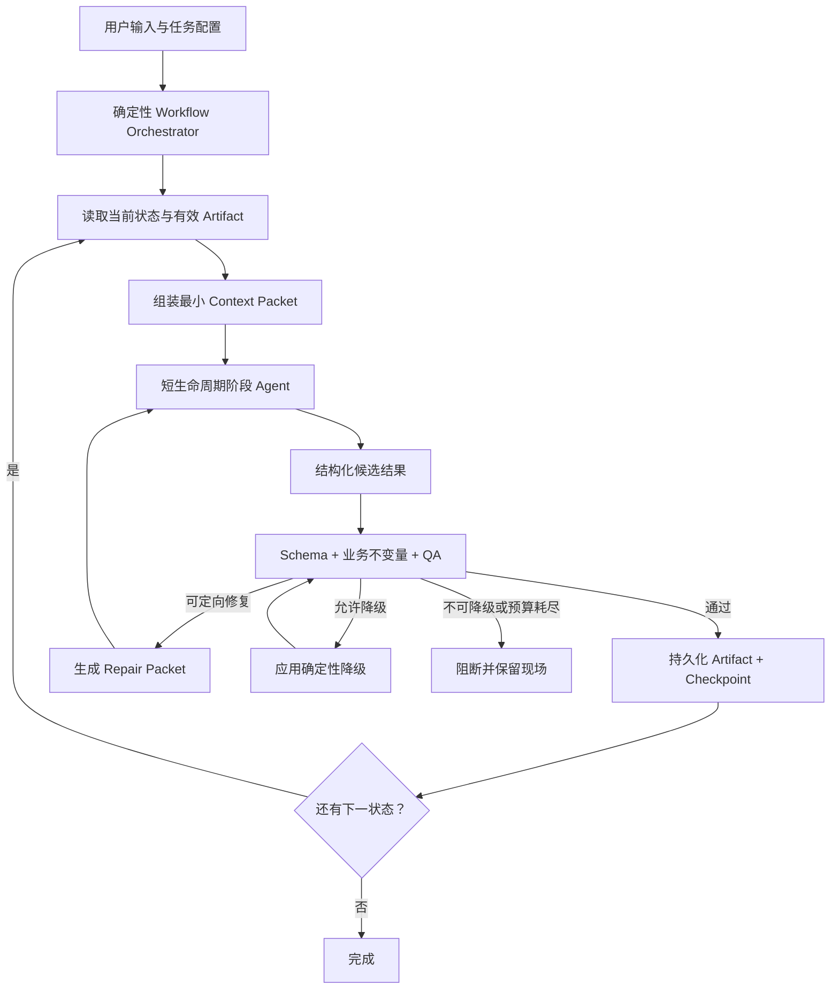
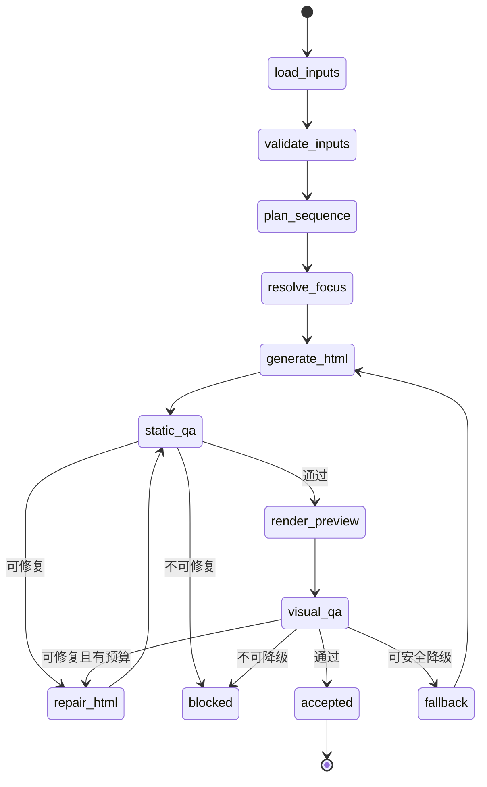

# asset-first Loop Engineering（Agent Loop）设计

> 日期：2026-07-16
> 分支：`dev`
> 代码基线：`3a23622`
> 状态：设计已确认，尚未形成实施计划
> 关联总结：[`2026-07-16-asset-first-image-camera-focus-summary.md`](../plans/2026-07-16-asset-first-image-camera-focus-summary.md)

## 1. 设计结论

本任务采用 **Artifact-Centered Bounded Agent Loop（以结构化产物为中心的有界 Agent 循环）**：

```text
确定性工作流控制阶段、预算、质量门和完成条件
+ 短生命周期 Agent 只解决当前阶段的语义问题
+ 结构化 Artifact 和 Checkpoint 传递状态
+ Scene 级上下文隔离
+ 确定性校验决定通过、修复、降级或阻断
```

这不是通用自治 Agent Runtime，也不是让一个“总导演 Agent”从输入一直对话到成片。MuseDock 已经有固定创作工作流、`generation_checkpoint`、输入指纹、`repair_and_resume`、Chromium 渲染、`ffmpeg` 合成和质量门；本设计只在这些现有能力上补齐有界循环和上下文工程。

overlay P0 已在当前基线完成，不属于本设计的待实施阶段。新 Loop 从统一素材、素材覆盖判断、多图编排、焦点分析、Scene HTML、渲染检查和定向恢复继续。

## 2. 为什么需要 Loop Engineering

这项工作同时包含：

- 用户上传、来源提取、页面截图、AI 生图、Pexels/search 和衍生图片的统一入库；
- required/preferred/optional 素材约束；
- Scene 使用一张或多张图片的语义规划；
- Caption 与 Shot、Focus Cue 的时间绑定；
- OCR、DOM、多模态候选和焦点可信度；
- Scene HTML 生成；
- 静态布局 QA、预览渲染 QA 和最终成片 QA；
- 失败后的定向修复、安全降级和断点恢复。

把它们作为一次模型调用的问题有三个：

1. 上下文会被图片分析、HTML、日志和多轮修复持续污染；
2. 模型既生成又自评，无法形成可信质量门；
3. 任一局部失败都可能迫使整条任务重跑。

Loop Engineering 的目标不是让 Agent 更自由，而是把自由限制在可验证的小决策中：

```text
Agent 提议
→ 代码验证
→ 写入版本化产物
→ 通过后进入下一状态
→ 失败时只失效相关下游
```

## 3. 目标与非目标

### 3.1 目标

- 长任务不依赖持续增长的对话上下文；
- 每个 Agent 调用只有一个明确职责和输出契约；
- 每个 Scene 可以独立规划、生成、验证、修复和恢复；
- 相同输入可以复用已有产物；
- 输入变化只失效真正受影响的下游；
- 模型调用次数、重试次数和耗时有硬上限；
- 不可信焦点、过激运镜等问题可以安全降级；
- required 素材未使用、白屏、无效引用等问题必须阻断；
- 用户能够看到当前阶段、尝试次数、降级和阻断原因。

### 3.2 非目标

第一版不实现：

- 通用多 Agent 总线；
- Agent 自由选择任意工具和任意下一阶段；
- Agent 递归创建 Agent；
- 多 Agent 投票决定是否通过质量门；
- 全局向量记忆或跨任务自动记忆；
- 把完整模型思维过程持久化；
- 多个 Agent 同时改写同一个 Scene 产物；
- 无限自我修复；
- 用 Agent 自报 confidence 代替确定性验证；
- 为 Loop 新建第二套素材 registry 或第二套工作流引擎。

## 4. 已成立的前置条件

当前 `dev` 已完成 overlay P0：

- `motion_overlay` 可为空；
- 普通图片和 diagram beat 不再强制叠卡；
- diagram hard gate 已补齐；
- 主视觉与 overlay 提示词已解耦；
- 空 overlay 不再注入受管 primitive；
- 布局自动修复后仍遮挡会阻断帧生成；
- 图片使用规则、提示词版本和相关测试已更新。

因此，新 Loop 的画面所有权基线是：

```text
有图片：图片摄影机 + 系统字幕，motion_overlay = null
无图片：diagram 自身动画 + 系统字幕，不叠同义卡片
```

## 5. 总体架构



唯一流程所有者是确定性 Orchestrator。Agent 不得：

- 跳过阶段；
- 修改通过条件；
- 提高自己的调用预算；
- 把 blocking issue 改成 warning；
- 自行宣布任务完成；
- 修改非当前 Scene 或非允许字段；
- 从未登记素材中自由选图。

## 6. 双层有界 Loop

### 6.1 任务级 Workflow Loop

保留当前阶段主干：

```text
source
→ research
→ assets
→ agent_run
→ brief
→ audio
→ project
→ check
→ render
→ inspect
```

新增能力优先成为现有阶段的子阶段或 checkpoint：

| 能力 | 归属阶段 |
|---|---|
| 上传素材认领 | `assets` |
| 来源提取、截图、生图、search 入库 | `assets` |
| 素材覆盖分析 | `assets` 后半段 |
| 缺失视觉角色补全 | `assets` 后半段 |
| Image Sequence Plan | `project` 前半段 |
| `focus_regions` | 素材入库后按需执行 |
| `focus_cues` | `project` 规划阶段 |
| Scene HTML | `project` |
| Scene 静态 QA | `project` |
| required 素材使用检查 | `check` |
| Chromium/ffmpeg 执行 | `render` |
| 成片视觉检查 | `inspect` |
| 定向重试 | 现有 `repair_and_resume` |

`agent_run` 继续表示导演改写，不变成包办全部步骤的总 Agent。Loop Engineering 是工作流的执行方式，不是一个新的万能阶段。

### 6.2 Scene Execution Loop

每个 Scene 独立运行：



一个 Scene 失败不会删除其他 Scene 已通过的产物。恢复时只执行失败 Scene 及被输入变化失效的下游状态。

## 7. Agent 角色与权限

第一版只定义五种逻辑角色；它们可以由同一模型使用不同 Prompt 执行，不要求五个常驻进程。

### 7.1 Asset Coverage Agent

职责：判断当前 Scene 已有素材是否覆盖所需视觉角色，以及是否真的需要生图或 search。

读取：

- Scene 旁白摘要和 Caption；
- 已登记素材的紧凑摘要；
- required/preferred/optional；
- `origin`、`evidence_class`、质量和可用状态。

输出：

- Scene 所需视觉角色；
- 已覆盖角色及对应 `asset_id`；
- 未覆盖角色；
- 是否建议生成、截图或 search；
- 简短理由。

禁止：

- 直接生成图片；
- 创建未登记 `asset_id`；
- 将 synthetic/search 标记为直接事实证据；
- 为凑图片数量请求补图。

### 7.2 Image Sequence Planner

职责：为一个 Scene 选择 `1～4` 张已登记图片，确定主要 sequence mode、Shot Role、Caption 绑定和最短可见时长。

读取：

- 当前 Scene；
- 当前 Scene 可用素材白名单；
- required 素材；
- Caption 时间；
- 前一 Scene 的紧凑连续性摘要。

输出：`image_sequence_plan.v1`。

禁止：

- 从全部文件系统自由找图；
- 重新解释素材来源属性；
- 修改旁白或 Caption 时间；
- 因为候选多就强制多图；
- 创建未被 Caption 时间覆盖的 Shot。

### 7.3 Focus Analyzer

职责：为真正需要局部聚焦的图片产生或匹配焦点候选。

读取：

- 单张图片或必要裁剪；
- 图片已有 OCR/DOM/多模态分析；
- 当前 Scene 相关 Caption；
- 焦点信任等级规则。

输出：`focus_regions.v1` 或 `focus_cues.v1` 候选。

禁止：

- 把 AI-only 候选升级为 A/B 级；
- 为同名歧义目标强行消歧；
- 决定最终 zoom 和位移；
- 直接画硬边框；
- 无证据时声称焦点已验证。

### 7.4 Scene HTML Agent

职责：把已批准的 Image Sequence Plan、Focus Cue、字幕和风格约束实现成 Scene HTML。

读取：

- 当前 Scene 的执行计划；
- 白名单素材引用；
- 确定性计算后的镜头参数；
- Caption；
- 局部风格与连续性摘要；
- HTML 输出约束。

输出：Scene HTML 和紧凑静态统计。

禁止：

- 重新选素材；
- 自行增加自由 focus/callout/arrow；
- 修改已批准的 Caption 绑定；
- 访问其他 Scene 的完整 HTML；
- 绕过系统字幕层；
- 宣布 QA 通过。

### 7.5 Visual Repair Agent

职责：只修复 Repair Packet 指定的问题。

读取：

- 当前有效 HTML；
- 当前未解决 issue；
- 允许修改字段；
- 已尝试策略和禁止重复策略。

输出：修订后的 HTML 或明确的 `cannot_repair`。

禁止：

- 重做整个 Scene Plan；
- 修改无关 Scene；
- 删除 required 素材以消除问题；
- 隐藏、降级或重命名 QA issue；
- 超出 Repair Packet 的允许修改范围。

## 8. Context Engineering

### 8.1 默认新上下文

每次阶段 Agent 调用默认使用新上下文：

```text
固定角色指令
+ 当前 Context Packet
+ 按需读取的 Artifact
= 本次完整上下文
```

不自动继承上一轮对话、工具日志或完整错误历史。

### 8.2 Context Packet

所有 Agent 调用使用同一信封结构：

```json
{
  "contract": "agent_context.v1",
  "task": {
    "workflow_id": "wf_...",
    "target": {
      "aspect_ratio": "9:16",
      "duration_sec": 60
    }
  },
  "stage": {
    "id": "image_sequence_plan",
    "scope_id": "scene_03",
    "attempt": 1,
    "max_attempts": 2
  },
  "inputs": {},
  "artifact_refs": [],
  "constraints": {},
  "allowed_changes": [],
  "output_contract": "image_sequence_plan.v1"
}
```

硬规则：

- 只包含当前决策需要的字段；
- 大对象优先传文件引用；
- `artifact_refs` 必须位于当前任务目录；
- 输入列出内容哈希或版本；
- `allowed_changes` 为空时 Agent 只能输出分析；
- Prompt 不依赖聊天历史中未落盘的决定。

### 8.3 传引用，不传全集

素材上下文只传紧凑投影：

```json
{
  "id": "github_page_01",
  "summary": "仓库主页截图",
  "origin": "page_capture",
  "evidence_class": "direct_source",
  "requirement": "preferred",
  "analysis_ref": "artifacts/assets/github_page_01.analysis.json",
  "thumbnail_ref": "artifacts/assets/github_page_01.thumb.jpg"
}
```

Agent 只有在职责需要时才读取完整分析或图片。Scene HTML Agent 不需要读取完整来源文章；Sequence Planner 不需要读取完整 HTML；Repair Agent 不需要读取其他 Scene 日志。

### 8.4 重试上下文重新压缩

重试不累加历史消息，只重建：

```json
{
  "attempt": 2,
  "current_artifact_ref": "scene_03.v1.html",
  "unresolved_issues": [
    {
      "code": "caption_occludes_focus",
      "caption_id": "cap_08",
      "region_id": "region_stars",
      "sample_time_sec": 21.6
    }
  ],
  "previous_actions": ["move_camera_target_up"],
  "forbidden_repeats": ["move_camera_target_up"],
  "allowed_changes": ["camera_target", "zoom"]
}
```

已解决问题不再进入下一轮。完整历史保留在事件记录中供审计，不进入模型上下文。

### 8.5 Scene 间有限共享

Scene 只共享：

- 全局画面目标和风格 token；
- 前一 Scene 的结尾构图摘要；
- 已使用素材 ID；
- 简单重复约束；
- 跨 Scene 转场类型。

不共享：

- 前一 Scene 完整 HTML；
- 前一 Scene 完整 QA；
- 前一 Scene Agent 对话；
- 其他 Scene 的图片分析全集。

## 9. Artifact 契约

### 9.1 产物清单

| Artifact | 作用域 | 生产者 | 主要消费者 |
|---|---|---|---|
| `asset_context` | 任务 | 确定性素材流程 | Coverage、Sequence、QA、UI |
| `asset_coverage.v1` | Scene | Coverage Agent | 素材补全流程 |
| `image_sequence_plan.v1` | Scene | Sequence Planner | Focus、HTML、QA |
| `focus_regions.v1` | Asset | Focus Analyzer + 验证器 | Focus Cue 绑定 |
| `focus_cues.v1` | Scene | Focus 匹配阶段 | 摄影机计算、字幕高亮 |
| `camera_plan.v1` | Scene | 确定性摄影机计算 | Scene HTML Agent |
| Scene HTML | Scene | HTML/Repair Agent | 静态 QA、渲染 |
| `scene_qa.v1` | Scene | QA | Orchestrator、Repair |
| `asset_usage_report` | 任务 | 确定性汇总 | `check`、UI |
| `visual-report.json` | 任务 | inspect | 完成门、恢复计划 |

### 9.2 Artifact 信封

所有新结构化产物使用共同元数据：

```json
{
  "contract": "image_sequence_plan.v1",
  "workflow_id": "wf_...",
  "scope": {
    "type": "scene",
    "id": "scene_03"
  },
  "input_fingerprint": "sha256:...",
  "producer": {
    "kind": "agent",
    "model": "...",
    "prompt_version": "image_sequence.v1"
  },
  "created_at": "2026-07-16T00:00:00.000Z",
  "data": {}
}
```

不保存模型思维过程。只保存：

- 结构化结果；
- `decision_summary`；
- 必要证据引用；
- 模型/provider；
- Prompt 和契约版本；
- 输入指纹；
- 调用耗时和 token 统计（provider 可提供时）。

### 9.3 写入规则

- Agent 原始输出先进入临时结果；
- Schema 和业务不变量通过后才成为 active Artifact；
- 新版本通过前不得覆盖最后一个有效版本；
- 每个作用域只能有一个 active 版本；
- 失败版本可保留诊断引用，但不得被下游消费；
- 文件写入采用现有项目存储方式，第一版不增加数据库或消息队列。

## 10. 状态与 Checkpoint

Scene Loop 最小状态：

```json
{
  "contract": "scene_loop_state.v1",
  "scene_id": "scene_03",
  "status": "visual_qa",
  "attempts": {
    "sequence_plan": 1,
    "focus": 1,
    "html": 2,
    "visual_qa": 2
  },
  "active_artifacts": {
    "sequence_plan": "scene_03.image-sequence.v1.json",
    "focus_cues": "scene_03.focus-cues.v1.json",
    "html": "scene_03.v2.html",
    "preview": "scene_03.v2.mp4"
  },
  "unresolved_issue_codes": [],
  "fallbacks_applied": [],
  "updated_at": "2026-07-16T00:00:00.000Z"
}
```

Checkpoint 可复用必须同时满足：

- 输入素材指纹一致；
- Scene 规格和 Caption 指纹一致；
- required 素材约束一致；
- Prompt 结构版本一致；
- 输出契约版本一致；
- 摄影机算法版本一致；
- 相关 QA 规则版本一致；
- 产物文件仍存在且可读。

失效传播采用最小下游范围：

| 变化 | 失效范围 |
|---|---|
| 单张素材文件变化 | 该素材分析、引用它的 Scene 规划及下游 |
| 素材来源元数据变化 | Coverage、引用决策及下游 |
| Caption 文本或时间变化 | Scene Plan、Focus Cue、HTML、渲染、QA |
| Focus 规则变化 | Focus、Camera Plan、HTML、渲染、QA |
| HTML Prompt 变化 | HTML、渲染、QA |
| QA 规则变化 | 对应 QA；只有新增阻断影响有效性时才继续失效下游 |
| 目标比例变化 | 所有 Camera Plan、HTML、渲染、QA |

## 11. 质量门、错误分类与恢复

### 11.1 错误分类

每个问题必须明确分类：

| 分类 | 含义 | 行为 |
|---|---|---|
| `retryable_agent` | Agent 输出不合法或局部实现可修 | 生成最小 Repair Packet |
| `retryable_external` | provider 限流、暂时网络问题 | 按现有策略有限重试 |
| `fallback_allowed` | 局部能力失败但有安全降级 | 应用确定性降级后重新 QA |
| `blocking_input` | 输入或引用不完整 | 阻断并提示用户操作 |
| `blocking_quality` | 继续导出会产生已知坏结果 | 阻断并保留现场 |
| `internal_error` | 契约、存储或代码异常 | 阻断，记录可定位诊断 |

### 11.2 允许降级

| 问题 | 降级 |
|---|---|
| Focus region 不可信 | 取消局部聚焦，只做整图轻运动 |
| 多个同名目标无法消歧 | 不聚焦，只高亮字幕 |
| Scene 时间不足以容纳多图 | 减少 Shot，不加速轮播 |
| 自然图片只有 C 级焦点 | 使用低倍率宽松推近 |
| Search/AI 生图失败但已有足够素材 | 使用现有素材完成 Scene |

降级后必须重新执行相关 QA，并记录为 `accepted_with_fallback`，不能直接标记普通成功。

### 11.3 必须阻断

- required 素材没有有效可见 Shot；
- required 素材可见时长为零；
- 引用了未登记素材；
- 素材文件丢失或不可读；
- Caption/Shot/Cue 引用不存在；
- Scene HTML 无法加载；
- 持续白屏、黑屏或空白边缘；
- Blocking 遮挡自动修复后仍存在；
- 输出文件不完整或无法播放；
- 同类错误达到预算上限且没有安全降级。

### 11.4 Agent 不能决定通过

完成判定只由代码执行：

```text
所有 Scene 为 accepted 或 accepted_with_fallback
+ required 素材门通过
+ 引用完整性门通过
+ Scene blocking issues 为零
+ render 成功
+ inspect 通过
+ 没有 pending/running/repair 状态
```

## 12. 调用预算与停止条件

第一版默认预算：

| 阶段 | 默认预算 |
|---|---:|
| 素材覆盖分析 | 每个 Scene 1 次；仅契约错误可补 1 次 |
| Image Sequence Plan | 首次 1 次 + 定向修复 1 次 |
| Focus 分析 | 每张最终候选图片最多 1 次 |
| Focus 匹配 | 每个 Scene 1 次；歧义直接降级 |
| Scene HTML | 首次 1 次 + 定向修复 1 次 |
| 确定性 QA | 每个候选版本均执行，不消耗模型预算 |
| Visual Repair | 每类可修复问题最多 1 次 |

停止条件：

- 通过质量门；
- 应用允许降级后通过；
- 达到阶段最大尝试次数；
- 同一 issue code 连续两次出现；
- 本轮输出没有减少 unresolved issue；
- 出现不可降级的 blocking issue；
- 用户停止任务；
- 任务级时间或模型调用预算耗尽。

不得通过提高最大重试次数掩盖不稳定 Prompt 或错误数据契约。

## 13. 并行与多 Agent 边界

### 13.1 Codex 当前存在的三层协作

不能把 Codex 的多 Agent 能力只等同于子 Agent。当前 Codex App 实际存在三层协作：

1. **Subagent Workflow**：主任务创建多个子 Agent Thread，子 Agent 完成有界子任务后向主任务返回结果；
2. **并行顶层任务**：多个 Codex 任务各自保留上下文、消息、结果和目标，可在同一项目中并行运行，也可使用独立 worktree 隔离代码修改；
3. **跨任务协调**：一个 Codex 任务可以读取其他任务状态、向其他任务发送后续消息，或请求把其他任务及 Git 状态在 Local、Worktree 和已连接主机之间交接。

Codex UI 中的“由 Codex 从另一个任务发送”属于第三层：消息来源是另一个独立任务，不是当前任务内部的普通子 Agent 返回卡片。

因此，广义上可以把 Codex App 组织成多 Agent 协作系统：一个协调任务负责拆分和收敛，多个独立任务或子 Agent 负责执行。但它不是自动共享上下文的 Agent Swarm：

- 每个顶层任务仍有独立上下文；
- 跨任务知识依靠显式消息、文件、Git 提交或 Artifact 传递；
- worktree 隔离可以避免并行修改直接覆盖，但不能自动解决语义冲突；
- Handoff 是移动任务及 Git 状态，不是复制一个共享 Agent；
- 最终仍需明确唯一协调者、产物所有者和合并规则。

### 13.2 对 MuseDock Agent Loop 的含义

MuseDock 产品运行时不依赖 Codex App 的子 Agent或跨任务工具。这些能力适合用来并行开发、审查和验证 MuseDock；产品内的 Agent Loop 仍按本规格通过 Context Packet、Artifact 和 Checkpoint 实现。

两者共享的工程原则是：

```text
独立上下文
+ 显式任务边界
+ 结构化交接
+ 返回摘要而不是原始噪声
+ 同一产物只有一个写入者
```

若使用 Codex 实施本规格，推荐：

- 一个顶层协调任务保存规格、任务顺序、跨阶段决策和最终验收；
- 独立顶层任务或子 Agent 并行完成只读代码追踪、样本分析和 Review；
- 需要长期独立修改的实现任务使用单独 worktree；
- 一个实现切片只指定一个写入任务；
- 各任务通过短交接摘要、提交或设计 Artifact 汇报，不转发完整日志；
- 协调任务统一决定合并顺序和回归验证。

### 13.3 运行时并行边界

适合并行：

- 不同素材的只读分析；
- 不同 Scene 的只读 Coverage；
- DOM、OCR 和多模态焦点候选获取；
- 不同 Scene 的预览渲染（资源允许时）；
- 遮挡、镜头、字幕、素材使用等独立 QA；
- 代码探索和评审。

不适合并行：

- 多个 Agent 同时写同一 Scene Plan；
- 多个 Agent 同时写同一 HTML；
- Agent 与确定性修复器同时改同一 Artifact；
- 未完成素材入库时并发进行最终 Sequence Plan；
- 未冻结 Caption 时间时生成最终 Focus Cue。

第一版采用 **单作用域单写者**：同一 `workflow_id + scope_type + scope_id + artifact_type` 同时只能有一个写入者。无需新增分布式锁；当前进程内任务执行和现有持久化边界足够。未来只有在多 worker 同时写同一任务成为真实需求时，再升级为存储层租约或队列串行键。

## 14. 可观测性与用户可见状态

每次状态变化记录紧凑事件：

```json
{
  "event": "scene_loop_transition",
  "workflow_id": "wf_...",
  "scene_id": "scene_03",
  "from": "visual_qa",
  "to": "repair_html",
  "attempt": 2,
  "reason_code": "caption_occludes_focus",
  "artifact_ref": "scene_03.v1.html",
  "timestamp": "2026-07-16T00:00:00.000Z"
}
```

用户界面只需要展示：

- 当前动作，例如“正在规划第 3 个场景的图片顺序…”；
- 当前 Scene 和阶段；
- 是否正在重试；
- 是否应用降级及中文原因；
- 阻断原因和可执行建议；
- 已完成 Scene 数量；
- 素材是否已使用。

不展示原始 Prompt、模型思维过程或大段第三方英文错误。第三方错误保留诊断原文，同时提供中文解释。

## 15. 安全与数据边界

- Artifact 引用必须解析到当前任务目录或明确允许的素材目录；
- 不把 Cookie、Token、API Key 或代理凭据写入 Context Packet；
- 页面截图和来源下载继续使用现有安全校验；
- 图片大小限制应在流式下载过程中执行；
- Agent 不能构造任意本地路径；
- HTML 继续经过现有静态校验和 Chromium 隔离执行路径；
- 外部 provider 错误不得把完整请求头或密钥写入事件；
- 用户上传的 required 约束只能由用户或确定性任务配置修改。

## 16. 测试与验收

### 16.1 契约测试

- Context Packet 不包含未声明字段；
- Agent 输出不符合 schema 时不得成为 active Artifact；
- `asset_id`、Caption ID、Region ID 引用均可解析；
- Agent 无法扩大 `allowed_changes`；
- synthetic/search 不得升级为直接事实证据；
- active Artifact 只有一个版本。

### 16.2 状态机测试

- 非法状态跳转被拒绝；
- QA 未通过不能进入 `accepted`；
- 达到预算后不再调用 Agent；
- 降级后必须重新 QA；
- blocking issue 不能被降级；
- 用户停止后不再推进状态；
- 单个 Scene 失败不会清除其他 Scene checkpoint。

### 16.3 上下文测试

- Scene Agent 收不到其他 Scene 完整 HTML；
- Repair Packet 只包含当前 unresolved issues；
- 第二次修复不会累加第一次完整聊天；
- 大型素材分析通过引用按需读取；
- Context Packet 可从落盘状态重新构建，不依赖内存对话。

### 16.4 恢复测试

- 输入指纹相同会复用产物；
- 单张素材变化只失效引用它的 Scene；
- Caption 变化会失效对应 Plan、Cue、HTML、渲染和 QA；
- Prompt 版本变化会失效对应 Agent 产物；
- 丢失文件不会被 checkpoint 错误复用；
- 重启进程后能从 active Artifact 和 Loop State 恢复。

### 16.5 端到端验收

至少覆盖：

1. 单图 Scene 无焦点，整图轻运动完成；
2. 多图全屏接力；
3. GitHub 截图经 OCR/DOM 验证后聚焦；
4. 同名焦点歧义后安全降级；
5. required 图片未使用而阻断；
6. Scene HTML 首次遮挡、一次定向修复后通过；
7. 修复失败并保留现场；
8. 中途停止后恢复，只重跑失败 Scene；
9. 多 Scene 长任务中 Context Packet 大小不随已完成 Scene 线性增长；
10. 最终 `asset_usage_report`、Scene 状态和 `visual-report.json` 一致。

## 17. 分阶段落地边界

本规格只定义 Loop 架构，不把所有资产和摄影机能力压成一个实施计划。后续实施计划应按依赖拆分：

1. **Loop 基础**：Context Packet、Artifact 信封、Scene Loop State、预算和状态转换；
2. **统一素材与 Coverage**：素材协议、任务认领、运行中追加、required 门；
3. **Image Sequence Plan**：Scene 级 `1～4` Shot、Caption 时间绑定和连续 HTML 时间线；
4. **Focus 与 Camera Plan**：Region 候选、验证、Cue、确定性坐标计算和降级；
5. **QA 与恢复闭环**：Repair Packet、定向失效、预览 QA、最终 inspect 和恢复验证。

每个阶段都必须能独立验收，后一个阶段只能消费前一个阶段已验证的 Artifact。

## 18. 最终决策

MuseDock 的 Agent Loop 固定为：

```text
有界确定性外层工作流
+ Scene 级内层循环
+ 阶段级新上下文
+ Artifact/Checkpoint 传递状态
+ Agent 只做语义提议
+ 代码掌握质量门和停止权
+ 只读分析可并行
+ 同一产物单写者
```

第一版复用现有文件存储、`project.json`、`generation_checkpoint`、输入指纹和 `repair_and_resume`。不增加通用 Agent 框架、共享向量记忆、多 Agent 投票、递归代理树或第二套工作流引擎。

这套边界保证超大任务可以逐 Scene、逐 Artifact 推进，模型上下文不会随着整个任务历史无限增长，失败也不会演变为全量重跑。
